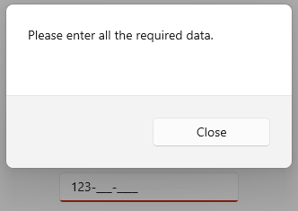

# Validation in WinUI MaskedTextBox

The `MaskedTextBox` control provides the ability to validate the input according to the completion of masked input. The validation fails if the mask is not completed by changing the border of the `MaskedTextBox` control to red and if all the inputs are given, the border returns to its default state.

Validation occurs by default in the `MaskedTextBox` control. But the validation can be disabled by assigning true to the IsValid property of the ValueChanging event.

## Get the Validation result

By using the IsValid property, the validation result can be known if it is succeeded or failed. The `IsValid` property returns the following results,
* **True** - if the validation is successful.
* **False** - if the validation is failed.





<StackPanel>
    <syncfusion:SfMaskedTextBox x:Name="maskedTextBox"
                                Width="200"
                                MaskType="Simple"
                                Mask="000-000-0000"
                                ValueChanging="maskedTextBox_ValueChanging">
    </syncfusion:SfMaskedTextBox>
    <Button x:Name="SubmitButton"
            Content="Submit"
            Margin="50,20,0,0"
            Width="100"
            Click="SubmitButton_Click"/>
</StackPanel>





private bool maskIsValid;

private void maskedTextBox_ValueChanging(object sender, MaskedTextBoxValueChangingEventArgs e)
{
    maskIsValid = e.IsValid;
}

private async void SubmitButton_Click(object sender, Microsoft.UI.Xaml.RoutedEventArgs e)
{
    if (!maskIsValid)
    {
        var contentDialog = new ContentDialog
        {
            Content = "Please enter all the required data.",
            CloseButtonText = "Close"
        };
        contentDialog.XamlRoot = this.Content.XamlRoot;
        await contentDialog.ShowAsync();
    }
}





