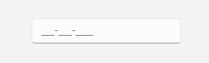

# Validation in WinUI MaskedTextBox

The `MaskedTextBox` control allows you to validate the input entered using the `ValueChanging` event. The validation condition can be customized using the properties of the `ValueChanging` event.

To implement validation support for the MaskedTextBox, you can utilize the `IsMaskCompleted` property in the `ValueChanging` event. When all the required input is provided, `IsMaskCompleted` will be true, indicating valid input. If it is false, the MaskedTextBox border turns red; otherwise, it returns to its default state.



<syncfusion:SfMaskedTextBox x:Name="maskedTextBox"
                            Width="200"
                            MaskType="Simple"
                            Mask="000-000-0000"
                            ValueChanging="maskedTextBox_ValueChanging">
</syncfusion:SfMaskedTextBox>


private void maskedTextBox_ValueChanging(object sender, MaskedTextBoxValueChangingEventArgs e)
{
    e.IsInputValid = e.IsMaskCompleted;
}



