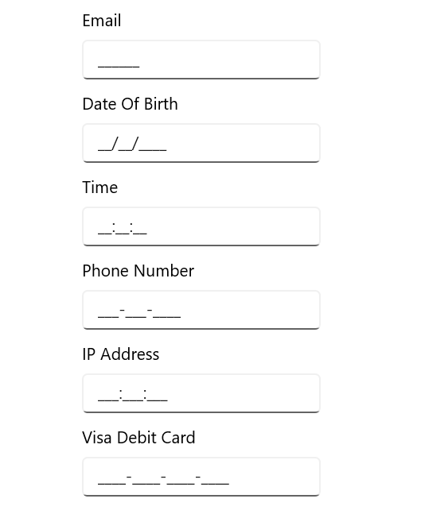

# WinUI MaskedTextBox Overview

The Masked text box is an advanced version of the Entry control that restricts your input to certain types of characters, text, and numbers using a mask pattern. This control is used to create a template for providing information such as telephone numbers, IP addresses, product IDs, and so on.

## Key features

* `Mask types`: Provides different types of mask types such as Simple and RegEx. 
* `PromptChar`: Provides support for setting the prompt characters manually.
* `Value`: Provides support to enter the Values and clipboard operations can be used with or without literal and prompt characters.
* `ValueMaskFormat`: Provides support to update the value based on the mask formats. 
* `Customization`: Provides support to customize the UI of masked text box. 