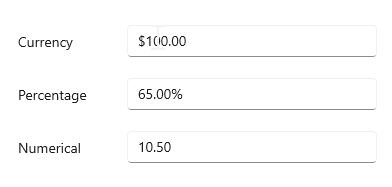
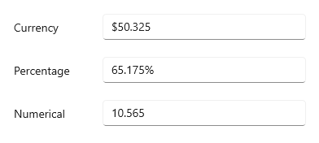

# Value formatting with WinUI NumberBox

This section explains how to change the value format of the `NumberBox` control using `NumberFormatter` and `CustomFormat` properties.

## Currency, percentage and decimal format

You can format the value of a `NumberBox` control using the `NumberFormatter` or `CustomFormat` property. By default, the value is formatted based on the current culture's decimal format. The default value of `NumberFormatter` and `CustomFormat` properties are **null**.

The following example shows how to set `CurrencyFormatter`, `DecimalFormatter` and `PercentFormatter` for `NumberFormatter` property. 

N> [Refer here](https://docs.microsoft.com/en-us/uwp/api/windows.globalization.numberformatting?view=winrt-19041#classes) to know more about the formatting classes that can assigned for `NumberFormatter` property.




CultureInfo culture = new CultureInfo("en-US");

// Format stock price in currency
stockPrice.NumberFormatter = new CurrencyFormatter(new RegionInfo(culture.LCID).ISOCurrencySymbol);

// Format product discount in percent
productDiscount.NumberFormatter = new PercentFormatter();

// Format worked hours in decimal
hoursWorked.NumberFormatter = new DecimalFormatter();




Using **N**, **C**, and **P** format values, we can apply numeric, currency, and percent custom formats in `CustomFormat` property.

N> When using both the `CustomFormat` and the `NumberFormatter` properties, the `CustomFormat` property takes high precedence. 

N> You can apply various custom formats available in [this page](https://docs.microsoft.com/en-us/dotnet/standard/base-types/standard-numeric-format-strings) which are supported for `double` type.




// Format stock price in currency
stockPrice.CustomFormat = "C2";

// Format product discount in percent
productDiscount.CustomFormat = "P2";

// Format worked hours in decimal
hoursWorked.CustomFormat = "N2";




## Format the integer digits

You can change the decimal digits of the value in the `NumberBox` control using `NumberFormatter` and `CustomFormat` properties. For the `NumberFormatter` property, you can customize the decimal digits of the value using the `IntegerDigits` property in `CurrencyFormatter`, `PercentFormatter`, and `DecimalFormatter` classes.




CultureInfo culture = new CultureInfo("en-US");
stockPrice.NumberFormatter = new CurrencyFormatter(new RegionInfo(culture.LCID).ISOCurrencySymbol) { IntegerDigits = 5};
productDiscount.NumberFormatter = new PercentFormatter() { IntegerDigits = 5 };
hoursWorked.NumberFormatter = new DecimalFormatter() { IntegerDigits = 5 };




For `CustomFormat` property, use the **0** format specifier to set the minimum number of decimal digits.  

N> **0** (Zero placeholder) replaces the zero with the corresponding digit present in the value; otherwise, zero appends with the leftmost position of the value. 




// Format stock price in currency
stockPrice.CustomFormat = "$00000.00";

// Format product discount in percent
productDiscount.CustomFormat = "00000.00%";

// Format worked hours in decimal
hoursWorked.CustomFormat = "00000.00";




## Format the fractional digits

You can change the fractional digits of the value in `NumberBox` control using `NumberFormatter` and `CustomFormat` properties. For the `NumberFormatter` property, you can customize the fractional digits of the value using the `FractionDigits` property in `CurrencyFormatter`, `PercentFormatter`, and `DecimalFormatter` classes.




CultureInfo culture = new CultureInfo("en-US");
stockPrice.NumberFormatter = new CurrencyFormatter(new RegionInfo(culture.LCID).ISOCurrencySymbol) { FractionDigits = 3 };
productDiscount.NumberFormatter = new PercentFormatter() { FractionDigits = 3};
hoursWorked.NumberFormatter = new DecimalFormatter() { FractionDigits = 3 };




For `CustomFormat` property, use the **0** format specifier to set the minimum number of fractional digits.  

N> **0** (Zero placeholder) replaces the zero with the corresponding digit present in the value.




stockPrice.CustomFormat = "$000.000";
productDiscount.CustomFormat = "00.000%";
hoursWorked.CustomFormat = "00.000";




## Apply custom format

You can apply custom formats to the `NumberBox` control using the **0** and **#** format specifiers. Using these format specifiers you can set the minimum and the maximum number of fractional digits in the `CustomFormat` property. 

   * **0** (Zero placeholder) replaces the zero with the corresponding digit present in the value; otherwise, zero appends with the leftmost position of the value. 

   * **#** (Digit placeholder) replaces the number sign symbol with the corresponding digit present in the value; otherwise, no digit will append with the value. 

In the below example, the value of the `CustomFormat` property is **#.00##**, hence it will allow a maximum of `4` fractional digits and a minimum of `2` fractional digits.




stockPrice.CustomFormat = "$00.00##";
productDiscount.CustomFormat = "00.00##%";
hoursWorked.CustomFormat = "00.00##";




## Change culture

By default, the culture value is **en-US**. Hence `NumberBox` control automatically formats itself based on current culture with a dollar (**$**) sign. You can apply different formats based on the cultural and regional settings using the [CultureInfo](https://docs.microsoft.com/en-us/dotnet/api/system.globalization.cultureinfo?view=net-5.0) class.




<editors:SfNumberBox x:Name="sfNumberBox"
                     HorizontalAlignment="Center" 
                     VerticalAlignment="Center" 
                     Value="10" />




CultureInfo culture = new CultureInfo("fr-FR");
sfNumberBox.NumberFormatter = new CurrencyFormatter(new RegionInfo(culture.LCID).ISOCurrencySymbol);




