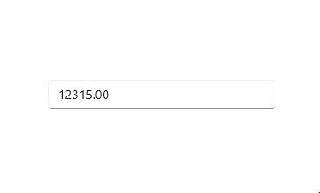

# Getting Started with WinUI NumberBox

This section explains the steps required to add the [WinUI NumberBox](https://www.syncfusion.com/winui-controls/NumberBox) control in the WinUI application and utilize the various functions provided.

## Structure of NumberBox control

## Creating an application with WinUI NumberBox

In this walkthrough, you will create a WinUI application that contains the `NumberBox` control.

## Adding control manually in XAML

To add `NumberBox` control manually in XAML, follow the below steps.

1. Create a [WinUI 3 desktop app for C# and .NET 5](https://docs.microsoft.com/en-us/windows/apps/winui/winui3/get-started-winui3-for-desktop) or [WinUI 3 app in UWP for C#](https://docs.microsoft.com/en-us/windows/apps/winui/winui3/get-started-winui3-for-uwp).
2.  Download and refer the following NuGet package in the project.

    * [Syncfusion.Editors.WinUI](https://www.nuget.org/packages/Syncfusion.Editors.WinUI)

3. Import the control namespace `Syncfusion.UI.Xaml.Editors` in XAML page.
4. Initialize the `NumberBox` control.




<Page
    x:Class="GettingStarted.MainPage"
    xmlns="http://schemas.microsoft.com/winfx/2006/xaml/presentation"
    xmlns:x="http://schemas.microsoft.com/winfx/2006/xaml"
    xmlns:local="using:GettingStarted"
    xmlns:d="http://schemas.microsoft.com/expression/blend/2008"
    xmlns:mc="http://schemas.openxmlformats.org/markup-compatibility/2006"
    xmlns:editors="using:Syncfusion.UI.Xaml.Editors"
    mc:Ignorable="d"
    Background="{ThemeResource ApplicationPageBackgroundThemeBrush}">
    <Grid Name="grid">
        <!--Adding NumberBox control -->
        <editors:SfNumberBox HorizontalAlignment="Center"
                             VerticalAlignment="Center" 
                             Value="15.35" />
    </Grid>
</Page>




## Adding control manually in C#

To add `NumberBox` control manually in C# , follow the below steps.

1. Create a [WinUI 3 desktop app for C# and .NET 5](https://docs.microsoft.com/en-us/windows/apps/winui/winui3/get-started-winui3-for-desktop) or [WinUI 3 app in UWP for C#](https://docs.microsoft.com/en-us/windows/apps/winui/winui3/get-started-winui3-for-uwp).
2.  Download and refer the following NuGet in the project.

    * [Syncfusion.Editors.WinUI](https://www.nuget.org/packages/Syncfusion.Editors.WinUI)

3. Import the control namespace `Syncfusion.UI.Xaml.Editors` in C# page.
4. Initialize the `NumberBox` control.




namespace GettingStarted
{
    public sealed partial class MainPage : Page
    {
        public MainPage()
        {
            this.InitializeComponent();
            // Creating an instance of the NumberBox control
            SfNumberBox sfNumberBox = new SfNumberBox();
            sfNumberBox.HorizontalAlignment = HorizontalAlignment.Center;
            sfNumberBox.VerticalAlignment = VerticalAlignment.Center;
            sfNumberBox.Value = 15.35;

            grid.Children.Add(sfNumberBox);
        }
    }
}




## Editing the value

By default, the `NumberBox` control allows you to enter numeric input and restricts the alphabetic input. Once `Enter` key is pressed or control focus is lost, the value of the `NumberBox` control is validated and updated based on the format applied.




<editors:SfNumberBox HorizontalAlignment="Center" 
                     VerticalAlignment="Center" 
                     CustomFormat="0.000" />




SfNumberBox sfNumberBox = new SfNumberBox();
sfNumberBox.HorizontalAlignment = HorizontalAlignment.Center;
sfNumberBox.VerticalAlignment = VerticalAlignment.Center;
sfNumberBox.CustomFormat = "0.000";




## Change number format

You can change the format in which the value should be displayed using the `CustomFormat` property and `NumberFormatter` property. By default, value of the `CustomFormat` property and `NumberFormatter` property is **null**. You can apply various custom formats available in [this link](https://docs.microsoft.com/en-us/dotnet/standard/base-types/standard-numeric-format-strings) to the `NumberBox` control  using `CustomFormat` property.




<editors:SfNumberBox HorizontalAlignment="Center"
                     VerticalAlignment="Center"
                     Value="12.5" 
                     CustomFormat="C2" />




SfNumberBox sfNumberBox = new SfNumberBox();
sfNumberBox.HorizontalAlignment = HorizontalAlignment.Center;
sfNumberBox.VerticalAlignment = VerticalAlignment.Center;
sfNumberBox.Value = 12.5;
sfNumberBox.CustomFormat = "C2";




You can also change the format of the value of `NumberBox` control using `NumberFormatter` property with different formatters available in [this link](https://docs.microsoft.com/en-us/uwp/api/windows.globalization.numberformatting?view=winrt-20348).




<editors:SfNumberBox Name="sfNumberBox" 
                     HorizontalAlignment="Center" 
                     VerticalAlignment="Center" 
                     Value="12.5" />




CultureInfo ci = new CultureInfo("en-US");
string currencyCode = new RegionInfo(ci.LCID).ISOCurrencySymbol;
sfNumberBox.NumberFormatter = new CurrencyFormatter(currencyCode, new string[] { ci.Name }, "ZZ")
{
    IntegerDigits = 1,
    FractionDigits = 2,
    Mode = CurrencyFormatterMode.UseCurrencyCode
};




## Accept null value

By default, `NumberBox` control allows **null** value. A null value is assigned when the user clicks the clear button or clears the input. You can disable this by setting the value of `AllowNull` property as **false**. When value of the `AllowNull` property is set to **false** and the input is cleared, the `NumberBox` control returns it to **0**. 




<editors:SfNumberBox HorizontalAlignment="Center"
                     VerticalAlignment="Center"
                     AllowNull="False" />




SfNumberBox sfNumberBox = new SfNumberBox();
sfNumberBox.HorizontalAlignment = HorizontalAlignment.Center;
sfNumberBox.VerticalAlignment = VerticalAlignment.Center;
sfNumberBox.AllowNull = false;




## Setting watermark text

You can prompt the user with any information by using the `PlaceHolderText` property. Watermark text will be displayed only when the value of the `AllowNull` property is **true** and the value of `NumberBox` control is **null**. The default value of `PlaceHolderText` property is **string.Empty** (No string will be displayed).




<editors:SfNumberBox HorizontalAlignment="Center" 
                     VerticalAlignment="Center" 
                     PlaceholderText="Enter input here..." />




SfNumberBox SfNumberBox= new SfNumberBox();
SfNumberBox.PlaceHolderText = "Enter input here...";
sfNumberBox.HorizontalAlignment = HorizontalAlignment.Center;
sfNumberBox.VerticalAlignment = VerticalAlignment.Center;




## Value changed notification

The `ValueChanged` event is triggered, when the `Value` property of `NumberBox` control is changed. The value will not be changed when the user enters the input. The value of the `NumberBox` control will be changed after validation is performed on the `Enter` keypress or when the focus is lost in the control. The `ValueChanged` contains the following properties.

 * `NewValue` - Contains the new input value.
 * `OldValue` - Contains the previous input value.




<editors:SfNumberBox HorizontalAlignment="Center"
                     VerticalAlignment="Center" 
                     x:Name="sfNumberBox"
                     ValueChanged="sfNumberBox_ValueChanged" />




SfNumberBox sfNumberBox = new SfNumberBox();
sfNumberBox.HorizontalAlignment = HorizontalAlignment.Center;
sfNumberBox.VerticalAlignment = VerticalAlignment.Center;
sfNumberBox.ValueChanged += sfNumberBox_ValueChanged;




You can handle the event as follows.




private void sfNumberBox_ValueChanged(object sender, ValueChangedEventArgs e)
{
    var oldValue = e.OldValue;
    var newValue = e.NewValue;
}


