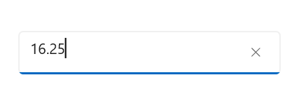

# WinUI NumberBox Overview

The [WinUI NumberBox](https://www.syncfusion.com/winui-controls/numberbox) control provides an intuitive and advanced editor control that allows you to enter numeric values in currency, percent, decimal formats and much more. It validates the user input independent of the custom format applied. It also validates the input when the focus is lost or the `Enter` key is pressed in the [NumberBox](https://help.syncfusion.com/cr/winui/Syncfusion.UI.Xaml.Editors.SfNumberBox.html) control. It supports showing placeholder text in the editor.

## Control Structure

The following table lists the structural elements of the `NumberBox` control:

| Element | Description |
|---------|-------------|
| Text box | Accepts the numeric input from the user. |
| Up-down button | Increases or decreases the value when clicked. |
| Clear button | Clears the current value when clicked. |
| Spinner | Displays the up and down buttons for value navigation. |

## Key Features

* Supports validation of input when the focus is lost or after pressing the `Enter` key.
* Supports increasing and decreasing the value by `PageUp`, `PageDown`, `UpArrow`, `DownArrow` keys and mouse scrolling.
* Supports increasing and decreasing the value using the up-down button. For more details, refer to [Up-Down button](https://help.syncfusion.com/winui/numberbox/updown-button).
* Supports displaying values in different custom formats. For more details, refer to [Value formatting](https://help.syncfusion.com/winui/numberbox/formatting).
* Supports displaying values in currency, percent, and decimal formats.
* Supports displaying values based on different culture and regional settings.
* Supports showing placeholder text when the `NumberBox` value is empty or null.
