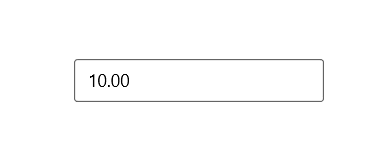

# Value change restriction in WinUI NumberBox

This section describes how to restrict the value change in the `NumberBox` control using `AllowNull`, `Minimum`, and `Maximum` properties.

## Restrict null value

By default, when no value is set for `NumberBox` control or when an invalid input is cleared, the textbox will be empty, as the value of `AllowNull` property is **true** and `Value` property is **null**.
You can reset the value to **0** when input is cleared by setting the `AllowNull` property value as **false**.




<editors:SfNumberBox HorizontalAlignment="Center" VerticalAlignment="Center" Value="10" AllowNull="False" />




SfNumberBox sfNumberBox = new SfNumberBox();
sfNumberBox.HorizontalAlignment = HorizontalAlignment.Center;
sfNumberBox.VerticalAlignment = VerticalAlignment.Center;
sfNumberBox.Value = 10;
sfNumberBox.AllowNull = false;




## Restrict value within range

Using the `Minimum` and `Maximum` properties, you can limit the input value of the `NumberBox` control to a minimum and maximum value range. The default value of the `Minimum` property is **double.MinValue** and `Maximum` property is **double.MaxValue**.




<editors:SfNumberBox HorizontalAlignment="Center" VerticalAlignment="Center" Value="50" Minimum="10" Maximum="30" />




SfNumberBox sfNumberBox = new SfNumberBox();
sfNumberBox.HorizontalAlignment = HorizontalAlignment.Center;
sfNumberBox.VerticalAlignment = VerticalAlignment.Center;
sfNumberBox.Minimum = 10;
sfNumberBox.Maximum = 30;
sfNumberBox.Value = 50;




## Restrict text editing

You can prevent users from editing the numerical value of the `NumberBox` control using the `IsReadOnly` property. By default, the value of `IsReadOnly` property is **false**. 




<editors:SfNumberBox x:Name="sfNumberBox" 
                     HorizontalAlignment="Center" VerticalAlignment="Center" IsReadOnly="True" />




SfNumberBox sfNumberBox = new SfNumberBox();
sfNumberBox.HorizontalAlignment = HorizontalAlignment.Center;
sfNumberBox.VerticalAlignment = VerticalAlignment.Center;
sfNumberBox.IsReadOnly = true;




