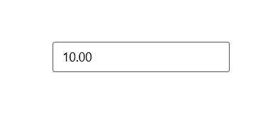

# Value change restriction in WinUI NumberBox

This section describes how to restrict the change in value of the [NumberBox](https://help.syncfusion.com/cr/winui/Syncfusion.UI.Xaml.Editors.SfNumberBox.html) control using [AllowNull](https://help.syncfusion.com/cr/winui/Syncfusion.UI.Xaml.Editors.SfNumberBox.html#Syncfusion_UI_Xaml_Editors_SfNumberBox_AllowNull), [Minimum](https://help.syncfusion.com/cr/winui/Syncfusion.UI.Xaml.Editors.SfNumberBox.html#Syncfusion_UI_Xaml_Editors_SfNumberBox_Minimum), and [Maximum](https://help.syncfusion.com/cr/winui/Syncfusion.UI.Xaml.Editors.SfNumberBox.html#Syncfusion_UI_Xaml_Editors_SfNumberBox_Maximum) properties.

N> The `Syncfusion.Editors.WinUI` NuGet package is supported on WinUI 3 with .NET 5 and later .NET versions. To get started, refer to the [Getting Started with WinUI NumberBox](https://help.syncfusion.com/winui/numberbox/getting-started) documentation.

## Restrict null value

By default, an empty or null value is set in the `NumberBox` control when the input is cleared, as the default value of the `AllowNull` property is **true**. When the [AllowNull](https://help.syncfusion.com/cr/winui/Syncfusion.UI.Xaml.Editors.SfNumberBox.html#Syncfusion_UI_Xaml_Editors_SfNumberBox_AllowNull) property value is **false**, the `NumberBox` control returns the value to **0** in the editor after clearing the input.

N> When the value of the `Minimum` property is **15** and the `AllowNull` property is **true**, a **null** value is returned in the `NumberBox` control after clearing the input.

N> When the value of the `Minimum` property is **15** and the `AllowNull` property is **false**, the minimum value is returned in the `NumberBox` control after clearing the input.




<editors:SfNumberBox HorizontalAlignment="Center"
                     VerticalAlignment="Center" 
                     Value="10" 
                     AllowNull="False" />




using Syncfusion.UI.Xaml.Editors;

SfNumberBox sfNumberBox = new SfNumberBox();
sfNumberBox.HorizontalAlignment = HorizontalAlignment.Center;
sfNumberBox.VerticalAlignment = VerticalAlignment.Center;
sfNumberBox.Value = 10;
sfNumberBox.AllowNull = false;




The following example demonstrates the combined behavior of `Minimum` and `AllowNull`:




<editors:SfNumberBox HorizontalAlignment="Center"
                     VerticalAlignment="Center" 
                     Value="20" 
                     Minimum="15"
                     AllowNull="True" />




using Syncfusion.UI.Xaml.Editors;

SfNumberBox sfNumberBox = new SfNumberBox();
sfNumberBox.HorizontalAlignment = HorizontalAlignment.Center;
sfNumberBox.VerticalAlignment = VerticalAlignment.Center;
sfNumberBox.Value = 20;
sfNumberBox.Minimum = 15;
sfNumberBox.AllowNull = true;
grid.Children.Add(sfNumberBox);




## Restrict value within range

You can restrict users from entering input outside a minimum and maximum range in the `NumberBox` control using the [Minimum](https://help.syncfusion.com/cr/winui/Syncfusion.UI.Xaml.Editors.SfNumberBox.html#Syncfusion_UI_Xaml_Editors_SfNumberBox_Minimum) and [Maximum](https://help.syncfusion.com/cr/winui/Syncfusion.UI.Xaml.Editors.SfNumberBox.html#Syncfusion_UI_Xaml_Editors_SfNumberBox_Maximum) properties. The range is inclusive — a value equal to `Minimum` or `Maximum` is accepted. The default values of both `Minimum` and `Maximum` are **null**.

N> If `Minimum` is greater than `Maximum`, the `Maximum` value is treated as the effective `Minimum` for validation.




<editors:SfNumberBox HorizontalAlignment="Center"
                     VerticalAlignment="Center"
                     Value="50"
                     Minimum="10"
                     Maximum="30" />




using Syncfusion.UI.Xaml.Editors;

SfNumberBox sfNumberBox = new SfNumberBox();
sfNumberBox.HorizontalAlignment = HorizontalAlignment.Center;
sfNumberBox.VerticalAlignment = VerticalAlignment.Center;
sfNumberBox.Minimum = 10;
sfNumberBox.Maximum = 30;
sfNumberBox.Value = 50;




## Restrict text editing

You can prevent users from editing the numerical value in the editor by setting the [IsEditable](https://help.syncfusion.com/cr/winui/Syncfusion.UI.Xaml.Editors.SfNumberBox.html#Syncfusion_UI_Xaml_Editors_SfNumberBox_IsEditable) property to **false**. However, you can still change the value by using the up-down buttons, mouse scroll, keyboard arrows, and page keys. By default, the value of the `IsEditable` property is **true**. For more details on `IsEditable`, refer to [Getting Started with WinUI NumberBox](https://help.syncfusion.com/winui/numberbox/getting-started#clear-button-visibility).




<editors:SfNumberBox x:Name="sfNumberBox" 
                     HorizontalAlignment="Center"
                     VerticalAlignment="Center"
                     IsEditable="True" />




using Syncfusion.UI.Xaml.Editors;

SfNumberBox sfNumberBox = new SfNumberBox();
sfNumberBox.HorizontalAlignment = HorizontalAlignment.Center;
sfNumberBox.VerticalAlignment = VerticalAlignment.Center;
sfNumberBox.IsEditable = true;




