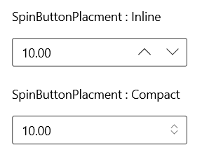

# UpDown Button (SpinButton) in WinUI NumberBox

This section describes how to change value in the `NumberBox` control using keys, mouse scroll and the SpinButton.

## Increase or decrease value

You can increment or decrement the value in the `NumberBox` control by using **UpArrow**, **DownArrow**, **PageUp** and **PageDown** keys. You can change the increment or decrement value when Arrow keys are pressed, using the `SmallChange` property and for Page keys using the `LargeChange` property. By default, the value of `SmallChange` property is **1** and `LargeChange` property  is **10**.

N> The value in `NumberBox` can also be increased or decreased by mouse scrolling. The mouse scrolling increases or decreases the value based on the `SmallChange` property value.




<editors:SfNumberBox HorizontalAlignment="Center" VerticalAlignment="Center" SmallChange="5" Value="10" LargeChange="10" />




SfNumberBox SfNumberBox= new SfNumberBox();
SfNumberBox.PlaceHolderText = "Enter input here...";
sfNumberBox.HorizontalAlignment = HorizontalAlignment.Center;
sfNumberBox.VerticalAlignment = VerticalAlignment.Center;




## UpDown button placement

You can increase or decrease the value of the `NumberBox` control using the spin button. By default, the value of `SpinButtonPlacement` property is **Hidden**. You can change the SpinButton position by setting **Inline** or **Compact** values.

N> When using the spin button, the `NumberBox` value changes based on the value of the `SmallChange` property.




<editors:SfNumberBox x:Name="sfNumberBox" 
                     HorizontalAlignment="Center" VerticalAlignment="Center" SpinButtonPlacement="Inline" />




SfNumberBox sfNumberBox = new SfNumberBox();
sfNumberBox.HorizontalAlignment = HorizontalAlignment.Center;
sfNumberBox.VerticalAlignment = VerticalAlignment.Center;
sfNumberBox.SpinButtonPlacement = NumberBoxSpinButtonPlacementMode.Inline;




