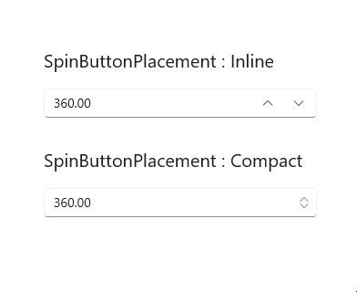
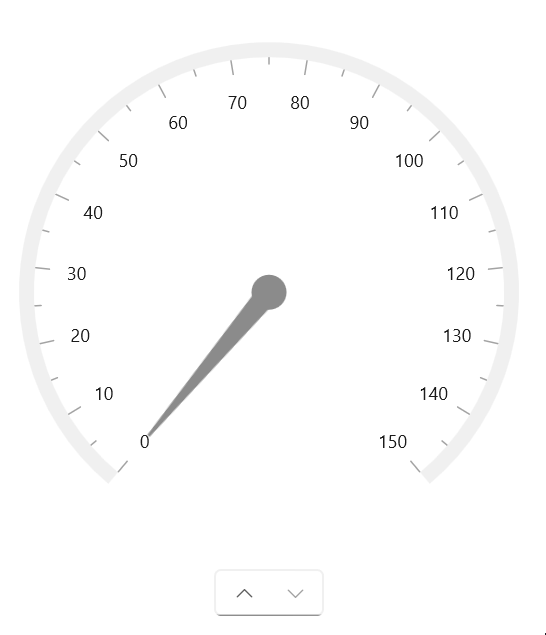
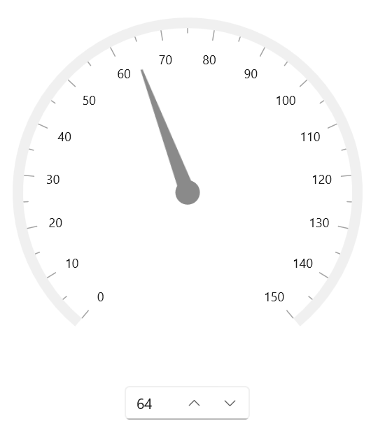

# UpDown Button (Spin Button) in WinUI NumberBox

This section describes how to change the value in the [NumberBox](https://help.syncfusion.com/cr/winui/Syncfusion.UI.Xaml.Editors.SfNumberBox.html) control using keys, mouse scrolling, and the up-down button.

N> The `Syncfusion.Editors.WinUI` NuGet package is supported on WinUI 3 with .NET 5 and later .NET versions. To get started, refer to the [Getting Started with WinUI NumberBox](https://help.syncfusion.com/winui/numberbox/getting-started) documentation.

## Increase or decrease value

You can increment or decrement the value in the `NumberBox` control by using **UpArrow**, **DownArrow**, **PageUp**, and **PageDown** keys. You can change the increment or decrement value when Arrow keys are pressed using the [SmallChange](https://help.syncfusion.com/cr/winui/Syncfusion.UI.Xaml.Editors.SfNumberBox.html#Syncfusion_UI_Xaml_Editors_SfNumberBox_SmallChange) property, and for Page keys using the [LargeChange](https://help.syncfusion.com/cr/winui/Syncfusion.UI.Xaml.Editors.SfNumberBox.html#Syncfusion_UI_Xaml_Editors_SfNumberBox_LargeChange) property. By default, the value of the `SmallChange` property is **1**, and the value of the `LargeChange` property is **10**.

N> The value in the `NumberBox` can also be changed by mouse scrolling. The mouse scrolling increases or decreases the value based on the `SmallChange` property.

N> Keyboard and mouse input respect the `Minimum` and `Maximum` bounds — the value will not increment or decrement beyond those limits.




<editors:SfNumberBox HorizontalAlignment="Center"
                     VerticalAlignment="Center" 
                     SmallChange="5"
                     Value="10"
                     LargeChange="10" />




using Syncfusion.UI.Xaml.Editors;

SfNumberBox sfNumberBox = new SfNumberBox();
SfNumberBox.PlaceholderText = "Enter input here...";
sfNumberBox.HorizontalAlignment = HorizontalAlignment.Center;
sfNumberBox.VerticalAlignment = VerticalAlignment.Center;



## UpDown button placement

You can increase or decrease the value of the `NumberBox` control using the up-down button. By default, the value of the [UpDownPlacementMode](https://help.syncfusion.com/cr/winui/Syncfusion.UI.Xaml.Editors.SfNumberBox.html#Syncfusion_UI_Xaml_Editors_SfNumberBox_UpDownPlacementMode) property is **Hidden**. You can change the up-down button position by setting the `UpDownPlacementMode` property to one of the following values:

 * **Hidden** - The up-down buttons are not displayed.
 * **Inline** - The up-down buttons are displayed next to the text box.
 * **Compact** - The up-down buttons are displayed in a compact position.

N> When using the up-down button, the `NumberBox` control value changes based on the value of the `SmallChange` property.




<editors:SfNumberBox x:Name="sfNumberBox" 
                     HorizontalAlignment="Center"
                     VerticalAlignment="Center"
                     UpDownPlacementMode="Inline" />




using Syncfusion.UI.Xaml.Editors;

SfNumberBox sfNumberBox = new SfNumberBox();
sfNumberBox.HorizontalAlignment = HorizontalAlignment.Center;
sfNumberBox.VerticalAlignment = VerticalAlignment.Center;
sfNumberBox.UpDownPlacementMode = NumberBoxUpDownPlacementMode.Inline;




## TextBox visibility

The [TextBoxVisibility](https://help.syncfusion.com/cr/winui/Syncfusion.UI.Xaml.Editors.SfNumberBox.html#Syncfusion_UI_Xaml_Editors_SfNumberBox_TextBoxVisibility) property can be used to show or hide the text box in the `NumberBox` control. When the text box visibility is collapsed, only the up-down buttons are visible. You can change the control values by using the up-down buttons.

N> This feature is enabled when the `UpDownPlacementMode` value is **Inline**.

The following example hides the text box:




<editors:SfNumberBox x:Name="numberBox"
                     Height="75" 
                     Width="300"
                     TextBoxVisibility="Collapsed"
                     UpDownPlacementMode="Inline"/>




using Syncfusion.UI.Xaml.Editors;

SfNumberBox sfNumberBox = new SfNumberBox();
sfNumberBox.TextBoxVisibility = Visibility.Collapsed;
sfNumberBox.UpDownPlacementMode = NumberBoxUpDownPlacementMode.Inline;




**When `TextBoxVisibility` is `Collapsed`:**

The following example shows the text box:




<editors:SfNumberBox x:Name="numberBox"
                     Height="75" 
                     Width="300"
                     TextBoxVisibility="Visible"
                     UpDownPlacementMode="Inline"/>




using Syncfusion.UI.Xaml.Editors;

SfNumberBox sfNumberBox = new SfNumberBox();
sfNumberBox.Height = 75;
sfNumberBox.Width = 300;
sfNumberBox.TextBoxVisibility = Visibility.Visible;
sfNumberBox.UpDownPlacementMode = NumberBoxUpDownPlacementMode.Inline;




**When `TextBoxVisibility` is `Visible`:**

