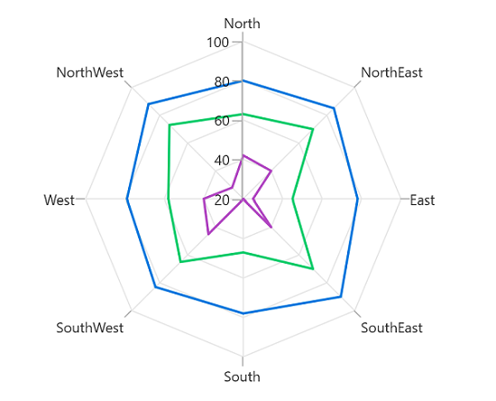
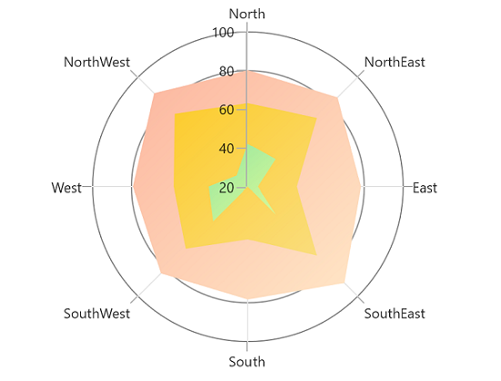
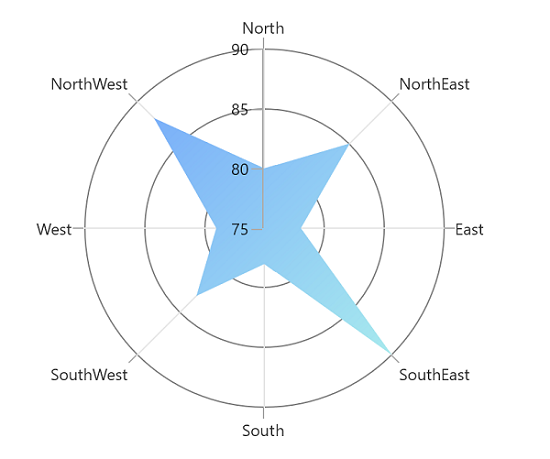

# Appearance in WinUI Chart (SfPolarChart)

The appearance of [SfPolarChart](https://help.syncfusion.com/cr/winui/Syncfusion.UI.Xaml.Charts.SfPolarChart.html) can be customized by using the predefined palettes, custom palettes and gradient, which allows to enrich the application.

## Palettes

[SfPolarChart](https://help.syncfusion.com/cr/winui/Syncfusion.UI.Xaml.Charts.SfPolarChart.html) provides options for applying various kinds of palettes. Some predefined palettes, such as.

* Metro
* AutumnBrights
* FloraHues
* Pineapple
* TomatoSpectrum
* RedChrome
* PurpleChrome
* BlueChrome
* GreenChrome
* Elite
* LightCandy
* SandyBeach

### Applying Palette

Each palette applies a set of predefined brushes to the series in a predefined order. [Metro](https://help.syncfusion.com/cr/winui/Syncfusion.UI.Xaml.Charts.ChartColorPalette.html#Syncfusion_UI_Xaml_Charts_ChartColorPalette_Metro) palette is the default palette. 





<chart:SfPolarChart x:Name="chart"
                    Palette="Metro"
                    GridLineType="Polygon">
        ...
        <chart:SfPolarChart.Series>
            <chart:PolarLineSeries ItemsSource="{Binding PlantDetails}" 
                        XBindingPath="Direction"
                        YBindingPath="Tree" Label="Tree">
            </chart:PolarLineSeries>

            <chart:PolarLineSeries ItemsSource="{Binding PlantDetails}" 
                        XBindingPath="Direction"
                        YBindingPath="Weed" Label="Weed">
            </chart:PolarLineSeries>

            <chart:PolarLineSeries ItemsSource="{Binding PlantDetails}" 
                        XBindingPath="Direction"
                        YBindingPath="Flower" Label="Flower">
            </chart:PolarLineSeries>
        </chart:SfPolarChart.Series>
        ...
</chart:SfPolarChart>





SfPolarChart chart = new SfPolarChart();
chart.Palette = ChartColorPalette.Metro;
chart.GridLineType = PolarChartGridLineType.Polygon;
...
PolarLineSeries series1 = new PolarLineSeries();
series1.XBindingPath = "Direction";
series1.YBindingPath = "Tree";
series1.ItemsSource = viewModel.PlantDetails;

PolarLineSeries series2 = new PolarLineSeries();
series2.XBindingPath = "Direction";
series2.YBindingPath = "Weed";
series2.ItemsSource = viewModel.PlantDetails;

PolarLineSeries series3 = new PolarLineSeries();
series3.XBindingPath = "Direction";
series3.YBindingPath = "Flower";
series3.ItemsSource = viewModel.PlantDetails;
...
this.Content = chart;





**BlueChrome** **Palette**





<chart:SfPolarChart x:Name="chart" 
                Palette="BlueChrome"
                GridLineType="Polygon">
                ...

</chart:SfPolarChart>





SfPolarChart chart = new SfPolarChart();
chart.Palette = ChartColorPalette.BlueChrome;
chart.GridLineType = PolarChartGridLineType.Polygon;
. . .
this.Content = chart;





## Custom Palette

[`SfPolarChart`](https://help.syncfusion.com/cr/winui/Syncfusion.UI.Xaml.Charts.SfPolarChart.html) provides support to define own brushes for the chart with preferred order by using the [CustomBrushes](https://help.syncfusion.com/cr/winui/Syncfusion.UI.Xaml.Charts.ChartColorModel.html#Syncfusion_UI_Xaml_Charts_ChartColorModel_CustomBrushes) property of [ChartColorModel](https://help.syncfusion.com/cr/winui/Syncfusion.UI.Xaml.Charts.ChartColorModel.html) and [Palette](https://help.syncfusion.com/cr/winui/Syncfusion.UI.Xaml.Charts.ChartBase.html#Syncfusion_UI_Xaml_Charts_ChartBase_Palette) value as `Custom`, as shown in the following code example.





<chart:SfPolarChart x:Name="chart" 
                Palette="Custom"
                GridLineType="Polygon">

    <chart:SfPolarChart.ColorModel>
        <chart:ChartColorModel>
            <chart:ChartColorModel.CustomBrushes>
                <SolidColorBrush Color="#0078DE" />
                <SolidColorBrush Color="#00CC6A" />
                <SolidColorBrush Color="#B146C2" />
            </chart:ChartColorModel.CustomBrushes>
        </chart:ChartColorModel>
    </chart:SfPolarChart.ColorModel>
. . .
</chart:SfPolarChart>





SfPolarChart chart = new SfPolarChart();
...
ChartColorModel colorModel = new ChartColorModel();
colorModel.CustomBrushes.Add(new SolidColorBrush(Color.FromArgb(255, 0, 120, 222)));
colorModel.CustomBrushes.Add(new SolidColorBrush(Color.FromArgb(255, 0, 204, 106)));
colorModel.CustomBrushes.Add(new SolidColorBrush(Color.FromArgb(255, 177, 70, 194)));
chart.ColorModel = colorModel;
chart.Palette = ChartColorPalette.Custom;
. . .            
this.Content = chart;





## Applying Gradient

Gradient for the chart can be set by using the [`ColorModel`](https://help.syncfusion.com/cr/winui/Syncfusion.UI.Xaml.Charts.ChartBase.html#Syncfusion_UI_Xaml_Charts_ChartBase_ColorModel) property of the polar chart with the help of `LinearGradientBrush` or `RadialGradientBrush`.





<chart:SfPolarChart Palette="Custom">

    <chart:SfPolarChart.ColorModel>
        <chart:ChartColorModel>
            <chart:ChartColorModel.CustomBrushes>
                <LinearGradientBrush>
                    <GradientStop Offset="1" Color="#FFE7C7" />
                    <GradientStop Offset="0" Color="#FCB69F" />
                </LinearGradientBrush>
                <LinearGradientBrush>
                    <GradientStop Offset="1" Color="#fadd7d" />
                    <GradientStop Offset="0" Color="#fccc2d" />
                </LinearGradientBrush>
                <LinearGradientBrush>
                    <GradientStop Offset="1" Color="#DCFA97" />
                    <GradientStop Offset="0" Color="#96E6A1" />
                </LinearGradientBrush>
            </chart:ChartColorModel.CustomBrushes>
        </chart:ChartColorModel>
    </chart:SfPolarChart.ColorModel>
. . .
</chart:SfPolarChart>





SfPolarChart chart = new SfPolarChart();
...
ChartColorModel colorModel = new ChartColorModel();
LinearGradientBrush gradientColor1 = new LinearGradientBrush();
GradientStop stop1 = new GradientStop() { Offset = 1, Color = Color.FromRgb(255, 231, 199) };
GradientStop stop2 = new GradientStop() { Offset = 0, Color = Color.FromRgb(252, 182, 159) };
gradientColor1.GradientStops.Add(stop1);
gradientColor1.GradientStops.Add(stop2);
LinearGradientBrush gradientColor2 = new LinearGradientBrush();
stop1 = new GradientStop() { Offset = 1, Color = Color.FromRgb(250, 221, 125) };
stop2 = new GradientStop() { Offset = 0, Color = Color.FromRgb(252, 204, 45) };
gradientColor2.GradientStops.Add(stop1);
gradientColor2.GradientStops.Add(stop2);
...
colorModel.CustomBrushes.Add(gradientColor1);
colorModel.CustomBrushes.Add(gradientColor2);
...
chart.ColorModel = colorModel;
chart.Palette = ChartColorPalette.Custom;
. . .





Gradient color using the [Interior](https://help.syncfusion.com/cr/winui/Syncfusion.UI.Xaml.Charts.ChartSeriesBase.html#Syncfusion_UI_Xaml_Charts_ChartSeriesBase_Interior) property of series with `LinearGradientBrush`.





<chart:SfPolarChart>
    ...
    <chart:PolarAreaSeries  ItemsSource="{Binding PlantDetails}" 
                            XBindingPath="Direction" 
                            YBindingPath="Tree" Label="Tree">

        <chart:PolarAreaSeries.Interior>
            <LinearGradientBrush>
                <GradientStop Offset="1" Color="#A8EAEE" />
                <GradientStop Offset="0" Color="#7BB0F9" />
            </LinearGradientBrush>
        </chart:PolarAreaSeries.Interior>
                   
    </chart:PolarAreaSeries>
...
</chart:SfPolarChart>





SfPolarChart chart = new SfPolarChart();
. . .
LinearGradientBrush gradientColor = new LinearGradientBrush();
GradientStop stop1 = new GradientStop() { Offset = 1, Color = Color.FromRgb(168, 234, 238) };
GradientStop stop2 = new GradientStop() { Offset = 0, Color = Color.FromRgb(123, 176, 249) };
gradientColor.GradientStops.Add(stop1);
gradientColor.GradientStops.Add(stop2);

PolarAreaSeries series = new PolarAreaSeries();
series.Interior = gradientColor;
...





