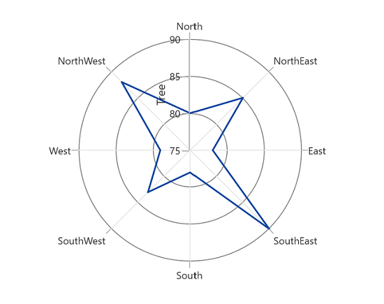
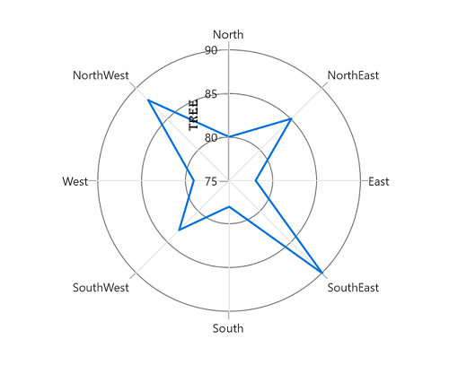
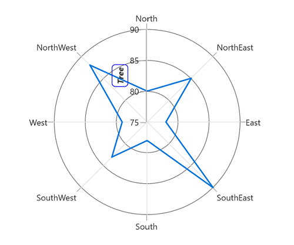

# Axis Title in WinUI Chart (SfPolarChart)

The [Header](https://help.syncfusion.com/cr/winui/Syncfusion.UI.Xaml.Charts.ChartAxis.html#Syncfusion_UI_Xaml_Charts_ChartAxis_Header) property is used to define the title for the chart axis. It accepts any `UIElement` as content for the chart axis header.





<chart:SfPolarChart>
    <chart:SfPolarChart.PrimaryAxis>
        <chart:CategoryAxis/>
    </chart:SfPolarChart.PrimaryAxis>
    <chart:SfPolarChart.SecondaryAxis>
        <chart:NumericalAxis Header="Tree"/>
    </chart:SfPolarChart.SecondaryAxis>
...
</chart:SfPolarChart>





SfPolarChart chart = new SfPolarChart();
chart.PrimaryAxis = new CategoryAxis();
chart.SecondaryAxis = new NumericalAxis()
{
    Header = "Tree" 
};
...





N> Polar chart supports title for secondary axis only.

## Style

The [`HeaderStyle`](https://help.syncfusion.com/cr/winui/Syncfusion.UI.Xaml.Charts.ChartAxis.html#Syncfusion_UI_Xaml_Charts_ChartAxis_HeaderStyle) property is used to provide style for the axis header.





<chart:SfPolarChart>
    <chart:SfPolarChart.PrimaryAxis>
        <chart:CategoryAxis/>
    </chart:SfPolarChart.PrimaryAxis>
    <chart:SfPolarChart.SecondaryAxis>
        <chart:NumericalAxis Header="Tree">
            <chart:NumericalAxis.HeaderStyle>
                <chart:LabelStyle FontFamily="Algerian" FontSize="13" Foreground="Black"/>
            </chart:NumericalAxis.HeaderStyle>
        </chart:NumericalAxis>
    </chart:SfPolarChart.SecondaryAxis>
    ...
</chart:SfPolarChart>





SfPolarChart chart = new SfPolarChart();
...
LabelStyle style = new LabelStyle()
{
    FontFamily = new FontFamily("Algerian"),
    FontSize = 13,
    Foreground = new SolidColorBrush(Colors.Black)
};

chart.PrimaryAxis = new CategoryAxis();

chart.SecondaryAxis = new NumericalAxis()
{
    Header = "Tree",
    LabelStyle = style
};
...





## Template

The appearance of the header can be customized using the [`HeaderTemplate`](https://help.syncfusion.com/cr/winui/Syncfusion.UI.Xaml.Charts.ChartAxis.html#Syncfusion_UI_Xaml_Charts_ChartAxis_HeaderTemplate) property.





<chart:SfPolarChart>
    <chart:SfPolarChart.Resources>
        <DataTemplate x:Key="headerTemplate">
            <Border BorderBrush="Blue" CornerRadius="5" BorderThickness="1">
                <TextBlock Text="{Binding}" FontSize="12" Margin="3"
                            FontStyle="Italic" FontWeight="Bold"/>
            </Border>
        </DataTemplate>
    </chart:SfPolarChart.Resources>

    <chart:SfPolarChart.PrimaryAxis>
        <chart:CategoryAxis/>
    </chart:SfPolarChart.PrimaryAxis>
    <chart:SfPolarChart.SecondaryAxis>
        <chart:NumericalAxis Header="Tree" HeaderTemplate="{StaticResource headerTemplate}">
        </chart:NumericalAxis>
    </chart:SfPolarChart.SecondaryAxis>
    ...
</chart:SfPolarChart>





SfPolarChart chart = new SfPolarChart();
...

chart.PrimaryAxis = new CategoryAxis();

chart.SecondaryAxis = new NumericalAxis()
{
    Header = "Tree",
    HeaderTemplate = chart.Resources["headerTemplate"] as DataTemplate
};
...





