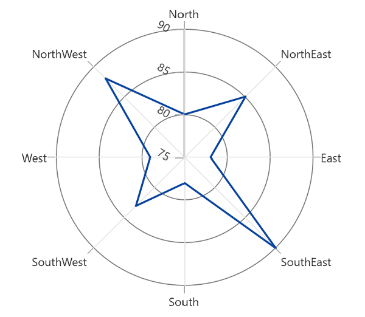

# Axis labels in WinUI Polar Chart

## Rotation angle

The [`LabelRotationAngle`]() property is used to define the angle for the label content. The following code example illustrates the [`LabelRotationAngle`]().





<chart:SfPolarChart>
    ...
    <chart:SfPolarChart.SecondaryAxis>
        <chart:NumericalAxis LabelRotationAngle="30"/>
    </chart:SfPolarChart.SecondaryAxis>
    ...
</chart:SfPolarChart>





SfPolarChart chart = new SfPolarChart();
...
chart.PrimaryAxis = new CategoryAxis();
chart.SecondaryAxis = new NumericalAxis()
{
    LabelRotationAngle = 30,
}
...





## Custom axis Labels

Chart axis allows user to define the own axis labels. The [`Content`]() and [`Position`]() property of [ChartAxisLabel]() used to define the labels for axis using the [`CustomLabels`]() property as in the below code sample.





<chart:SfPolarChart Width="500" Height="300"  Palette="BlueChrome">
                
    <chart:SfPolarChart.PrimaryAxis>
        <chart:CategoryAxis >
            <chart:CategoryAxis.CustomLabels>
                <chart:ChartAxisLabel Position="0" Content="North(0°)"/>
                <chart:ChartAxisLabel Position="1" Content="NorthEast(45°)"/>
                <chart:ChartAxisLabel Position="2" Content="East(90°)"/>
                <chart:ChartAxisLabel Position="3" Content="SouthEast(135°)"/>
                <chart:ChartAxisLabel Position="4" Content="South(180°)"/>
                <chart:ChartAxisLabel Position="5" Content="SouthWest(225°)"/>
                <chart:ChartAxisLabel Position="6" Content="West(270°)"/>
                <chart:ChartAxisLabel Position="7" Content="NorthWest(315°)"/>
            </chart:CategoryAxis.CustomLabels>
        </chart:CategoryAxis>
    </chart:SfPolarChart.PrimaryAxis>
                    
    <chart:SfPolarChart.SecondaryAxis>
        <chart:NumericalAxis/>
    </chart:SfPolarChart.SecondaryAxis>
    ...
</chart:SfPolarChart>





SfPolarChart chart = new SfPolarChart();

CategoryAxis axis = new CategoryAxis();

axis.CustomLabels.Add(new ChartAxisLabel() { Position = 0, Content = "North(0°)" });
axis.CustomLabels.Add(new ChartAxisLabel() { Position = 1, Content = "NorthEast(45°)" });
axis.CustomLabels.Add(new ChartAxisLabel() { Position = 2, Content = "East(90°)" });
axis.CustomLabels.Add(new ChartAxisLabel() { Position = 3, Content = "SouthEast(135°)" });
axis.CustomLabels.Add(new ChartAxisLabel() { Position = 4, Content = "South(180°)" });
axis.CustomLabels.Add(new ChartAxisLabel() { Position = 5, Content = "SouthWest(225°)" });
axis.CustomLabels.Add(new ChartAxisLabel() { Position = 6, Content = "West(270°)" });
axis.CustomLabels.Add(new ChartAxisLabel() { Position = 7, Content = "NorthWest(315°)" });

chart.PrimaryAxis = axis;

chart.SecondaryAxis = new NumericalAxis();
...





N> Also, directly bind the collection of labels to the [`LabelSource`]() property for defining custom labels.

The following code sample demonstrates how to bind the collection of labels to the [LabelSource]().





<chart:SfPolarChart>
        
    <chart:SfPolarChart.PrimaryAxis>
        <chart:CategoryAxis LabelSource="{Binding Labels}" ContentPath="Content"/>
    </chart:SfPolarChart.PrimaryAxis>
        
    <chart:SfPolarChart.SecondaryAxis>
        <chart:NumericalAxis/>
    </chart:SfPolarChart.SecondaryAxis>
    ...
</chart:SfPolarChart>





SfPolarChart chart = new SfPolarChart();

chart.PrimaryAxis = new CategoryAxis()
{
    ContentPath = "Content",
    PositionPath = "Position",
    LabelsSource = viewModel.Labels,
};

...

public List<LabelItem> Labels { get; set; }

Labels = new List<LabelItem>
{
    new LabelItem() {Position=0, Content = "North(0°)"},
    new LabelItem() {Position=1, Content = "NorthEast(45°)"},
    new LabelItem() {Position=2, Content = "East(90°)" },
    new LabelItem() {Position=3, Content = "SouthEast(135°)"},
    new LabelItem() {Position=4, Content = "South(180°)"},
    new LabelItem() {Position=5, Content = "SouthWest(225°)"},
    new LabelItem() {Position=6, Content = "West(270°)"},
    new LabelItem() {Position=7, Content = "NorthWest(315°)"},
};

public class LabelItem
{
    public string Content { get; set; }
    public int Position { get; set; }
}





## Formatting axis label

Axis labels can be formatted by predefined formatting types by using the [LabelFormat]() property based on the axis types.





<chart:SfPolarChart>
            
    <chart:SfPolarChart.PrimaryAxis>
        <chart:CategoryAxis/>
    </chart:SfPolarChart.PrimaryAxis>
                
    <chart:SfPolarChart.SecondaryAxis>
        <chart:NumericalAxis LabelFormat="0.0"/>
    </chart:SfPolarChart.SecondaryAxis>
    ...

</chart:SfPolarChart>





SfPolarChart chart = new SfPolarChart();

chart.PrimaryAxis = new CategoryAxis();

chart.SecondaryAxis = new NumericalAxis()
{
    LabelFormat = "0.0",
};
...





## Label template

The appearance of the axis labels can be customized by using the [`LabelTemplate`]() property of axis.





<chart:SfPolarChart>

    <chart:SfPolarChart.Resources>
        <DataTemplate x:Key="labelTemplate">
            <Border Background="Blue" CornerRadius="5" BorderThickness="1">
                <TextBlock Text="{Binding Content}" Foreground="White" FontStyle="Italic" FontSize="10" FontWeight="Bold" Margin="3"/>
            </Border>
        </DataTemplate>
    </chart:SfPolarChart.Resources>

    <chart:SfPolarChart.PrimaryAxis>
        <chart:DateTimeAxis LabelTemplate="{StaticResource labelTemplate}"/>
    </chart:SfPolarChart.PrimaryAxis>

    <chart:SfPolarChart.SecondaryAxis>
        <chart:NumericalAxis/>
    </chart:SfPolarChart.SecondaryAxis>
    ...

</chart:SfPolarChart>





SfPolarChart chart = new SfPolarChart();

chart.PrimaryAxis = new CategoryAxis()
{
    LabelTemplate = chart.Resources["labelTemplate"] as DataTemplate
};

chart.SecondaryAxis = new NumericalAxis();
...





