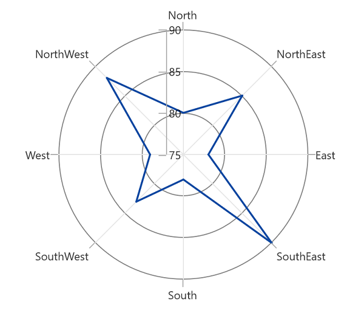
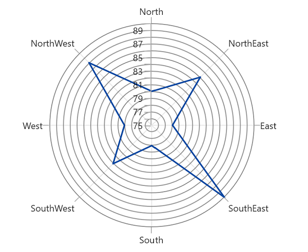
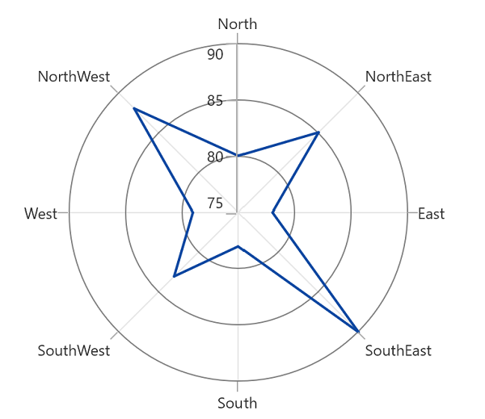

# Axis Labels in  WinUI Polar Chart

Labels will be generated by the range and the values binded to [`XBindingPath`]() or [`YBindingPath`]() properties.

## Positioning the chart axis labels

The [`LabelsPosition`]() property is used to position the axis label either inside or outside the chart plotting area. By default, [LabelsPosition]() is [`Outside`]().

**Inside**





<chart:SfPolarChart>
    ...
    <chart:SfPolarChart.SecondaryAxis>
        <chart:NumericalAxis LabelPosition="Inside">
        </chart:NumericalAxis>
    </chart:SfPolarChart.SecondaryAxis>
    ...
</chart:SfPolarChart>





SfPolarChart chart = new SfPolarChart();
...

chart.SecondaryAxis = new NumericalAxis()
{
    LabelsPosition = AxisElementPosition.Inside,
}
...





**LabelRotationAngle**

[`LabelRotationAngle`]() property allows you to define the angle for the label content. The following code example illustrates the [`LabelRotationAngle`]().





<chart:SfPolarChart>
    ...
    <chart:SfPolarChart.SecondaryAxis>
        <chart:NumericalAxis LabelRotationAngle="30"/>
    </chart:SfPolarChart.SecondaryAxis>
    ...
</chart:SfPolarChart>





SfPolarChart chart = new SfPolarChart();
...
chart.PrimaryAxis = new CategoryAxis();
chart.SecondaryAxis = new NumericalAxis()
{
    LabelRotationAngle = 30,
}
...





## Customize chart axis Labels

Polar chart allows user to define the labels for the axis. For defining the axis label you have to set the [`LabelContent`]() and [`Position`]() property .You can define the labels using [`CustomLabels`]() property as in the below code snippet.





<chart:SfPolarChart Width="500" Height="300"  Palette="BlueChrome">
                
    <chart:SfPolarChart.PrimaryAxis>
        <chart:CategoryAxis >
            <chart:CategoryAxis.CustomLabels>
                <chart:ChartAxisLabel Position="0" Content="North(0°)"/>
                <chart:ChartAxisLabel Position="1" Content="NorthEast(45°)"/>
                <chart:ChartAxisLabel Position="2" Content="East(90°)"/>
                <chart:ChartAxisLabel Position="3" Content="SouthEast(135°)"/>
                <chart:ChartAxisLabel Position="4" Content="South(180°)"/>
                <chart:ChartAxisLabel Position="5" Content="SouthWest(225°)"/>
                <chart:ChartAxisLabel Position="6" Content="West(270°)"/>
                <chart:ChartAxisLabel Position="7" Content="NorthWest(315°)"/>
            </chart:CategoryAxis.CustomLabels>
        </chart:CategoryAxis>
    </chart:SfPolarChart.PrimaryAxis>
                    
    <chart:SfPolarChart.SecondaryAxis>
        <chart:NumericalAxis/>
    </chart:SfPolarChart.SecondaryAxis>
    ...
</chart:SfPolarChart>





SfPolarChart chart = new SfPolarChart();

CategoryAxis axis = new CategoryAxis();

axis.CustomLabels.Add(new ChartAxisLabel() { Position = 0, Content = "North(0°)" });
axis.CustomLabels.Add(new ChartAxisLabel() { Position = 1, Content = "NorthEast(45°)" });
axis.CustomLabels.Add(new ChartAxisLabel() { Position = 2, Content = "East(90°)" });
axis.CustomLabels.Add(new ChartAxisLabel() { Position = 3, Content = "SouthEast(135°)" });
axis.CustomLabels.Add(new ChartAxisLabel() { Position = 4, Content = "South(180°)" });
axis.CustomLabels.Add(new ChartAxisLabel() { Position = 5, Content = "SouthWest(225°)" });
axis.CustomLabels.Add(new ChartAxisLabel() { Position = 6, Content = "West(270°)" });
axis.CustomLabels.Add(new ChartAxisLabel() { Position = 7, Content = "NorthWest(315°)" });

chart.PrimaryAxis = axis;

chart.SecondaryAxis = new NumericalAxis();
...





N> Also, directly bind the collection of labels to the [`LabelSource`]() property for defining custom labels.





<chart:SfPolarChart>
        
    <chart:SfPolarChart.PrimaryAxis>
        <chart:CategoryAxis LabelSource="{Binding Labels}" ContentPath="Content"/>
    </chart:SfPolarChart.PrimaryAxis>
        
    <chart:SfPolarChart.SecondaryAxis>
        <chart:NumericalAxis/>
    </chart:SfPolarChart.SecondaryAxis>
    ...
</chart:SfPolarChart>





SfPolarChart chart = new SfPolarChart();

chart.PrimaryAxis = new CategoryAxis()
{
    ContentPath = "Content",
    PositionPath = "Position",
    LabelsSource = Labels,
};

...

public List<LabelItem> Labels { get; set; }

Labels = new List<LabelItem>
{
    new LabelItem() {Position=0, Content = "North(0°)"},
    new LabelItem() {Position=1, Content = "NorthEast(45°)"},
    new LabelItem() {Position=2, Content = "East(90°)" },
    new LabelItem() {Position=3, Content = "SouthEast(135°)"},
    new LabelItem() {Position=4, Content = "South(180°)"},
    new LabelItem() {Position=5, Content = "SouthWest(225°)"},
    new LabelItem() {Position=6, Content = "West(270°)"},
    new LabelItem() {Position=7, Content = "NorthWest(315°)"},
};

public class LabelItem
{
    public string Content { get; set; }
    public int Position { get; set; }
}





## Formatting chart axis labels

Axis labels can be formatting by predefined formatting types based on the axis types.

**NumericalAxis**





<chart:SfPolarChart>
            
    <chart:SfPolarChart.PrimaryAxis>
        <chart:CategoryAxis/>
    </chart:SfPolarChart.PrimaryAxis>
                
    <chart:SfPolarChart.SecondaryAxis>
        <chart:NumericalAxis LabelFormat="0.0"/>
    </chart:SfPolarChart.SecondaryAxis>
    ...

</chart:SfPolarChart>





SfPolarChart chart = new SfPolarChart();

chart.PrimaryAxis = new CategoryAxis();

chart.SecondaryAxis = new NumericalAxis()
{
    LabelFormat = "0.0",
};
...





**DateTimeAxis**





<chart:SfPolarChart>
            
    <chart:SfPolarChart.PrimaryAxis>
        <chart:DateTimeAxis Interval="1" IntervalType="Days" LabelFormat="MMM/dd"/>
    </chart:SfPolarChart.PrimaryAxis>
            
    <chart:SfPolarChart.SecondaryAxis>
        <chart:NumericalAxis/>
    </chart:SfPolarChart.SecondaryAxis>
    ...

</chart:SfPolarChart>





SfPolarChart chart = new SfPolarChart();

chart.PrimaryAxis = new DateTimeAxis()
{
    Interval = 1,
    IntervalType = DateTimeIntervalType.Days,
    LabelFormat = "MMM/dd",
};

chart.SecondaryAxis = new NumericalAxis();
...





## Label template

[`LabelTemplate`]() property allows you to define the appearance for the axis labels. The following code example illustrates the [`LabelTemplate`]() property.





<chart:SfPolarChart>

    <chart:SfPolarChart.Resources>
        <DataTemplate x:Key="labelTemplate">
            <Border Background="Blue" CornerRadius="5" BorderThickness="1">
                <TextBlock Text="{Binding Content}" Foreground="White" FontStyle="Italic" FontSize="10" FontWeight="Bold"                      Margin="3"/>
            </Border>
        </DataTemplate>
    </chart:SfPolarChart.Resources>

    <chart:SfPolarChart.PrimaryAxis>
        <chart:DateTimeAxis LabelTemplate="{StaticResource labelTemplate}"/>
    </chart:SfPolarChart.PrimaryAxis>

    <chart:SfPolarChart.SecondaryAxis>
        <chart:NumericalAxis/>
    </chart:SfPolarChart.SecondaryAxis>
    ...

</chart:SfPolarChart>





SfPolarChart chart = new SfPolarChart();

chart.PrimaryAxis = new CategoryAxis()
{
    LabelTemplate = chart.Resources["labelTemplate"] as DataTemplate
};

chart.SecondaryAxis = new NumericalAxis();
...





## Label extent

The [LabelExtent]() property allows us to set the distance between the axis header and the axis. The following code snippet defines the [`LabelExtent`]() property.





<chart:SfPolarChart>
        
    <chart:SfPolarChart.PrimaryAxis>
        <chart:CategoryAxis/>
    </chart:SfPolarChart.PrimaryAxis>
            
    <chart:SfPolarChart.SecondaryAxis>
        <chart:NumericalAxis Header="Tree" LabelExtent="30" />
    </chart:SfPolarChart.SecondaryAxis>
    ...

</chart:SfPolarChart>





SfPolarChart chart = new SfPolarChart();

chart.PrimaryAxis = new NumericalAxis();

chart.SecondaryAxis = new NumericalAxis();
{
    Header = "Tree",
    LabelExtent = 30,
};
...





## Smart axis labels

When there are more number of axis labels, they may overlap with each other. SfPolarChart provides support to handle the overlapping labels using the [`LabelsIntersectAction`]() property. By default the [`LabelsIntersectAction`]() value is [`Hide`]().

The following are the options for intersecting action.

| Actions | Description |
|--|--|
| None | Used to display all the label even if it intersects |
| Hide | Used to hide the labels if it intersects |
| MultipleRows | Used to move the labels to next row if it intersects |
| Auto | Used to rotate the labels if it intersects |

**Hide**

Hide option is used to hide the labels if it intersects. The following code snippet demonstrates the [LabelsIntersectAction]() as [Hide]() option.





<chart:SfPolarChart>
        
    <chart:SfPolarChart.PrimaryAxis>
        <chart:CategoryAxis/>
    </chart:SfPolarChart.PrimaryAxis>

    <chart:SfPolarChart.SecondaryAxis>
        <chart:NumericalAxis LabelIntersectAction="Hide"
                    Minimum="75"  Maximum="90" Interval="1"/>
    </chart:SfPolarChart.SecondaryAxis>
    ...

</chart:SfPolarChart>





SfPolarChart chart = new SfPolarChart();

chart.PrimaryAxis = new CategoryAxis();
{
    LabelsIntersectAction = AxisLabelsIntersectAction.None,
};

chart.SecondaryAxis = new NumericalAxis()
{
    LabelsIntersectAction = AxisLabelsIntersectAction.None,    
    Minimum = 75,
    Maximum = 90,
    Interval = 1,
};
...





## EdgeLabelsDrawingMode

SfPolarChart provides support to customize the position of the edge labels in axis using the [`EdgeLabelsDrawingMode`]() property. [`EdgeLabelsDrawingMode`]() property default value is [`Center`]().

The following are the customizing options in [`EdgeLabelsDrawingMode`]().

| Action | Description |
|--|--|
| Center | Positions the label with tick line as center. |
| Fit | Position the gridline inside based on the edge label size |
| Hide | Hides the edge labels. |
| Shift | Shifts the edge labels to the left or right so that it comes inside the chart area. |

**Shift**





<chart:SfPolarChart>
        
<chart:SfPolarChart.PrimaryAxis>
    <chart:CategoryAxis/>
</chart:SfPolarChart.PrimaryAxis>
        
<chart:SfPolarChart.SecondaryAxis>
    <chart:NumericalAxis EdgeLabelsDrawingMode="Shift"/>
</chart:SfPolarChart.SecondaryAxis>
...

</chart:SfPolarChart>





SfPolarChart chart = new SfPolarChart();

chart.PrimaryAxis = new CategoryAxis();

chart.SecondaryAxis = new NumericalAxis()
{
    EdgeLabelsDrawingMode = EdgeLabelsDrawingMode.Shift,
};
...





