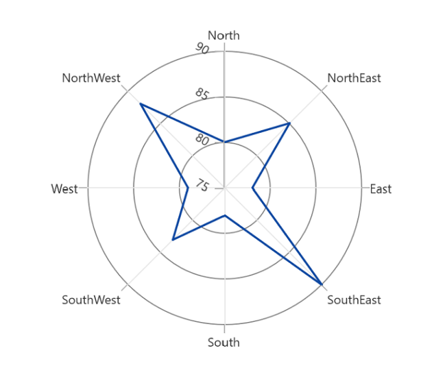
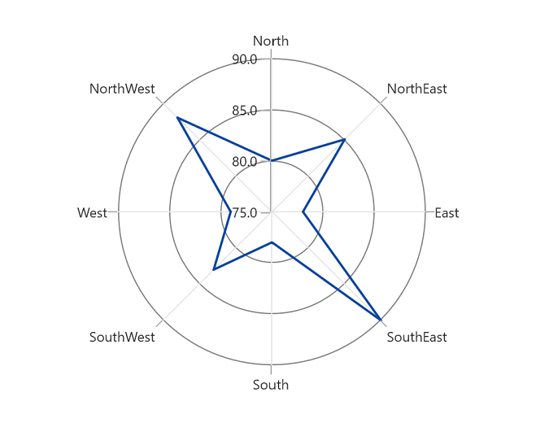
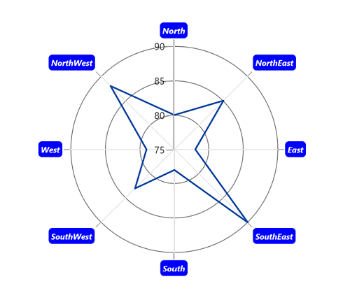

# Axis labels in WinUI Chart

Axis labels are used to show the units or measures or category values of axis to visualize the data. It will be generated based on the range and values binded to the series in the chart. 

## Rotation

The [LabelRotationAngle](https://help.syncfusion.com/cr/winui/Syncfusion.UI.Xaml.Charts.ChartAxis.html#Syncfusion_UI_Xaml_Charts_ChartAxis_LabelRotationAngle) property is used to define the angle for the label content.





<chart:SfPolarChart>
    ...
    <chart:SfPolarChart.SecondaryAxis>
        <chart:NumericalAxis LabelRotationAngle="30"/>
    </chart:SfPolarChart.SecondaryAxis>
    ...
</chart:SfPolarChart>





SfPolarChart chart = new SfPolarChart();
...
chart.PrimaryAxis = new CategoryAxis();
chart.SecondaryAxis = new NumericalAxis()
{
    LabelRotationAngle = 30,
}
...





## Format

Axis labels can be formatted by predefined formatting types by using the [LabelFormat](https://help.syncfusion.com/cr/winui/Syncfusion.UI.Xaml.Charts.ChartAxis.html#Syncfusion_UI_Xaml_Charts_ChartAxis_LabelFormat) property based on the axis types.





<chart:SfPolarChart>
            
    <chart:SfPolarChart.PrimaryAxis>
        <chart:CategoryAxis/>
    </chart:SfPolarChart.PrimaryAxis>
                
    <chart:SfPolarChart.SecondaryAxis>
        <chart:NumericalAxis LabelFormat="0.0"/>
    </chart:SfPolarChart.SecondaryAxis>
    ...

</chart:SfPolarChart>





SfPolarChart chart = new SfPolarChart();

chart.PrimaryAxis = new CategoryAxis();

chart.SecondaryAxis = new NumericalAxis()
{
    LabelFormat = "0.0",
};
...





## Template

The appearance of the axis labels can be customized by using the [LabelTemplate](https://help.syncfusion.com/cr/winui/Syncfusion.UI.Xaml.Charts.ChartAxis.html#Syncfusion_UI_Xaml_Charts_ChartAxis_LabelTemplate) property of axis.





<chart:SfPolarChart x:Name="chart">

    <chart:SfPolarChart.Resources>
        <DataTemplate x:Key="labelTemplate">
            <Border Background="Blue" CornerRadius="5" BorderThickness="1">
                <TextBlock Text="{Binding Content}" Foreground="White" FontStyle="Italic" FontSize="10" FontWeight="Bold" Margin="3"/>
            </Border>
        </DataTemplate>
    </chart:SfPolarChart.Resources>

    <chart:SfPolarChart.PrimaryAxis>
        <chart:CategoryAxis LabelTemplate="{StaticResource labelTemplate}"/>
    </chart:SfPolarChart.PrimaryAxis>

    <chart:SfPolarChart.SecondaryAxis>
        <chart:NumericalAxis/>
    </chart:SfPolarChart.SecondaryAxis>
    ...

</chart:SfPolarChart>





SfPolarChart chart = new SfPolarChart();

chart.PrimaryAxis = new CategoryAxis()
{
    LabelTemplate = chart.Resources["labelTemplate"] as DataTemplate
};

chart.SecondaryAxis = new NumericalAxis();
...





