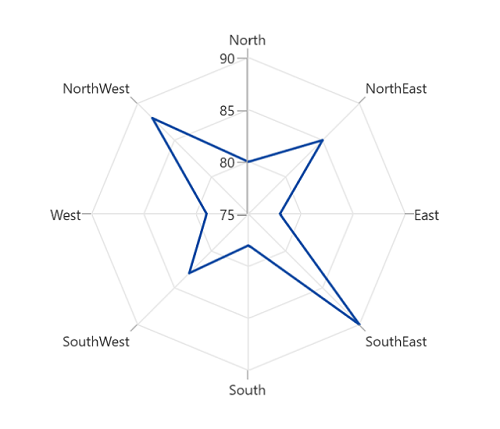
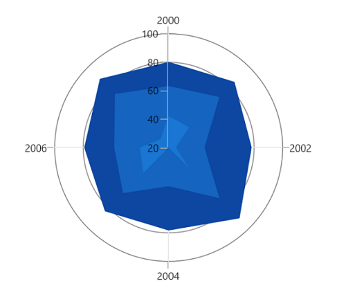
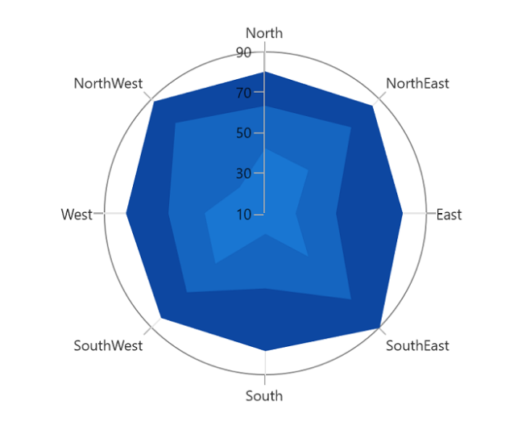
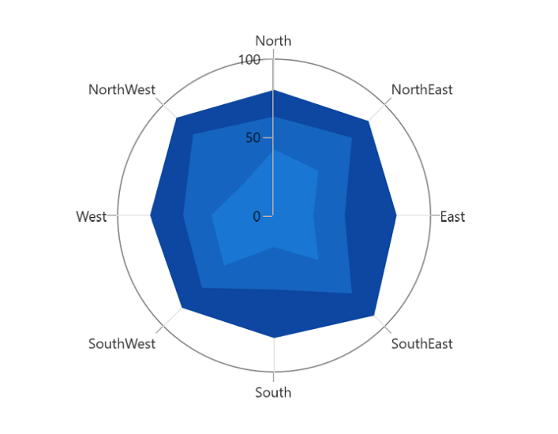
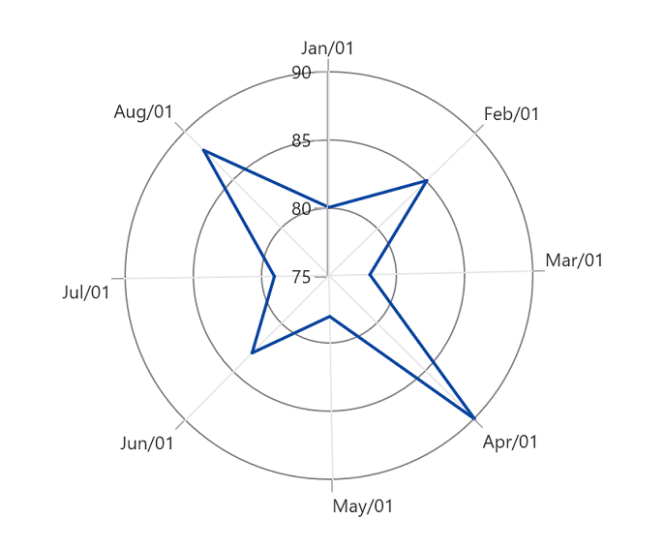

# Types of Axis in WinUI Chart (SfPolarChart) 

Polar chart supports the following types of chart axis.

* CategoryAxis
* NumericalAxis
* DateTimeAxis

## Category Axis

The [CategoryAxis](https://help.syncfusion.com/cr/winui/Syncfusion.UI.Xaml.Charts.CategoryAxis.html) is an indexed based axis that plots values based on the index of the data point collection. The points are equally spaced here.





<chart:SfPolarChart>

    <chart:SfPolarChart.PrimaryAxis>
        <chart:CategoryAxis/>
    </chart:SfPolarChart.PrimaryAxis>

    <chart:SfPolarChart.SecondaryAxis>
        <chart:NumericalAxis/>
    </chart:SfPolarChart.SecondaryAxis>
...

</chart:SfPolarChart>





SfPolarChart chart = new SfPolarChart();
chart.PrimaryAxis = new CategoryAxis();
chart.SecondaryAxis = new NumericalAxis();
...





## Numerical Axis

The [NumericalAxis](https://help.syncfusion.com/cr/winui/Syncfusion.UI.Xaml.Charts.NumericalAxis.html) is used to plot the numerical values to the chart. [`NumericalAxis`](https://help.syncfusion.com/cr/winui/Syncfusion.UI.Xaml.Charts.NumericalAxis.html) can be defined for both [`PrimaryAxis`](https://help.syncfusion.com/cr/winui/Syncfusion.UI.Xaml.Charts.SfPolarChart.html#Syncfusion_UI_Xaml_Charts_SfPolarChart_PrimaryAxis) and [`SecondaryAxis`](https://help.syncfusion.com/cr/winui/Syncfusion.UI.Xaml.Charts.SfPolarChart.html#Syncfusion_UI_Xaml_Charts_SfPolarChart_SecondaryAxis).





<chart:SfPolarChart>

    <chart:SfPolarChart.PrimaryAxis>
        <chart:NumericalAxis/>
    </chart:SfPolarChart.PrimaryAxis>
    
    <chart:SfPolarChart.SecondaryAxis>
        <chart:NumericalAxis/>
    </chart:SfPolarChart.SecondaryAxis>
    ...
    
</chart:SfPolarChart>





SfPolarChart chart = new SfPolarChart();
...
chart.PrimaryAxis = new NumericalAxis();
chart.SecondaryAxis = new NumericalAxis();
...





### Customizing the range

[Maximum](https://help.syncfusion.com/cr/winui/Syncfusion.UI.Xaml.Charts.NumericalAxis.html#Syncfusion_UI_Xaml_Charts_NumericalAxis_Maximum) and [Minimum](https://help.syncfusion.com/cr/winui/Syncfusion.UI.Xaml.Charts.NumericalAxis.html#Syncfusion_UI_Xaml_Charts_NumericalAxis_Minimum) properties of axis is used for setting the maximum and minimum value of the axis range respectively.

N> If  minimum or maximum value is set, the other value is calculated by default internally.





<chart:SfPolarChart>
    <chart:SfPolarChart.SecondaryAxis>
        <chart:NumericalAxis Minimum="10" Maximum="90" Interval="20" />
    </chart:SfPolarChart.SecondaryAxis>
    ...
</chart:SfPolarChart>





SfPolarChart chart = new SfPolarChart();
...
chart.SecondaryAxis = new NumericalAxis()
{
    Maximum = 90,
    Minimum = 10,
    Interval = 20,
};
...





### Start from zero

[NumericalAxis](https://help.syncfusion.com/cr/winui/Syncfusion.UI.Xaml.Charts.NumericalAxis.html) will calculate the start range based on the data points binded to the chart. By defining the [StartRangeFromZero](https://help.syncfusion.com/cr/winui/Syncfusion.UI.Xaml.Charts.NumericalAxis.html#Syncfusion_UI_Xaml_Charts_NumericalAxis_StartRangeFromZero) property to True, numerical axis start the range from zero.

N> By default, axis range is calculated between the minimum and maximum value of the data points.





<chart:SfPolarChart>
    <chart:SfPolarChart.SecondaryAxis>
        <chart:NumericalAxis StartRangeFromZero="True" />
    </chart:SfPolarChart.SecondaryAxis>
    ...
</chart:SfPolarChart>





SfPolarChart chart = new SfPolarChart();
...
chart.SecondaryAxis = new NumericalAxis()
{
   StartRangeFromZero = true
};
...





## DateTime Axis

The [DateTimeAxis](https://help.syncfusion.com/cr/winui/Syncfusion.UI.Xaml.Charts.DateTimeAxis.html) is used to plot the chart with `DateTime` values.





<chart:SfPolarChart>
            
    <chart:SfPolarChart.PrimaryAxis>
        <chart:DateTimeAxis Interval="1" IntervalType="Months" LabelFormat="MMM/dd"/>
    </chart:SfPolarChart.PrimaryAxis>
            
    <chart:SfPolarChart.SecondaryAxis>
        <chart:NumericalAxis/>
    </chart:SfPolarChart.SecondaryAxis>
    ...

</chart:SfPolarChart>





SfPolarChart chart = new SfPolarChart();

chart.PrimaryAxis = new DateTimeAxis()
{
    Interval = 1,
    IntervalType = DateTimeIntervalType.Months,
    LabelFormat = "MMM/dd",
};

chart.SecondaryAxis = new NumericalAxis();
...





