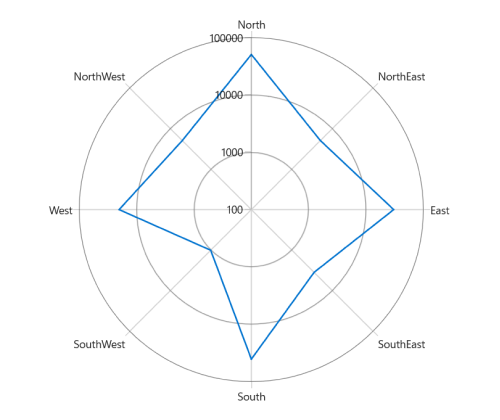

# Types of Axis in WinUI Chart (SfPolarChart)

The Polar Chart supports the following types of chart axes:

* CategoryAxis
* NumericalAxis
* DateTimeAxis
* LogarithmicAxis

## Category Axis

The [CategoryAxis](https://help.syncfusion.com/cr/winui/Syncfusion.UI.Xaml.Charts.CategoryAxis.html) is an index-based axis that plots values based on the index of the data point collection. The points are equally spaced.





<chart:SfPolarChart>

    <chart:SfPolarChart.PrimaryAxis>
        <chart:CategoryAxis/>
    </chart:SfPolarChart.PrimaryAxis>

    <chart:SfPolarChart.SecondaryAxis>
        <chart:NumericalAxis/>
    </chart:SfPolarChart.SecondaryAxis>
...

</chart:SfPolarChart>





SfPolarChart chart = new SfPolarChart();
chart.PrimaryAxis = new CategoryAxis();
chart.SecondaryAxis = new NumericalAxis();
...





## Numerical Axis

The [NumericalAxis](https://help.syncfusion.com/cr/winui/Syncfusion.UI.Xaml.Charts.NumericalAxis.html) is used to plot numerical values on the chart. It can be defined for both [PrimaryAxis](https://help.syncfusion.com/cr/winui/Syncfusion.UI.Xaml.Charts.SfPolarChart.html#Syncfusion_UI_Xaml_Charts_SfPolarChart_PrimaryAxis) and [SecondaryAxis](https://help.syncfusion.com/cr/winui/Syncfusion.UI.Xaml.Charts.SfPolarChart.html#Syncfusion_UI_Xaml_Charts_SfPolarChart_SecondaryAxis).





<chart:SfPolarChart>

    <chart:SfPolarChart.PrimaryAxis>
        <chart:NumericalAxis/>
    </chart:SfPolarChart.PrimaryAxis>
    
    <chart:SfPolarChart.SecondaryAxis>
        <chart:NumericalAxis/>
    </chart:SfPolarChart.SecondaryAxis>
    ...
    
</chart:SfPolarChart>





SfPolarChart chart = new SfPolarChart();
...
chart.PrimaryAxis = new NumericalAxis();
chart.SecondaryAxis = new NumericalAxis();
...





### Customizing the Range

The [Maximum](https://help.syncfusion.com/cr/winui/Syncfusion.UI.Xaml.Charts.NumericalAxis.html#Syncfusion_UI_Xaml_Charts_NumericalAxis_Maximum) and [Minimum](https://help.syncfusion.com/cr/winui/Syncfusion.UI.Xaml.Charts.NumericalAxis.html#Syncfusion_UI_Xaml_Charts_NumericalAxis_Minimum) properties of the axis are used to set the maximum and minimum values of the axis range, respectively.

N> If either the minimum or maximum value is set, the other value is automatically calculated internally.





<chart:SfPolarChart>
    <chart:SfPolarChart.SecondaryAxis>
        <chart:NumericalAxis Minimum="10"
			     Maximum="90"
			     Interval="20" />
    </chart:SfPolarChart.SecondaryAxis>
    ...
</chart:SfPolarChart>





SfPolarChart chart = new SfPolarChart();
...
chart.SecondaryAxis = new NumericalAxis()
{
    Maximum = 90,
    Minimum = 10,
    Interval = 20,
};
...





## DateTime Axis

The [DateTimeAxis](https://help.syncfusion.com/cr/winui/Syncfusion.UI.Xaml.Charts.DateTimeAxis.html) is used to plot charts with `DateTime` values.





<chart:SfPolarChart>
            
    <chart:SfPolarChart.PrimaryAxis>
        <chart:DateTimeAxis Interval="1"
			    IntervalType="Months">
        <chart:DateTimeAxis.LabelStyle>
            <chart:LabelStyle LabelFormat="MMM/dd" />
        </chart:DateTimeAxis.LabelStyle>
    </chart:DateTimeAxis>
    </chart:SfPolarChart.PrimaryAxis>
            
    <chart:SfPolarChart.SecondaryAxis>
        <chart:NumericalAxis/>
    </chart:SfPolarChart.SecondaryAxis>
    ...

</chart:SfPolarChart>





SfPolarChart chart = new SfPolarChart();

chart.PrimaryAxis = new DateTimeAxis()
{
    Interval = 1,
    IntervalType = DateTimeIntervalType.Months,
    LabelStyle = new LabelStyle() { LabelFormat="MMM/dd" },
};

chart.SecondaryAxis = new NumericalAxis();
...





## Logarithmic Axis

The [LogarithmicAxis](https://help.syncfusion.com/cr/winui/Syncfusion.UI.Xaml.Charts.LogarithmicAxis.html) uses a logarithmic scale, making it highly effective for visualizing data with large range differences. It can be applied to both the PrimaryAxis and SecondaryAxis.





<chart:SfPolarChart>
. . .
<chart:SfPolarChart.SecondaryAxis>
    <chart:LogarithmicAxis />
</chart:SfPolarChart.SecondaryAxis>

</chart:SfPolarChart>





SfPolarChart chart = new SfPolarChart();
. . .
LogarithmicAxis secondaryAxis = new LogarithmicAxis()
chart.SecondaryAxis.Add(secondaryAxis);





### Interval

The axis interval can be customized using the [Interval](https://help.syncfusion.com/cr/winui/Syncfusion.UI.Xaml.Charts.LogarithmicAxis.html#Syncfusion_UI_Xaml_Charts_LogarithmicAxis_Interval) property. By default, the interval is calculated based on the minimum and maximum values of the provided data, with a default value of `1`.





<chart:SfPolarChart>
. . .
<chart:SfPolarChart.SecondaryAxis>
    <chart:LogarithmicAxis Interval="10" />
</chart:SfPolarChart.SecondaryAxis>

</chart:SfPolarChart>





SfPolarChart chart = new SfPolarChart();
. . .
LogarithmicAxis secondaryAxis = new LogarithmicAxis()
{
    Interval = 10,
};

chart.SecondaryAxis.Add(secondaryAxis);




### Customizing the Range

The range of the logarithmic axis can be customized using the [Minimum](https://help.syncfusion.com/cr/winui/Syncfusion.UI.Xaml.Charts.LogarithmicAxis.html#Syncfusion_UI_Xaml_Charts_LogarithmicAxis_Minimum) and [Maximum](https://help.syncfusion.com/cr/winui/Syncfusion.UI.Xaml.Charts.LogarithmicAxis.html#Syncfusion_UI_Xaml_Charts_LogarithmicAxis_Maximum) properties. By default, the range is automatically calculated to align with the provided data.





<chart:SfPolarChart>
. . .
<chart:SfPolarChart.SecondaryAxis>
    <chart:LogarithmicAxis Minimum="100" Maximum="10000" />
</chart:SfPolarChart.SecondaryAxis>

</chart:SfPolarChart>





SfPolarChart chart = new SfPolarChart();
. . .
LogarithmicAxis secondaryAxis = new LogarithmicAxis()
{
    Minimum = 100,
    Maximum = 10000,
};

chart.SecondaryAxis.Add(secondaryAxis);




### Customizing the Logarithmic Base

The logarithmic axis base can be customized using the [LogarithmicBase](https://help.syncfusion.com/cr/winui/Syncfusion.UI.Xaml.Charts.LogarithmicAxis.html#Syncfusion_UI_Xaml_Charts_LogarithmicAxis_LogarithmicBase) property. The default base value is `10`.





<chart:SfPolarChart>
. . .
<chart:SfPolarChart.SecondaryAxis>
    <chart:LogarithmicAxis LogarithmicBase="2" />
</chart:SfPolarChart.SecondaryAxis>

</chart:SfPolarChart>





SfPolarChart chart = new SfPolarChart();
. . .
LogarithmicAxis secondaryAxis = new LogarithmicAxis()
{
    LogarithmicBase = 2,
};

chart.SecondaryAxis.Add(secondaryAxis);




## Events

### ActualRangeChanged

The [ActualRangeChanged](https://help.syncfusion.com/cr/winui/Syncfusion.UI.Xaml.Charts.ChartAxis.html#Syncfusion_UI_Xaml_Charts_ChartAxis_ActualRangeChanged) event is triggered when the actual range of the axis changes. The event argument contains the following information:

* [ActualMinimum](https://help.syncfusion.com/cr/winui/Syncfusion.UI.Xaml.Charts.ActualRangeChangedEventArgs.html#Syncfusion_UI_Xaml_Charts_ActualRangeChangedEventArgs_ActualMinimum) - Retrieves the actual minimum value of the axis.
* [ActualMaximum](https://help.syncfusion.com/cr/winui/Syncfusion.UI.Xaml.Charts.ActualRangeChangedEventArgs.html#Syncfusion_UI_Xaml_Charts_ActualRangeChangedEventArgs_ActualMaximum) - Retrieves the actual maximum value of the axis.

### LabelCreated

The [LabelCreated](https://help.syncfusion.com/cr/winui/Syncfusion.UI.Xaml.Charts.ChartAxis.html#Syncfusion_UI_Xaml_Charts_ChartAxis_LabelCreated) event is triggered when an axis label is created. The event argument contains the following information:

* [Label](https://help.syncfusion.com/cr/winui/Syncfusion.UI.Xaml.Charts.ChartAxisLabelEventArgs.html#Syncfusion_UI_Xaml_Charts_ChartAxisLabelEventArgs_Label) - Used to get or set the text of the axis label.
* [Position](https://help.syncfusion.com/cr/winui/Syncfusion.UI.Xaml.Charts.ChartAxisLabelEventArgs.html#Syncfusion_UI_Xaml_Charts_ChartAxisLabelEventArgs_Position) - Used to get the position of the label.
* [LabelStyle](https://help.syncfusion.com/cr/winui/Syncfusion.UI.Xaml.Charts.ChartAxisLabelEventArgs.html#Syncfusion_UI_Xaml_Charts_ChartAxisLabelEventArgs_LabelStyle) - Used to customize the appearance of axis labels.
