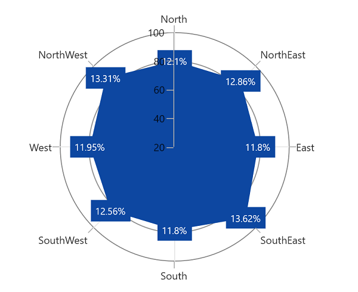
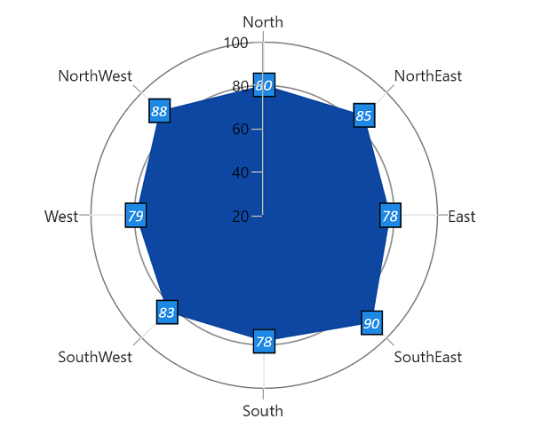
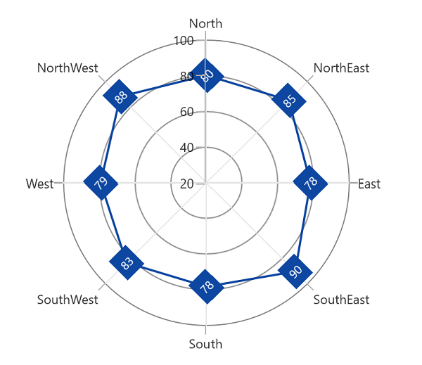

# Data label in WinUI Polar Chart (SfPolarChart)

Data labels are used to display values related to a chart segment. Values from data point(x, y) or other custom properties from a data source can be displayed.

Each data label can be represented by the following:

* `Label` - displays the segment label content at the (X, Y) point.
* `ConnectorLine` - used to connect the (X, Y) point and the label element.

## Enable data label

[ShowDataLabels]() property of series is used to enable the data labels. The following code example illustrates how to achieve this.

% tabs %}



<chart:PolarAreaSeries ShowDataLabels="True"
                 ItemsSource="{Binding Data}"  
                 XBindingPath="Product" 
                 YBindingPath="SalesRate"/>





PolarAreaSeries series = new PolarAreaSeries();
series.ShowDataLabels = true;
...





## Data label context

To customize the content of data labels, need to define [DataLabelSettings]() of series and set [Context]() property of [DataLabelSettings]() to define the value to be displayed as label content.

The following code example demonstrates how to define the percentage value to be displayed as data label content.




<chart:PolarAreaSeries ShowDataLabels="True">
. . .
<chart:PolarAreaSeries.DataLabelSettings>
    <chart:PolarDataLabelSettings Context="Percentage"/>
</chart:PolarAreaSeries.DataLabelSettings>

</chart:PolarAreaSeries>




        
PolarAreaSeries series = new PolarAreaSeries();
series.ShowDataLabels = true;
series.DataLabelSettings = new PolarDataLabelSettings() {Context = LabelContext.Percentage };
...





| Context values | Description |
|---|--|
| DataLabelItem | Displays the y value|
| Percentage | Displays the percentage value of series point among other points|
| XValue | Displays the X value of series point|
| YValue | Displays the Y value of series point|
| DateTime | Displays LabelContent.DateTime value|

## Data label customization

The following properties are used to customize the data label.

* [`BorderBrush`]()- used to change the border color.
* [`BorderThickness`]()- used to change the thickness of the border.
* [`Margin`]()- used to change the margin size for label.
* [`FontStyle`]()-  used to change font style of the label.
* [`FontSize`]()-  used to change font size of the label.
* [`Foreground`]()- used to change the text color of the label.
* [`FontFamily`]()-  used to change the font family of the label.
* [`Background`]()- used to change the label background color.

The following code example demonstrates the customization of data label using the above properties:




 <chart:PolarAreaSeries ItemsSource="{Binding PlantDetails}" 
                        XBindingPath="Direction" 
                        YBindingPath="Tree" Label="Tree"
                        ShowDataLabels="True">
            <chart:PolarAreaSeries.DataLabelSettings>
                <chart:PolarDataLabelSettings Foreground="White" FontSize="12" FontFamily="Calibri" BorderBrush="White"                             BorderThickness="1" Margin="1" FontStyle="Italic" Background="#1E88E5">
                </chart:PolarDataLabelSettings>
            </chart:PolarAreaSeries.DataLabelSettings>
</chart:PolarAreaSeries>
...





...
PolarAreaSeries series = new PolarAreaSeries();
series.ShowDataLabels = true;
series.DataLabelSettings = new PolarDataLabelSettings() 
{ 
    Foreground = new SolidColorBrush(Colors.White),
    BorderBrush = new SolidColorBrush(Colors.White),
    Background = "#1E88E5",
    BorderThickness = new Thickness(1),
    Margin = new Thickness(1),
    FontStyle = FontStyles.Italic,
    FontFamily = new FontFamily("Calibri"),
    FontSize = 12
};
...





## Label template

The appearance of the data label can be customized using the [`ContentTemplate`]() property of [`PolarDataLabelSettings`]() as shown in the following code example.





<chart:SfPolarChart >
    <chart:SfPolarChart.Resources>
        <DataTemplate x:Key="datalabelTemplate">
            <StackPanel Margin="10" Orientation="Vertical">
                <Ellipse Height="15" Width="15" Fill="{Binding Interior}" 
                 Stroke="#4a4a4a" StrokeThickness="2"/>
                <TextBlock HorizontalAlignment="Center" FontSize="12"
                           Foreground="Black" 
                           FontWeight="SemiBold" Text="{Binding Item.Product}"/>
            </StackPanel>
        </DataTemplate>
    </chart:SfPolarChart.Resources>
    ...
    <chart:PolarLineSeries ShowDataLabels="True">
        <chart:PolarLineSeries.DataLabelSettings>
            <chart:PolarDataLabelSettings ContentTemplate="{StaticResource datalabelTemplate}"
                                            Context="DataLabelItem"/>
    </chart:PolarLineSeries.DataLabelSettings>
</chart:PolarLineSeries>





SfPolarChart chart = new SfPolarChart();
...
PolarLineSeries series = new PolarLineSeries();
series.ShowDataLabels = true;

series.DataLabelSettings = new PolarDataLabelSettings() 
{ 
    Context = LabelContext.DataLabelItem,
    ContentTemplate = chart.Resources["datalabelTemplate"] as DataTemplate,
};
...





## Label format

The [Format]() property can be used to format the data labels. The following code example demonstrates the how to format data labels with single decimal digit.





<chart:SfPolarChart x:Name="chart">
...
    <chart:PolarLineSeries ShowDataLabels="True">
        <chart:PolarLineSeries.DataLabelSettings>
            <chart:PolarDataLabelSettings Format="#.0"/>
    </chart:PolarLineSeries.DataLabelSettings>

</chart:SfPolarChart>





SfPolarChart chart = new SfPolarChart();
. . . 
PolarLineSeries series = new PolarLineSeries();
series.ShowDataLabels = true;

series.DataLabelSettings = new PolarDataLabelSettings() 
{ 
    Format = "#.0",
};
...





## Label rotation

[Rotation]() property is used to define the angle to which the label has to rotate. The following code demonstrates the label rotating angle.





<chart:SfPolarChart x:Name="chart">
...
    <chart:PolarLineSeries ShowDataLabels="True"  
                            ItemsSource="{Binding PlantDetails}" 
                            XBindingPath="Direction" 
                            YBindingPath="Tree">
        <chart:PolarLineSeries.DataLabelSettings>
            <chart:PolarDataLabelSettings Rotation="-45"/>
        </chart:PolarLineSeries.DataLabelSettings>
    </chart:PolarLineSeries>
    ...
</chart:SfPolarChart>





SfPolarChart chart = new SfPolarChart();
. . . 
PolarLineSeries series = new PolarLineSeries();
series.ShowDataLabels = true;

series.DataLabelSettings = new PolarDataLabelSettings() 
{ 
    Rotation = -45,
};
...





## Applying series brush

[`UseSeriesPalette`]() property is used to set the interior of the series to the data label background. 





<chart:SfPolarChart x:Name="chart">
...
    <chart:PolarLineSeries ShowDataLabels="True"  
                            ItemsSource="{Binding PlantDetails}" 
                            XBindingPath="Direction" 
                            YBindingPath="Tree">
        <chart:PolarLineSeries.DataLabelSettings>
            <chart:PolarDataLabelSettings UseSeriesPalette="True"/>
        </chart:PolarLineSeries.DataLabelSettings>
    </chart:PolarLineSeries>
    ...
</chart:SfPolarChart>





SfPolarChart chart = new SfPolarChart();
. . . 
PolarLineSeries series = new PolarLineSeries();
series.ShowDataLabels = true;
series.DataLabelSettings = new PolarDataLabelSettings()
{
    UseSeriesPalette = true,
};
...





## Connector line

This feature is used to connect label and data point using a line. [ShowConnectorLine]() property of [PolarDataLabelSettings]() is used to enable the connector line in the polar chart.

The connector line can be customized using the below properies.

* [ConnectorHeight]()
* [ConnectorLineStyle]()
* [ConnectorRotationAngle]()

The following code example shows the customization options for connector line:





<chart:SfPolarChart x:Name="chart">
...
    <chart:PolarLineSeries ShowDataLabels="True"  
                            ItemsSource="{Binding PlantDetails}" 
                            XBindingPath="Direction" 
                            YBindingPath="Tree">
        <chart:PolarLineSeries.DataLabelSettings>
            <chart:PolarDataLabelSettings ShowConnectorLine="True" ConnectorHeight="25" 
                                          ConnectorRotation="45"/>
        </chart:PolarLineSeries.DataLabelSettings>
    </chart:PolarLineSeries>
    ...
</chart:SfPolarChart>





SfPolarChart chart = new SfPolarChart();
. . . 
PolarLineSeries series = new PolarLineSeries();
series.ShowDataLabels = true;
series.DataLabelSettings = new PolarDataLabelSettings()
{
    ShowConnectorLine = true,
    ConnectorHeight = 25,
    ConnectorRotation = 45,
};
...





