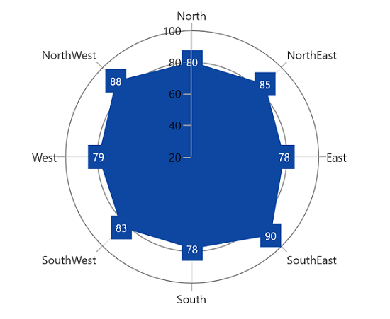
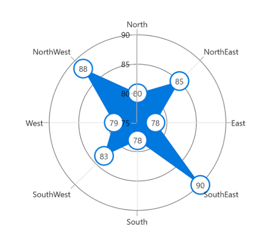
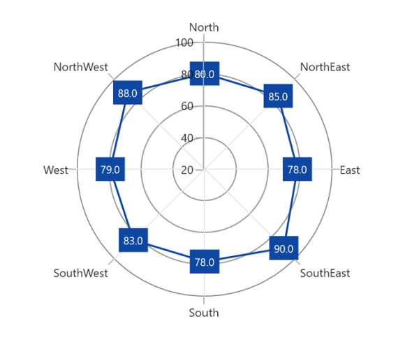
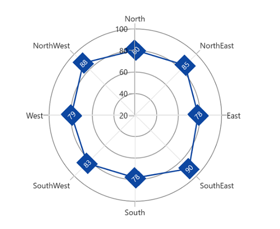
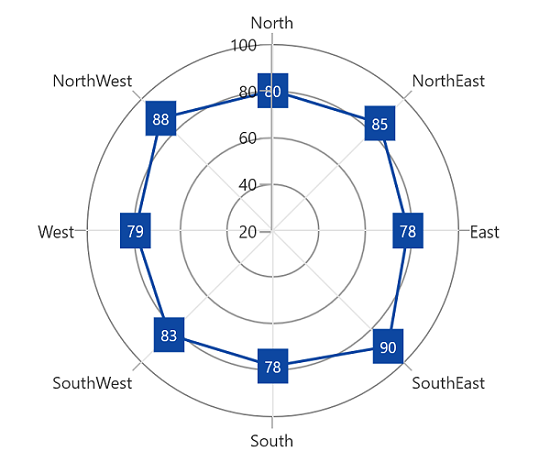
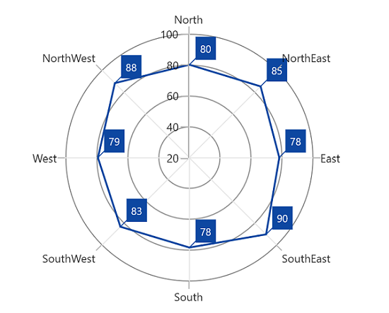

# Data Label in WinUI Chart (SfPolarChart)

Data labels are used to display values related to a chart segment. Values from data points(x, y) or other custom properties from a data source can be displayed.

Each data label can be represented by the following:

* `Label` - displays the segment label content at the (X, Y) point.
* `Connector line` - used to connect the (X, Y) point and the label element.

## Enable Data Label

The [ShowDataLabels](https://help.syncfusion.com/cr/winui/Syncfusion.UI.Xaml.Charts.DataMarkerSeries.html#Syncfusion_UI_Xaml_Charts_DataMarkerSeries_ShowDataLabels) property of a series is used to enable the data labels.





<chart:SfPolarChart>
    ...
    <chart:PolarAreaSeries ShowDataLabels="True"
                    ItemsSource="{Binding Data}"  
                    XBindingPath="Product" 
                    YBindingPath="SalesRate"/>
    ...
</chart:SfPolarChart>                 





SfPolarChart chart = new SfPolarChart();
PolarAreaSeries series = new PolarAreaSeries();
series.ShowDataLabels = true;
...





## Context

To customize the content of data labels, need to define [DataLabelSettings](https://help.syncfusion.com/cr/winui/Syncfusion.UI.Xaml.Charts.PolarRadarSeriesBase.html#Syncfusion_UI_Xaml_Charts_PolarRadarSeriesBase_DataLabelSettings) of series and set [Context](https://help.syncfusion.com/cr/winui/Syncfusion.UI.Xaml.Charts.ChartDataLabelSettings.html#Syncfusion_UI_Xaml_Charts_ChartDataLabelSettings_Context) property of [DataLabelSettings](https://help.syncfusion.com/cr/winui/Syncfusion.UI.Xaml.Charts.PolarRadarSeriesBase.html#Syncfusion_UI_Xaml_Charts_PolarRadarSeriesBase_DataLabelSettings) to define the value to be displayed as label content.





<chart:SfPolarChart>
    <chart:PolarAreaSeries ShowDataLabels="True"
                        ItemsSource="{Binding PlantDetails}" 
                        XBindingPath="Direction"
                        YBindingPath="Tree">
    <chart:PolarAreaSeries.DataLabelSettings>
        <chart:PolarDataLabelSettings Context="Percentage"/>
    </chart:PolarAreaSeries.DataLabelSettings>

    </chart:PolarAreaSeries>
</chart:SfPolarChart>





SfPolarChart chart = new SfPolarChart();
...
PolarAreaSeries series = new PolarAreaSeries();
series.ShowDataLabels = true;
series.DataLabelSettings = new PolarDataLabelSettings() {Context = LabelContext.Percentage };
...





## Customization

The following properties are used to customize the data label.

* [`BorderBrush`](https://help.syncfusion.com/cr/winui/Syncfusion.UI.Xaml.Charts.ChartDataLabelSettings.html#Syncfusion_UI_Xaml_Charts_ChartDataLabelSettings_BorderBrush)- used to change the border color.
* [`BorderThickness`](https://help.syncfusion.com/cr/winui/Syncfusion.UI.Xaml.Charts.ChartDataLabelSettings.html#Syncfusion_UI_Xaml_Charts_ChartDataLabelSettings_BorderThickness)- used to change the thickness of the border.
* [`Margin`](https://help.syncfusion.com/cr/winui/Syncfusion.UI.Xaml.Charts.ChartDataLabelSettings.html#Syncfusion_UI_Xaml_Charts_ChartDataLabelSettings_Margin)- used to change the margin size for label.
* [`FontStyle`](https://help.syncfusion.com/cr/winui/Syncfusion.UI.Xaml.Charts.ChartDataLabelSettings.html#Syncfusion_UI_Xaml_Charts_ChartDataLabelSettings_FontStyle)-  used to change font style of the label.
* [`FontSize`](https://help.syncfusion.com/cr/winui/Syncfusion.UI.Xaml.Charts.ChartDataLabelSettings.html#Syncfusion_UI_Xaml_Charts_ChartDataLabelSettings_FontSize)-  used to change font size of the label.
* [`Foreground`](https://help.syncfusion.com/cr/winui/Syncfusion.UI.Xaml.Charts.ChartDataLabelSettings.html#Syncfusion_UI_Xaml_Charts_ChartDataLabelSettings_Foreground)- used to change the text color of the label.
* [`FontFamily`](https://help.syncfusion.com/cr/winui/Syncfusion.UI.Xaml.Charts.ChartDataLabelSettings.html#Syncfusion_UI_Xaml_Charts_ChartDataLabelSettings_FontFamily)-  used to change the font family of the label.
* [`Background`](https://help.syncfusion.com/cr/winui/Syncfusion.UI.Xaml.Charts.ChartDataLabelSettings.html#Syncfusion_UI_Xaml_Charts_ChartDataLabelSettings_Background)- used to change the label background color.





<chart:SfPolarChart>
    ...
    <chart:PolarAreaSeries ItemsSource="{Binding PlantDetails}" 
                            XBindingPath="Direction" 
                            YBindingPath="Tree" Label="Tree"
                            ShowDataLabels="True">
                <chart:PolarAreaSeries.DataLabelSettings>
                    <chart:PolarDataLabelSettings Foreground="White" FontSize="12" FontFamily="Calibri" BorderBrush="White"                             BorderThickness="1" Margin="1" FontStyle="Italic" Background="#1E88E5">
                    </chart:PolarDataLabelSettings>
                </chart:PolarAreaSeries.DataLabelSettings>
    </chart:PolarAreaSeries>
    ...
</chart:SfPolarChart>





SfPolarChart chart = new SfPolarChart();
...
PolarAreaSeries series = new PolarAreaSeries();
series.ShowDataLabels = true;
series.DataLabelSettings = new PolarDataLabelSettings() 
{ 
    Foreground = new SolidColorBrush(Colors.White),
    BorderBrush = new SolidColorBrush(Colors.White),
    Background = "#1E88E5",
    BorderThickness = new Thickness(1),
    Margin = new Thickness(1),
    FontStyle = FontStyles.Italic,
    FontFamily = new FontFamily("Calibri"),
    FontSize = 12
};
...





## Template

The appearance of the data label can be customized using the [`ContentTemplate`](https://help.syncfusion.com/cr/winui/Syncfusion.UI.Xaml.Charts.ChartDataLabelSettings.html#Syncfusion_UI_Xaml_Charts_ChartDataLabelSettings_ContentTemplate) property of [`PolarDataLabelSettings`](https://help.syncfusion.com/cr/winui/Syncfusion.UI.Xaml.Charts.PolarDataLabelSettings.html) as shown in the following code example.





<chart:SfPolarChart >
    <chart:SfPolarChart.Resources>
        <DataTemplate x:Key="datalabelTemplate">
                    <Grid>
                        <Ellipse
                                Width="30"
                                Height="30"
                                HorizontalAlignment="Left"
                                VerticalAlignment="Top"
                                Fill="White"
                                Stroke="#0078DE"
                                StrokeThickness="2" />
                        <TextBlock
                                HorizontalAlignment="Center"
                                VerticalAlignment="Center"
                                FontFamily="Segoe UI"
                                FontSize="12"
                                Foreground="#FF585858"
                                Text="{Binding}"
                                TextWrapping="Wrap" />
                    </Grid>
            </StackPanel>
        </DataTemplate>
    </chart:SfPolarChart.Resources>
    ...
    <chart:PolarLineSeries ShowDataLabels="True">
        <chart:PolarLineSeries.DataLabelSettings>
            <chart:PolarDataLabelSettings ContentTemplate="{StaticResource datalabelTemplate}"
                                            Context="DataLabelItem"/>
        </chart:PolarLineSeries.DataLabelSettings>
    </chart:PolarLineSeries>
    ...
</chart:SfPolarChart>





SfPolarChart chart = new SfPolarChart();
...
PolarLineSeries series = new PolarLineSeries();
series.ShowDataLabels = true;

series.DataLabelSettings = new PolarDataLabelSettings() 
{ 
    Context = LabelContext.DataLabelItem,
    ContentTemplate = chart.Resources["datalabelTemplate"] as DataTemplate,
};
...





## Format

The [Format](https://help.syncfusion.com/cr/winui/Syncfusion.UI.Xaml.Charts.ChartDataLabelSettings.html#Syncfusion_UI_Xaml_Charts_ChartDataLabelSettings_Format) property can be used to format the data labels.





<chart:SfPolarChart x:Name="chart">
    ...
    <chart:PolarLineSeries ShowDataLabels="True">
        <chart:PolarLineSeries.DataLabelSettings>
            <chart:PolarDataLabelSettings Format="#.0"/>
        </chart:PolarLineSeries.DataLabelSettings>
    </chart:PolarLineSeries>
    ...
</chart:SfPolarChart>





SfPolarChart chart = new SfPolarChart();
. . . 
PolarLineSeries series = new PolarLineSeries();
series.ShowDataLabels = true;

series.DataLabelSettings = new PolarDataLabelSettings() 
{ 
    Format = "#.0",
};
...





## Rotation

[Rotation](https://help.syncfusion.com/cr/winui/Syncfusion.UI.Xaml.Charts.ChartDataLabelSettings.html#Syncfusion_UI_Xaml_Charts_ChartDataLabelSettings_Rotation) property is used to define the angle to which the label has to rotate.





<chart:SfPolarChart x:Name="chart">
...
    <chart:PolarLineSeries ShowDataLabels="True"  
                            ItemsSource="{Binding PlantDetails}" 
                            XBindingPath="Direction" 
                            YBindingPath="Tree">
        <chart:PolarLineSeries.DataLabelSettings>
            <chart:PolarDataLabelSettings Rotation="-45"/>
        </chart:PolarLineSeries.DataLabelSettings>
    </chart:PolarLineSeries>
    ...
</chart:SfPolarChart>





SfPolarChart chart = new SfPolarChart();
. . . 
PolarLineSeries series = new PolarLineSeries();
series.ShowDataLabels = true;

series.DataLabelSettings = new PolarDataLabelSettings() 
{ 
    Rotation = -45,
};
...





## Applying Series Interior

The [`UseSeriesPalette`](https://help.syncfusion.com/cr/winui/Syncfusion.UI.Xaml.Charts.ChartDataLabelSettings.html#Syncfusion_UI_Xaml_Charts_ChartDataLabelSettings_UseSeriesPalette) property is used to set the [Interior](https://help.syncfusion.com/cr/winui/Syncfusion.UI.Xaml.Charts.ChartSeriesBase.html#Syncfusion_UI_Xaml_Charts_ChartSeriesBase_Interior) of the series to the data label background. 





<chart:SfPolarChart x:Name="chart">
...
    <chart:PolarLineSeries ShowDataLabels="True"  
                            ItemsSource="{Binding PlantDetails}" 
                            XBindingPath="Direction" 
                            YBindingPath="Tree">
        <chart:PolarLineSeries.DataLabelSettings>
            <chart:PolarDataLabelSettings UseSeriesPalette="True"/>
        </chart:PolarLineSeries.DataLabelSettings>
    </chart:PolarLineSeries>
    ...
</chart:SfPolarChart>





SfPolarChart chart = new SfPolarChart();
. . . 
PolarLineSeries series = new PolarLineSeries();
series.ShowDataLabels = true;
series.DataLabelSettings = new PolarDataLabelSettings()
{
    UseSeriesPalette = true,
};
...





## Connector Line

Connector line is used to connect label and data point using a line. [ShowConnectorLine](https://help.syncfusion.com/cr/winui/Syncfusion.UI.Xaml.Charts.ChartDataLabelSettings.html#Syncfusion_UI_Xaml_Charts_ChartDataLabelSettings_ShowConnectorLine) property of [PolarDataLabelSettings](https://help.syncfusion.com/cr/winui/Syncfusion.UI.Xaml.Charts.PolarDataLabelSettings.html) is used to enable the connector line in the polar chart.

The connector line can be customized using the following properties:

* [ConnectorHeight](https://help.syncfusion.com/cr/winui/Syncfusion.UI.Xaml.Charts.ChartDataLabelSettings.html#Syncfusion_UI_Xaml_Charts_ChartDataLabelSettings_ConnectorHeight) - used to set height for connector line.
* [ConnectorLineStyle](https://help.syncfusion.com/cr/winui/Syncfusion.UI.Xaml.Charts.ChartDataLabelSettings.html#Syncfusion_UI_Xaml_Charts_ChartDataLabelSettings_ConnectorLineStyle) -  used to customize the style of line.
* [ConnectorRotation](https://help.syncfusion.com/cr/winui/Syncfusion.UI.Xaml.Charts.ChartDataLabelSettings.html#Syncfusion_UI_Xaml_Charts_ChartDataLabelSettings_ConnectorRotation) - used to rotate the connector line at any angle.





<chart:SfPolarChart x:Name="chart">
...
    <chart:PolarLineSeries ShowDataLabels="True"  
                            ItemsSource="{Binding PlantDetails}" 
                            XBindingPath="Direction" 
                            YBindingPath="Tree">
        <chart:PolarLineSeries.DataLabelSettings>
            <chart:PolarDataLabelSettings ShowConnectorLine="True" ConnectorHeight="25" 
                                          ConnectorRotation="45"/>
        </chart:PolarLineSeries.DataLabelSettings>
    </chart:PolarLineSeries>
    ...
</chart:SfPolarChart>





SfPolarChart chart = new SfPolarChart();
. . . 
PolarLineSeries series = new PolarLineSeries();
series.ShowDataLabels = true;
series.DataLabelSettings = new PolarDataLabelSettings()
{
    ShowConnectorLine = true,
    ConnectorHeight = 25,
    ConnectorRotation = 45,
};
...





