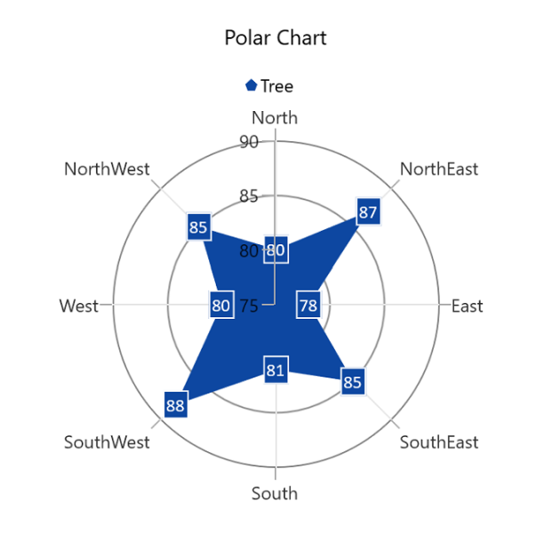

# Getting Started with WinUI Polar Chart (SfPolarChart)

This section explains how to populate the [WinUI Polar Chart](https://www.syncfusion.com/winui-controls/charts/winui-polar-chart) with data, headers, data labels, legends, and tooltips, as well as the essential aspects for getting started with the chart.

## Creating an Application with WinUI Chart

1. Create a [WinUI 3 desktop app for C# and .NET 5](https://docs.microsoft.com/en-us/windows/apps/winui/winui3/get-started-winui3-for-desktop).
2. Add a reference to [Syncfusion.Chart.WinUI](https://www.nuget.org/packages/Syncfusion.Chart.WinUI/) NuGet.
3. Import the control namespace `Syncfusion.UI.Xaml.Charts` in XAML or C# to initialize the control.
4. Initialize the [SfPolarChart](https://help.syncfusion.com/cr/winui/Syncfusion.UI.Xaml.Charts.SfPolarChart.html) control.


 



<Window
   x:Class="ChartDemo.MainWindow"
   ...
   xmlns:chart="using:Syncfusion.UI.Xaml.Charts">

<chart:SfPolarChart/>

 </Window>  
 




using Syncfusion.UI.Xaml.Charts;

...
public sealed partial class MainWindow : Window
{
    
    public MainWindow()
    {
        this.InitializeComponent();
        SfPolarChart chart = new SfPolarChart();
        ...
        this.Content = chart;
    }
}





{{ codesnippet1 | OrderList_Indent_Level_1 }}

## Initialize View Model

Now, let us define a simple data model that represents a data point in the chart.

  



public class PlantData
{
    public string Direction { get; set; }
    public double Tree { get; set; }
}

 

 

Next, create a view model class and initialize a list of `Model` objects as follows.

  



public class ChartViewModel
{
    public ObservableCollection<PlantData> PlantDetails { get; set; }

    public ChartViewModel()
    {
        PlantDetails = new ObservableCollection<PlantData>()
        {
            new PlantData(){ Direction = "North", Tree = 80 },
            new PlantData(){ Direction = "NorthEast", Tree = 87 },
            new PlantData(){ Direction = "East", Tree = 78 },
            new PlantData(){ Direction = "SouthEast", Tree = 85 },
            new PlantData(){ Direction = "South", Tree = 81 },
            new PlantData(){ Direction = "SouthWest", Tree = 88 },
            new PlantData(){ Direction = "West", Tree = 80 },
            new PlantData(){ Direction = "NorthWest", Tree = 85 },
        };
    }
}

 

 

Create a `ChartViewModel` instance and set it as the chart's `DataContext`. This enables property binding from the `ChartViewModel` class.

N> If you prefer to set `DataContext` in XAML, add the namespace of the `ViewModel` class to your XAML Page.

 

 

<Window
    ...
    xmlns:chart="using:Syncfusion.UI.Xaml.Charts"
    xmlns:model="using:ChartDemo.ViewModel">

    <chart:SfPolarChart>
        <chart:SfPolarChart.DataContext>
            <model:ChartViewModel/>
        </chart:SfPolarChart.DataContext>
    </chart:SfPolarChart>

</Window>



 

ChartViewModel viewModel = new ChartViewModel();
chart.DataContext = viewModel;
...



 

## Initialize Chart Axis

[ChartAxis](https://help.syncfusion.com/cr/winui/Syncfusion.UI.Xaml.Charts.ChartAxis.html) is used to locate data points inside the chart area. The [PrimaryAxis](https://help.syncfusion.com/cr/winui/Syncfusion.UI.Xaml.Charts.SfPolarChart.html#Syncfusion_UI_Xaml_Charts_SfPolarChart_PrimaryAxis) and [SecondaryAxis](https://help.syncfusion.com/cr/winui/Syncfusion.UI.Xaml.Charts.SfPolarChart.html#Syncfusion_UI_Xaml_Charts_SfPolarChart_SecondaryAxis) properties of the chart are used to initialize the axes for the chart.

 

 

<chart:SfPolarChart> 
      <chart:SfPolarChart.PrimaryAxis> 
           <chart:CategoryAxis /> 
      </chart:SfPolarChart.PrimaryAxis> 
      <chart:SfPolarChart.SecondaryAxis> 
           <chart:NumericalAxis/> 
      </chart:SfPolarChart.SecondaryAxis>
      ...
</chart:SfPolarChart>



 

SfPolarChart chart = new SfPolarChart();
CategoryAxis primaryAxis = new CategoryAxis();
chart.PrimaryAxis = primaryAxis;    
NumericalAxis secondaryAxis = new NumericalAxis();
chart.SecondaryAxis = secondaryAxis;
...



 

## Populate Chart with Data

Add [PolarAreaSeries](https://help.syncfusion.com/cr/winui/Syncfusion.UI.Xaml.Charts.PolarAreaSeries.html) to the polar chart [Series](https://help.syncfusion.com/cr/winui/Syncfusion.UI.Xaml.Charts.SfPolarChart.html#Syncfusion_UI_Xaml_Charts_SfPolarChart_Series) collection and bind `Data` to the series [ItemsSource](https://help.syncfusion.com/cr/winui/Syncfusion.UI.Xaml.Charts.ChartSeries.html#Syncfusion_UI_Xaml_Charts_ChartSeries_ItemsSource) property from its `DataContext` for creating the polar chart.

N> To plot the series, the [XBindingPath](https://help.syncfusion.com/cr/winui/Syncfusion.UI.Xaml.Charts.ChartSeries.html#Syncfusion_UI_Xaml_Charts_ChartSeries_XBindingPath) and [YBindingPath](https://help.syncfusion.com/cr/winui/Syncfusion.UI.Xaml.Charts.PolarSeries.html#Syncfusion_UI_Xaml_Charts_PolarSeries_YBindingPath) properties must be configured so that the chart can get values from the respective properties in the data model.

   



<chart:SfPolarChart>
    <chart:SfPolarChart.PrimaryAxis> 
        <chart:CategoryAxis /> 
    </chart:SfPolarChart.PrimaryAxis> 
    <chart:SfPolarChart.SecondaryAxis> 
        <chart:NumericalAxis/> 
    </chart:SfPolarChart.SecondaryAxis>
    <chart:SfPolarChart.Series>
        <chart:PolarAreaSeries ItemsSource="{Binding PlantDetails}" 
                               XBindingPath="Direction" 
                               YBindingPath="Tree"/>
    </chart:SfPolarChart.Series>
    ...
</chart:SfPolarChart>





SfPolarChart chart = new SfPolarChart();

ChartViewModel viewModel = new ChartViewModel();
chart.DataContext = viewModel;

CategoryAxis primaryAxis = new CategoryAxis();
chart.PrimaryAxis = primaryAxis;    
NumericalAxis secondaryAxis = new NumericalAxis();
chart.SecondaryAxis = secondaryAxis;

PolarAreaSeries series = new PolarAreaSeries();
series.XBindingPath = "Direction";
series.YBindingPath = "Tree";

series.SetBinding(
    ChartSeriesBase.ItemsSourceProperty, 
    new Binding() 
    { Path = new PropertyPath("PlantDetails") });

chart.Series.Add(series);
. . .



 

## Add Title

The title of the chart provides quick information to the user about the data being plotted in the chart. The [Header](https://help.syncfusion.com/cr/winui/Syncfusion.UI.Xaml.Charts.ChartBase.html#Syncfusion_UI_Xaml_Charts_ChartBase_Header) property is used to set the title for the polar chart as follows.

 



<chart:SfPolarChart Header="Polar Chart"> 
...
</chart:SfPolarChart> 





SfPolarChart chart = new SfPolarChart();
chart.Header = "Polar Chart";
...



  

## Enable Data Labels

The [ShowDataLabels](https://help.syncfusion.com/cr/winui/Syncfusion.UI.Xaml.Charts.ChartSeries.html#Syncfusion_UI_Xaml_Charts_ChartSeries_ShowDataLabels) property of a series can be used to enable data labels to improve the readability of the chart. The label visibility is set to `False` by default.

 



<chart:SfPolarChart>
    ...
    <chart:PolarAreaSeries ShowDataLabels="True"
                           ItemsSource="{Binding PlantDetails}" 
                           XBindingPath="Direction" 
                           YBindingPath="Tree">
    </chart:PolarAreaSeries>
</chart:SfPolarChart>





SfPolarChart chart = new SfPolarChart();
PolarAreaSeries series = new PolarAreaSeries();
series.ShowDataLabels = true;
...



  

## Enable Legend

The legend provides information about the data points displayed in the polar chart. The [Legend](https://help.syncfusion.com/cr/winui/Syncfusion.UI.Xaml.Charts.ChartBase.html#Syncfusion_UI_Xaml_Charts_ChartBase_Legend) property of the chart is used to enable it.

 



<chart:SfPolarChart>
    ...
    <chart:SfPolarChart.Legend>
        <chart:ChartLegend/>
    </chart:SfPolarChart.Legend>
    ...
</chart:SfPolarChart>





SfPolarChart chart = new SfPolarChart();
. . .
chart.Legend = new ChartLegend();
...



  

N> Additionally, set a label for each series using the [Label](https://help.syncfusion.com/cr/winui/Syncfusion.UI.Xaml.Charts.ChartSeries.html#Syncfusion_UI_Xaml_Charts_ChartSeries_Label) property of the chart series, which will be displayed in the corresponding legend.

 



<chart:SfPolarChart>
    . . .
    <chart:PolarAreaSeries ItemsSource="{Binding PlantDetails}" 
                           XBindingPath="Direction" 
                           YBindingPath="Tree"
                           Label="Tree"/>
    ...
</chart:SfPolarChart>





SfPolarChart chart = new SfPolarChart();
...
PolarAreaSeries series = new PolarAreaSeries();
series.ItemsSource = viewModel.PlantDetails;
series.XBindingPath = "Direction";
series.YBindingPath = "Tree";
series.Label = "Tree";
...



  

The following code example gives you the complete code of above configurations.

 



<chart:SfPolarChart Header="Polar Chart">
    <chart:SfPolarChart.DataContext>
        <model:ChartViewModel/>
    </chart:SfPolarChart.DataContext>
    <chart:SfPolarChart.PrimaryAxis> 
           <chart:CategoryAxis /> 
      </chart:SfPolarChart.PrimaryAxis> 
      <chart:SfPolarChart.SecondaryAxis> 
           <chart:NumericalAxis/> 
      </chart:SfPolarChart.SecondaryAxis>
    <chart:SfPolarChart.Legend>
        <chart:ChartLegend/>
    </chart:SfPolarChart.Legend>
    <chart:SfPolarChart.Series>
        <chart:PolarAreaSeries ItemsSource="{Binding PlantDetails}" 
                   XBindingPath="Direction"
			       YBindingPath="Tree"
                   Label="Tree"
			       ShowDataLabels="True"
                   LegendIcon="Pentagon">
            <chart:PolarAreaSeries.DataLabelSettings>
                <chart:PolarDataLabelSettings Foreground="White" 
					      FontSize="12" 
                          FontFamily="Calibri"
					      BorderBrush="White" 
                          BorderThickness="1"
					      Margin="1"/>
                </chart:PolarAreaSeries.DataLabelSettings>
        </chart:PolarAreaSeries>
    </chart:SfPolarChart.Series>
</chart:SfPolarChart>





using Syncfusion.UI.Xaml.Charts;
. . .
public sealed partial class MainWindow : Window
{
    public MainWindow()
    {
        SfPolarChart chart = new SfPolarChart();

        chart.Header = "Polar Chart";
        chart.Legend = new ChartLegend();
        ChartViewModel viewModel = new ChartViewModel();
        chart.DataContext = viewModel;
        
        CategoryAxis primaryAxis = new CategoryAxis();
        chart.PrimaryAxis = primaryAxis;    
        NumericalAxis secondaryAxis = new NumericalAxis();
        chart.SecondaryAxis = secondaryAxis;

        PolarAreaSeries series = new PolarAreaSeries();
        series.XBindingPath = "Direction";
        series.YBindingPath = "Tree";
        series.Label = "Tree";
        series.LegendIcon = ChartLegendIcon.Pentagon;
        series.ShowDataLabels = true;
        series.DataLabelSettings = new PolarDataLabelSettings() 
        { 
            Foreground = new SolidColorBrush(Colors.White),
            BorderBrush = new SolidColorBrush(Colors.White),
            BorderThickness = new Thickness(1),
            Margin = new Thickness(1),
            FontFamily = new FontFamily("Calibri"),
            FontSize = 12
        };

        series.SetBinding(
            ChartSeriesBase.ItemsSourceProperty, 
            new Binding() 
            { Path = new PropertyPath("PlantDetails") });

        chart.Series.Add(series);
        this.Content = chart;
    }
}





The following chart is created as a result of the above code.

N> Download the demo application from [GitHub](https://github.com/SyncfusionExamples/GettingStartedChartWinUI/tree/main/PolarChartGettingStarted)

N> You can also explore our [WinUI Polar Chart example](https://github.com/syncfusion/winui-demos/tree/master/chart/Views/Polar%20Charts), which shows how to easily configure with built-in support for creating stunning visual effects.
