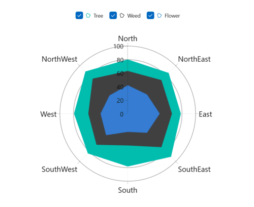

# Legend in WinUI Chart (SfPolarChart)

The legend contains list of series in the chart. The information provided in each legend item helps to identify the corresponding series in the chart.





<chart:SfPolarChart>
    ...
    <chart:SfPolarChart.Legend>
        <chart:ChartLegend/>
    </chart:SfPolarChart.Legend>
    
</chart:SfPolarChart>





SfPolarChart chart = new SfPolarChart();
chart.Legend = new ChartLegend();
...





## Title

Polar chart provides support to add any `UIElement` as a title for legend. [Header](https://help.syncfusion.com/cr/winui/Syncfusion.UI.Xaml.Charts.ChartLegend.html#Syncfusion_UI_Xaml_Charts_ChartLegend_Header) property of [ChartLegend](https://help.syncfusion.com/cr/winui/Syncfusion.UI.Xaml.Charts.ChartLegend.html) is used to define the title for the legend.





<chart:SfPolarChart>
    <chart:SfPolarChart.Legend>
        <chart:ChartLegend>
            <chart:ChartLegend.Header>
                <TextBlock Text="Plant Details" 
                    HorizontalAlignment="Center"
                    FontWeight="Bold"
                    Foreground="Blue"/>
            </chart:ChartLegend.Header>
        </chart:ChartLegend>
    </chart:SfPolarChart.Legend>
    ...
</chart:SfPolarChart>





SfPolarChart chart = new SfPolarChart();
ChartLegend legend = new ChartLegend();

TextBlock textBlock = new TextBlock()
{
    Text = "Plant Details",
    HorizontalTextAlignment = TextAlignment.Center,
    Foreground = new SolidColorBrush(Colors.Blue),
    FontWeight = FontWeights.Bold,
};

legend.Header = textBlock;
chart.Legend = legend;
...





## Icon

The legend icon represents a symbol associated with each legend item. The appearance of the legend icon can be customized using the following properties:

* [IconWidth](https://help.syncfusion.com/cr/winui/Syncfusion.UI.Xaml.Charts.ChartLegend.html#Syncfusion_UI_Xaml_Charts_ChartLegend_IconWidth) - Gets or sets the double value that represents the legend icon(s) width.
* [IconHeight](https://help.syncfusion.com/cr/winui/Syncfusion.UI.Xaml.Charts.ChartLegend.html#Syncfusion_UI_Xaml_Charts_ChartLegend_IconHeight) - Gets or sets the double value that represents that legend icon(s) height.
* [IconVisibility](https://help.syncfusion.com/cr/winui/Syncfusion.UI.Xaml.Charts.ChartLegend.html#Syncfusion_UI_Xaml_Charts_ChartLegend_IconVisibility) - Gets or sets the visibility of the legend icon.





<chart:SfPolarChart>
    <chart:SfPolarChart.Legend>
        <chart:ChartLegend IconWidth="15" IconHeight="15" 
                        IconVisibility="Visible">
        </chart:ChartLegend>
    </chart:SfPolarChart.Legend>
    ...
</chart:SfPolarChart>





SfPolarChart chart = new SfPolarChart();
chart.Legend = new ChartLegend()
{
    IconWidth = 15,
    IconHeight = 15,
    IconVisibility = Visibility.Visible,
};
...





## Item spacing

[ItemMargin](https://help.syncfusion.com/cr/winui/Syncfusion.UI.Xaml.Charts.ChartLegend.html#Syncfusion_UI_Xaml_Charts_ChartLegend_ItemMargin) property of the [ChartLegend](https://help.syncfusion.com/cr/winui/Syncfusion.UI.Xaml.Charts.ChartLegend.html) is used to provide spacing between each legend items.





<chart:SfPolarChart>
    <chart:SfPolarChart.Legend>
        <chart:ChartLegend ItemMargin="10"/>
    </chart:SfPolarChart.Legend>
    ...
</chart:SfPolarChart>





SfPolarChart chart = new SfPolarChart();
chart.Legend = new ChartLegend()
{
    ItemMargin = new Thickness(10)
};
...





## Checkbox for legend

Polar chart provides support to enable the checkbox for each legend item to visible or collapse the corresponding series. By default, the value of [CheckBoxVisibility](https://help.syncfusion.com/cr/winui/Syncfusion.UI.Xaml.Charts.ChartLegend.html#Syncfusion_UI_Xaml_Charts_ChartLegend_CheckBoxVisibility) property is `Collapsed`. 





<chart:SfPolarChart>
    <chart:SfPolarChart.Legend>
        <chart:ChartLegend CheckBoxVisibility="Visible"/>
    </chart:SfPolarChart.Legend>
    ...
</chart:SfPolarChart>





SfPolarChart chart = new SfPolarChart();
chart.Legend = new ChartLegend()
{
   CheckBoxVisibility = Visibility.Visible
};
...





## Toggle Series Visibility 

By enabling the [ToggleSeriesVisibility](https://help.syncfusion.com/cr/winui/Syncfusion.UI.Xaml.Charts.ChartLegend.html#Syncfusion_UI_Xaml_Charts_ChartLegend_ToggleSeriesVisibility) property, the visibility of the series can be controlled by tapping the legend item. By default, the value of [ToggleSeriesVisibility](https://help.syncfusion.com/cr/winui/Syncfusion.UI.Xaml.Charts.ChartLegend.html#Syncfusion_UI_Xaml_Charts_ChartLegend_ToggleSeriesVisibility) property is `False`.





<chart:SfPolarChart>
    <chart:SfPolarChart.Legend>
        <chart:ChartLegend ToggleSeriesVisibility="True"/>
    </chart:SfPolarChart.Legend>
    ...
</chart:SfPolarChart>





SfPolarChart chart = new SfPolarChart();

chart.Legend = new ChartLegend()
{
   ToggleSeriesVisibility = true
};
...





## Placement

By using the [Placement]( ) property, legends can be docked to the left, right, and top or bottom of the chart area. By default, the chart legend is docked at the top of the chart as mentioned earlier.

To display the legend at the right, you can set the [Placement]( ) as [Right]( ) as in below code snippet.





<chart:SfPolarChart>
    <chart:SfPolarChart.Legend>
        <chart:ChartLegend ItemMargin="10" Placement="Right"/>
    </chart:SfPolarChart.Legend>
    ...
</chart:SfPolarChart>





SfPolarChart chart = new SfPolarChart();
chart.Legend = new ChartLegend()
{
   Placement = LegendPlacement.Right,
   ItemMargin = new Thickness(10),
};
...





## Background customization 

The legend background appearance can be customized by using the following properties:

`BorderThickness` - used to change the stroke width of the legend.
`BorderBrush` - used to change the stroke color of the legend.
`Background` - used to change the background color of legend.
`Opacity` - used to control the transparency of the legend icon shape.
`CornerRadius` - used to change the corner radius of the legend.





<chart:SfPolarChart>
    <chart:SfPolarChart.Legend>
        <chart:ChartLegend Background="LightGray" BorderBrush="Black" 
                        BorderThickness="1" CornerRadius="5" 
                        Opacity="0.9">
        </chart:ChartLegend>
    </chart:SfPolarChart.Legend>
    ...
</chart:SfPolarChart>





SfPolarChart chart = new SfPolarChart();
chart.Legend = new ChartLegend()
{
    Background = new SolidColorBrush(Colors.LightGray),
    BorderBrush = new SolidColorBrush(Colors.Black),
    BorderThickness = new Thickness(1),
    Opacity = 0.9,
    CornerRadius = new CornerRadius(5)
};
...





## Template

Customize each legend item by using the `ItemTemplate` property in [ChartLegend](https://help.syncfusion.com/cr/winui/Syncfusion.UI.Xaml.Charts.ChartLegend.html), as shown in the following code sample.





<chart:SfPolarChart x:Name="chart">
    <chart:SfPolarChart.Resources>
        <DataTemplate x:Key="labelTemplate">
            <StackPanel Margin="10" Orientation="Vertical">
                <Ellipse Height="15" Width="15" Fill="{Binding Interior}" 
                 Stroke="#4a4a4a" StrokeThickness="2"/>
                <TextBlock HorizontalAlignment="Center" FontSize="12"
                           Foreground="Black" 
                           FontWeight="SemiBold" Text="{Binding Label}"/>
            </StackPanel>
        </DataTemplate>
    </chart:SfPolarChart.Resources>
    ...
    <chart:SfPolarChart.Legend>
        <chart:ChartLegend ItemTemplate="{StaticResource labelTemplate}"/>
    </chart:SfPolarChart.Legend>
    ...
</chart:SfPolarChart>





SfPolarChart chart = new SfPolarChart();
chart.Legend = new ChartLegend()
{
   ItemTemplate = chart.Resources["labelTemplate"] as DataTemplate
};
...





