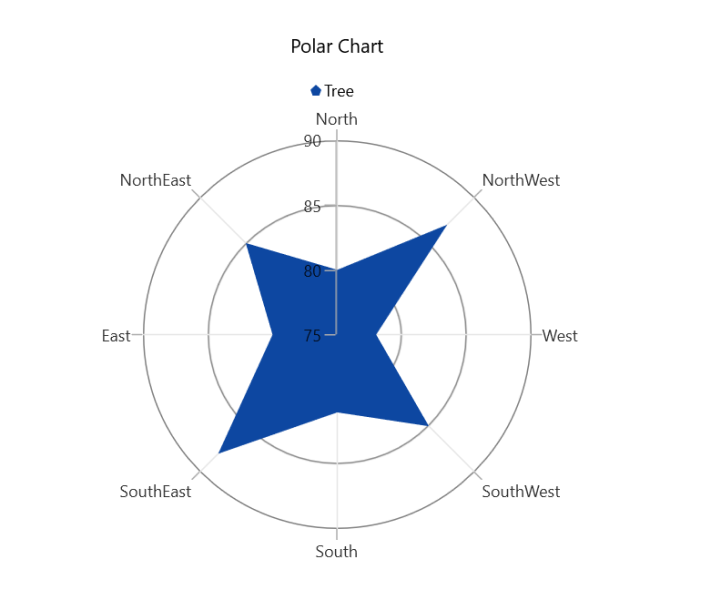

# WinUI Chart (SfPolarChart) Overview

Syncfusion WinUI Polar Chart is used to create the beautiful polar series to visualize the data in terms of values and angles, which are used in high quality WinUI applications. Polar chart is also known as star chart, spider chart, web chart, spider web chart, cobweb chart and radar chart.

## Key features

* It supports line and area series for data representation and greater UI visualization.

* Legends provide more information about the segments. The legend can also be used to collapse the segments. If an item exceeds the available bounds, the legends can be wrapped or scrolled.

* Polar chart provides support for rendering multiple series at same time, with options to compare and visualize two different series simultaneously.

* User friendly and provides various options for you to customize chart features like axis, title, data labels, and legends.

