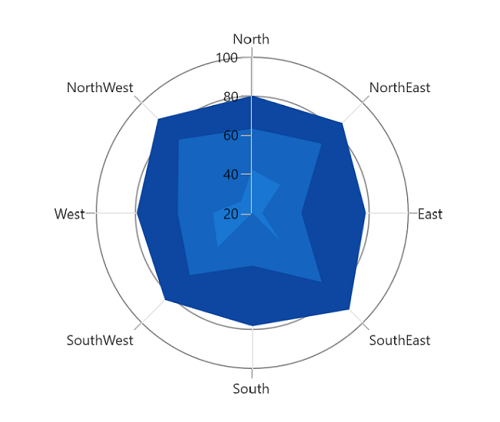
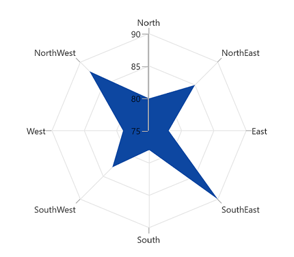
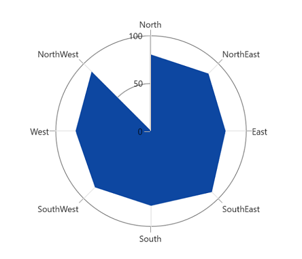

# Polar Area Chart in WinUI Charts (SfPolarChart)

To render an area series in a polar chart, create an instance of the [PolarAreaSeries](https://help.syncfusion.com/cr/winui/Syncfusion.UI.Xaml.Charts.PolarAreaSeries.html) and add it to the [Series](https://help.syncfusion.com/cr/winui/Syncfusion.UI.Xaml.Charts.SfPolarChart.html#Syncfusion_UI_Xaml_Charts_SfPolarChart_Series) collection property of [SfPolarChart](https://help.syncfusion.com/cr/winui/Syncfusion.UI.Xaml.Charts.SfPolarChart.html).





<chart:SfPolarChart>
...
    <chart:SfPolarChart.Series>
        <chart:PolarAreaSeries ItemsSource="{Binding PlantDetails}" 
                               XBindingPath="Direction"
                               YBindingPath="Tree" Label="Tree" />

        <chart:PolarAreaSeries ItemsSource="{Binding PlantDetails}" 
                               XBindingPath="Direction"
                               YBindingPath="Weed" Label="Weed" />

        <chart:PolarAreaSeries ItemsSource="{Binding PlantDetails}" 
                               XBindingPath="Direction"
                               YBindingPath="Flower" Label="Flower" />
    </chart:SfPolarChart.Series>
...
</chart:SfPolarChart>





SfPolarChart chart = new SfPolarChart();
...
PolarAreaSeries series1 = new PolarAreaSeries();
series1.XBindingPath = "Direction";
series1.YBindingPath = "Tree";
series1.ItemsSource = viewModel.PlantDetails;

PolarAreaSeries series2 = new PolarAreaSeries();
series2.XBindingPath = "Direction";
series2.YBindingPath = "Weed";
series2.ItemsSource = viewModel.PlantDetails;

PolarAreaSeries series3 = new PolarAreaSeries();
series3.XBindingPath = "Direction";
series3.YBindingPath = "Flower";
series3.ItemsSource = viewModel.PlantDetails;
...
chart.Series.Add(series1);
chart.Series.Add(series2);
chart.Series.Add(series3);
...





## Grid Line Type

The [GridLineType](https://help.syncfusion.com/cr/winui/Syncfusion.UI.Xaml.Charts.SfPolarChart.html#Syncfusion_UI_Xaml_Charts_SfPolarChart_GridLineType) property is used to change the rendering type of axis grid lines. The default value of [GridLineType](https://help.syncfusion.com/cr/winui/Syncfusion.UI.Xaml.Charts.SfPolarChart.html#Syncfusion_UI_Xaml_Charts_SfPolarChart_GridLineType) is [Circle](https://help.syncfusion.com/cr/winui/Syncfusion.UI.Xaml.Charts.PolarChartGridLineType.html#Syncfusion_UI_Xaml_Charts_PolarChartGridLineType_Circle). By changing the grid line type to [Polygon](https://help.syncfusion.com/cr/winui/Syncfusion.UI.Xaml.Charts.PolarChartGridLineType.html#Syncfusion_UI_Xaml_Charts_PolarChartGridLineType_Polygon), the polar chart can resemble a spider chart or web chart.





<chart:SfPolarChart GridLineType="Polygon">
...
    <chart:SfPolarChart.Series>
        <chart:PolarAreaSeries ItemsSource="{Binding PlantDetails}" 
                               XBindingPath="Direction"
                               YBindingPath="Tree" />
    </chart:SfPolarChart.Series>
...
</chart:SfPolarChart>





SfPolarChart chart = new SfPolarChart();
chart.GridLineType= PolarChartGridLineType.Polygon;
...
PolarAreaSeries series = new PolarAreaSeries();
series.XBindingPath = "Direction";
series.YBindingPath = "Tree";
series.ItemsSource = viewModel.PlantDetails;

chart.Series.Add(series);
...





## Closing Path

The [IsClosed](https://help.syncfusion.com/cr/winui/Syncfusion.UI.Xaml.Charts.PolarSeries.html#Syncfusion_UI_Xaml_Charts_PolarSeries_IsClosed) property is used to render the series with or without a closed path. The default value of [IsClosed](https://help.syncfusion.com/cr/winui/Syncfusion.UI.Xaml.Charts.PolarSeries.html#Syncfusion_UI_Xaml_Charts_PolarSeries_IsClosed) is `true`. 





<chart:SfPolarChart GridLineType="Polygon">
...
    <chart:SfPolarChart.Series>
        <chart:PolarAreaSeries ItemsSource="{Binding PlantDetails}" 
                               XBindingPath="Direction"
                               YBindingPath="Tree" 
                               IsClosed="False" />
    </chart:SfPolarChart.Series>
...
</chart:SfPolarChart>





SfPolarChart chart = new SfPolarChart();
chart.GridLineType= PolarChartGridLineType.Polygon;
...
PolarAreaSeries series = new PolarAreaSeries();
series.XBindingPath = "Direction";
series.YBindingPath = "Tree";
series.ItemsSource = viewModel.PlantDetails;
series.IsClosed= false;
...
chart.Series.Add(series);





