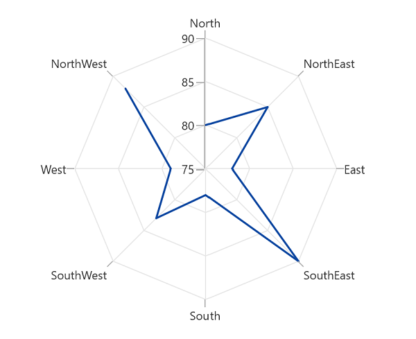

# PolarLineSeries in WinUI Polar Charts (SfPolarChart)

To render a polar or radar chart with line type, create an instance of the [PolarLineSeries]() and add it to the [PolarChart]() [Series]() collection property. The following code example shows how to use [PolarLineSeries]().





<chart:SfPolarChart Palette="BlueChrome">
...
    <chart:SfPolarChart.Series>
        <chart:SfPolarChart.Series>
            <chart:PolarLineSeries ItemsSource="{Binding PlantDetails}" 
                        XBindingPath="Direction"
                        YBindingPath="Tree" Label="Tree">
            </chart:PolarLineSeries>

            <chart:PolarLineSeries ItemsSource="{Binding PlantDetails}" 
                        XBindingPath="Direction"
                        YBindingPath="Weed" Label="Weed">
            </chart:PolarLineSeries>

            <chart:PolarLineSeries ItemsSource="{Binding PlantDetails}" 
                        XBindingPath="Direction"
                        YBindingPath="Flower" Label="Flower">
            </chart:PolarLineSeries>
        </chart:SfPolarChart.Series>

    </chart:SfPolarChart.Series>
...
</chart:SfPolarChart>





SfPolarChart chart = new SfPolarChart();
chart.Palette = ChartColorPalette.BlueChrome;
...
PolarLineSeries series1 = new PolarLineSeries();
series1.XBindingPath = "Direction";
series1.YBindingPath = "Tree";
series1.ItemsSource = viewModel.PlantDetails;

PolarLineSeries series2 = new PolarLineSeries();
series2.XBindingPath = "Direction";
series2.YBindingPath = "Weed";
series2.ItemsSource = viewModel.PlantDetails;

PolarLineSeries series3 = new PolarLineSeries();
series3.XBindingPath = "Direction";
series3.YBindingPath = "Flower";
series3.ItemsSource = viewModel.PlantDetails;
...
chart.Series.Add(series1);
chart.Series.Add(series2);
chart.Series.Add(series3);





## PolarChart GridLineType

The PolarChart [GridLineType]() property used to change the grid line type as `Circle` or `Polygon`. The PolarChart default [GridLineType]() value is `Circle` and type of `PolarChartGridLineType`. The following code example show the `PolarLineSeries` with [GridLineType]() as `Polygon`.





<chart:SfPolarChart GridLineType="Polygon">
...
    <chart:SfPolarChart.Series>
        <chart:PolarLineSeries ItemsSource="{Binding PlantDetails}" 
                    XBindingPath="Direction"
                    YBindingPath="Tree" >
        </chart:PolarLineSeries>
    </chart:SfPolarChart.Series>
...
</chart:SfPolarChart>





SfPolarChart chart = new SfPolarChart();
chart.GridLineType= PolarChartGridLineType.Polygon;
...
PolarLineSeries series = new PolarLineSeries();
series.XBindingPath = "Direction";
series.YBindingPath = "Tree";
series.ItemsSource = viewModel.PlantDetails;
...
chart.Series.Add(series);





## IsClosed

[PolarLineSeries]() [IsClosed]() property used to draw the polar arew with or without closed area path. The default value of [IsClosed]() is `true`. The following code example of the [IsClosed]() value as `false`.





<chart:SfPolarChart GridLineType="Polygon">
...
    <chart:SfPolarChart.Series>
        <chart:PolarLineSeries ItemsSource="{Binding PlantDetails}" 
                    XBindingPath="Direction"
                    YBindingPath="Tree" 
                    IsClosed="False">
        </chart:PolarLineSeries>
    </chart:SfPolarChart.Series>
...
</chart:SfPolarChart>





SfPolarChart chart = new SfPolarChart();
chart.GridLineType= PolarChartGridLineType.Polygon;
...
PolarLineSeries series = new PolarLineSeries();
series.XBindingPath = "Direction";
series.YBindingPath = "Tree";
series.ItemsSource = viewModel.PlantDetails;
series.IsClosed= false;
...
chart.Series.Add(series);





