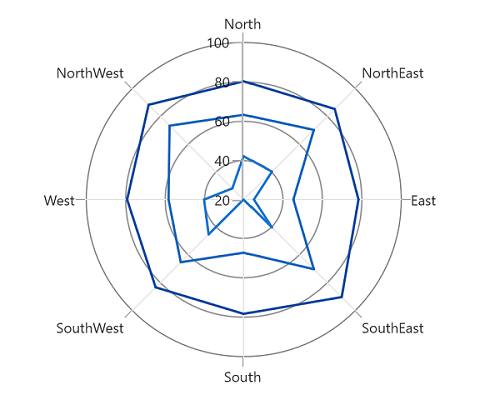
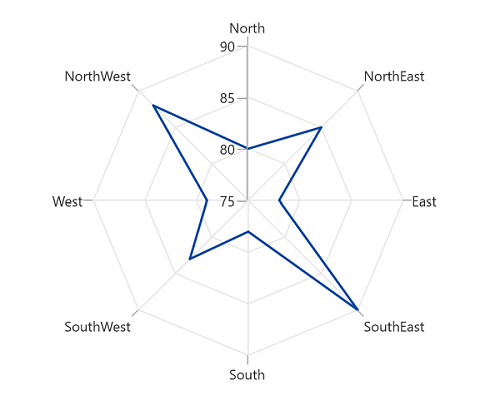

# Polar Line Chart in WinUI Charts (SfPolarChart)

To render a line series in polar chart, create an instance of the [PolarLineSeries]() and add it to the [Series]() collection property of [SfPolarChart]().





<chart:SfPolarChart Palette="BlueChrome">
...
    <chart:SfPolarChart.Series>
        <chart:SfPolarChart.Series>
            <chart:PolarLineSeries ItemsSource="{Binding PlantDetails}" 
                        XBindingPath="Direction"
                        YBindingPath="Tree" Label="Tree">
            </chart:PolarLineSeries>

            <chart:PolarLineSeries ItemsSource="{Binding PlantDetails}" 
                        XBindingPath="Direction"
                        YBindingPath="Weed" Label="Weed">
            </chart:PolarLineSeries>

            <chart:PolarLineSeries ItemsSource="{Binding PlantDetails}" 
                        XBindingPath="Direction"
                        YBindingPath="Flower" Label="Flower">
            </chart:PolarLineSeries>
        </chart:SfPolarChart.Series>

    </chart:SfPolarChart.Series>
...
</chart:SfPolarChart>





SfPolarChart chart = new SfPolarChart();
chart.Palette = ChartColorPalette.BlueChrome;
...
PolarLineSeries series1 = new PolarLineSeries();
series1.XBindingPath = "Direction";
series1.YBindingPath = "Tree";
series1.ItemsSource = viewModel.PlantDetails;

PolarLineSeries series2 = new PolarLineSeries();
series2.XBindingPath = "Direction";
series2.YBindingPath = "Weed";
series2.ItemsSource = viewModel.PlantDetails;

PolarLineSeries series3 = new PolarLineSeries();
series3.XBindingPath = "Direction";
series3.YBindingPath = "Flower";
series3.ItemsSource = viewModel.PlantDetails;
...
chart.Series.Add(series1);
chart.Series.Add(series2);
chart.Series.Add(series3);





## Grid line type

The [GridLineType]() property is used to change the rendering type of axis grid lines. The default value of [GridLineType]() is `Circle`. By changing the grid line type as `Polygon`, we can shown the polar chart similar like radar chart or spider chart or web chart. 





<chart:SfPolarChart GridLineType="Polygon">
...
    <chart:SfPolarChart.Series>
        <chart:PolarLineSeries ItemsSource="{Binding PlantDetails}" 
                    XBindingPath="Direction"
                    YBindingPath="Tree" >
        </chart:PolarLineSeries>
    </chart:SfPolarChart.Series>
...
</chart:SfPolarChart>





SfPolarChart chart = new SfPolarChart();
chart.GridLineType= PolarChartGridLineType.Polygon;
...
PolarLineSeries series = new PolarLineSeries();
series.XBindingPath = "Direction";
series.YBindingPath = "Tree";
series.ItemsSource = viewModel.PlantDetails;
...
chart.Series.Add(series);





## Closing Path

[IsClosed]() property is used to render the series with or without closed path. The default value of [IsClosed]() is `true`. 





<chart:SfPolarChart GridLineType="Polygon">
...
    <chart:SfPolarChart.Series>
        <chart:PolarLineSeries ItemsSource="{Binding PlantDetails}" 
                    XBindingPath="Direction"
                    YBindingPath="Tree" 
                    IsClosed="False">
        </chart:PolarLineSeries>
    </chart:SfPolarChart.Series>
...
</chart:SfPolarChart>





SfPolarChart chart = new SfPolarChart();
chart.GridLineType= PolarChartGridLineType.Polygon;
...
PolarLineSeries series = new PolarLineSeries();
series.XBindingPath = "Direction";
series.YBindingPath = "Tree";
series.ItemsSource = viewModel.PlantDetails;
series.IsClosed = false;
...
chart.Series.Add(series);





