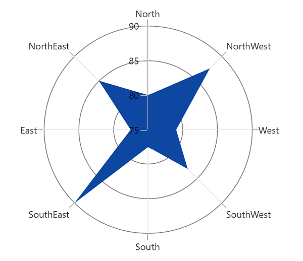

# Start angle in WinUI Polar Charts (SfPolarChart)

Chart axis provides support to render polar and radar series on 0, 90, 180 and 270 degrees. It can be achieved by the axis [PolarAngle]() property. The [PolarAngle]() is type of [ChartPolarAngle]() and its default value is Rotate270. Rotate0, Rotate90 and Rotate180 are another supported values of [PolarAngle](). Both the primary and secondary axes can be rotated individually based on its [PolarAngle]() value.

### Rotate0

The below code snippet explains how the axes of series has been rotated when [PolarAngle]() value is Rotate0,





<chart:SfPolarChart.PrimaryAxis>
    <chart:CategoryAxis PolarAngle="Rotate0"/>
</chart:SfPolarChart.PrimaryAxis>
<chart:SfPolarChart.SecondaryAxis>
    <chart:NumericalAxis PolarAngle="Rotate0"/>
</chart:SfPolarChart.SecondaryAxis>





chart.PrimaryAxis = new CategoryAxis()
{

    PolarAngle = ChartPolarAngle.Rotate0

};

chart.SecondaryAxis = new NumericalAxis()
{

    PolarAngle = ChartPolarAngle.Rotate0

};





### Rotate90

The below code snippet explains how the axes of series has been rotated when [PolarAngle]() value is Rotate90,





<chart:SfPolarChart.PrimaryAxis>
    <chart:CategoryAxis PolarAngle="Rotate90"/>
</chart:SfPolarChart.PrimaryAxis>
<chart:SfPolarChart.SecondaryAxis>
    <chart:NumericalAxis PolarAngle="Rotate90"/>
</chart:SfPolarChart.SecondaryAxis>





chart.PrimaryAxis = new CategoryAxis()
{

    PolarAngle = ChartPolarAngle.Rotate90

};

chart.SecondaryAxis = new NumericalAxis()
{

    PolarAngle = ChartPolarAngle.Rotate90

};





### Rotate180

The below code snippet explains how the axes of series has been rotated when [PolarAngle]() value is Rotate180,





<chart:SfPolarChart.PrimaryAxis>
    <chart:CategoryAxis PolarAngle="Rotate180"/>
</chart:SfPolarChart.PrimaryAxis>
<chart:SfPolarChart.SecondaryAxis>
    <chart:NumericalAxis PolarAngle="Rotate180"/>
</chart:SfPolarChart.SecondaryAxis>





chart.PrimaryAxis = new CategoryAxis()
{

    PolarAngle = ChartPolarAngle.Rotate180

};

chart.SecondaryAxis = new NumericalAxis()
{

    PolarAngle = ChartPolarAngle.Rotate180

};





### Rotate270

The below code snippet explains how the axes of series has been rotated, when [PolarAngle]() value is Rotate270,





<chart:SfPolarChart.PrimaryAxis>
    <chart:CategoryAxis PolarAngle="Rotate270"/>
</chart:SfPolarChart.PrimaryAxis>
<chart:SfPolarChart.SecondaryAxis>
    <chart:NumericalAxis PolarAngle="Rotate270"/>
</chart:SfPolarChart.SecondaryAxis>





chart.PrimaryAxis = new CategoryAxis()
{

    PolarAngle = ChartPolarAngle.Rotate270

};

chart.SecondaryAxis = new NumericalAxis()
{

    PolarAngle = ChartPolarAngle.Rotate270

};





