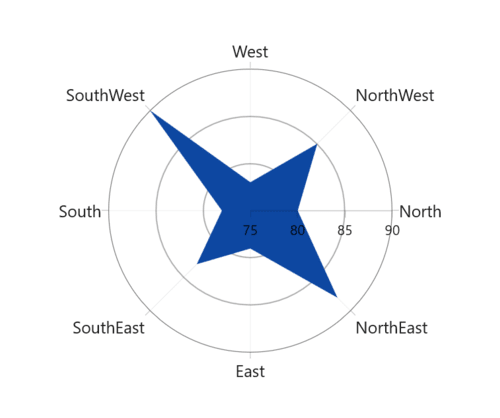

# Rendering Position in WinUI Chart (SfPolarChart)

By using the [StartAngle](https://help.syncfusion.com/cr/winui/Syncfusion.UI.Xaml.Charts.SfPolarChart.html#Syncfusion_UI_Xaml_Charts_SfPolarChart_StartAngle) property of polar chart, you can modify the rendering position of the series on four degree values: 0, 90, 180, and 270. The default value of [StartAngle](https://help.syncfusion.com/cr/winui/Syncfusion.UI.Xaml.Charts.SfPolarChart.html#Syncfusion_UI_Xaml_Charts_SfPolarChart_StartAngle) property is [Rotate270](https://help.syncfusion.com/cr/winui/Syncfusion.UI.Xaml.Charts.ChartPolarAngle.html#Syncfusion_UI_Xaml_Charts_ChartPolarAngle_Rotate270).





<chart:SfPolarChart StartAngle="Rotate0">
...
</chart:SfPolarChart>





SfPolarChart chart = new SfPolarChart();
chart.StartAngle = ChartPolarAngle.Rotate0;
...





