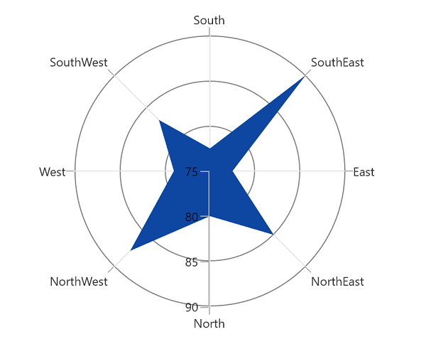
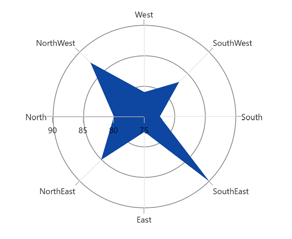

# Start angle in WinUI Polar Charts (SfPolarChart)

SfPolarChart [StartAngle]() property is used to render the polar chart axes on 0, 90, 180 and 270 degrees. The [StartAngle]() property is of type [ChartPolarAngle]() and its default value is [Rotate270]().

### Rotate0

The below code snippet explains how the axes of polar chart has been rotated when [StartAngle]() value is Rotate0,





<chart:SfPolarChart StartAngle="Rotate0">
...
</chart:SfPolarChart>





SfPolarChart chart = new SfPolarChart();
chart.StartAngle = ChartPolarAngle.Rotate0;
...





### Rotate90

The below code snippet explains how the axes of series has been rotated when [StartAngle]() value is Rotate90,





<chart:SfPolarChart StartAngle="Rotate90">
...
</chart:SfPolarChart>





SfPolarChart chart = new SfPolarChart();
chart.StartAngle = ChartPolarAngle.Rotate90;
...





### Rotate180

The below code snippet explains how the axes of series has been rotated when [StartAngle]() value is Rotate180,





<chart:SfPolarChart StartAngle="Rotate180">
...
</chart:SfPolarChart>





SfPolarChart chart = new SfPolarChart();
chart.StartAngle = ChartPolarAngle.Rotate180;
...





### Rotate270

The below code snippet explains how the axes of series has been rotated, when [StartAngle]() value is Rotate270,





<chart:SfPolarChart StartAngle="Rotate270">
...
</chart:SfPolarChart>





SfPolarChart chart = new SfPolarChart();
chart.StartAngle = ChartPolarAngle.Rotate270;
...





