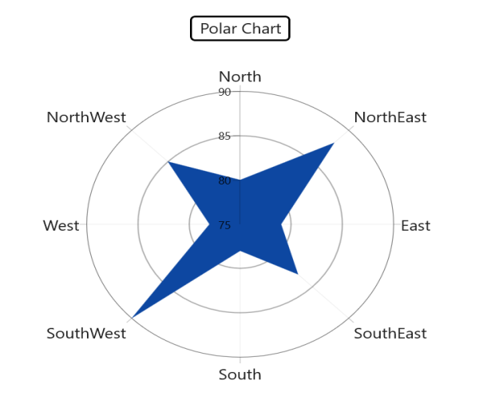

# Chart Title in WinUI Chart (SfPolarChart)

[Header](https://help.syncfusion.com/cr/winui/Syncfusion.UI.Xaml.Charts.ChartBase.html#Syncfusion_UI_Xaml_Charts_ChartBase_Header) property is used to define the title for the chart.

   



<chart:SfPolarChart x:Name="chart" Header="Polar Chart">
 . . .           
</chart:SfPolarChart>





SfPolarChart chart = new SfPolarChart();
chart.Header = "Polar Chart";
. . . 
this.Content = chart;



 

## Customization

Chart provides support to add any `UIElement` as a title. The following code example defines `TextBlock` as chart header.





 <chart:SfPolarChart>
    <chart:SfPolarChart.Header>
        <Border BorderThickness="2" BorderBrush="Black" Margin="10" CornerRadius="5">
            <TextBlock FontSize="14" Text="Polar Chart" Margin="5"/>
        </Border>
    </chart:SfPolarChart.Header>
    ...
</chart:SfPolarChart>





SfPolarChart chart = new SfPolarChart();
. . .
Border border = new Border()
{
    BorderThickness = new Thickness(2),
    BorderBrush = new SolidColorBrush(Colors.Black),
    Margin = new Thickness(10),
    CornerRadius = new CornerRadius(5)
};

TextBlock textBlock = new TextBlock()
{
    Text = "Polar Chart",
    Margin = new Thickness(5),
    FontSize = 14
};

border.Child = textBlock;
. . . 
this.Content = chart;





## Alignment

The title text content can be aligned horizontally to the left, center or right of the chart using the [HorizontalHeaderAlignment](https://help.syncfusion.com/cr/winui/Syncfusion.UI.Xaml.Charts.ChartBase.html#Syncfusion_UI_Xaml_Charts_ChartBase_HorizontalHeaderAlignment) property of the [SfPolarChart](https://help.syncfusion.com/cr/winui/Syncfusion.UI.Xaml.Charts.SfPolarChart.html).





<chart:SfPolarChart HorizontalHeaderAlignment="Left">
    <chart:SfPolarChart.Header>
        <Border BorderThickness="2" BorderBrush="Black" Background="LightBlue" Margin="10" CornerRadius="5">
            <TextBlock Text="Polar Chart"
                    Margin="5" 
                    HorizontalTextAlignment="Center"
                    FontSize="14" 
                    Foreground="Blue">
            </TextBlock>
        </Border>
    </chart:SfPolarChart.Header>
    ...
 </chart:SfPolarChart>





SfPolarChart chart = new SfPolarChart();
chart.HorizontalHeaderAlignment = HorizontalAlignment.Left;
...
Border border = new Border()
{
    BorderThickness = new Thickness(2),
    BorderBrush = new SolidColorBrush(Colors.Black),
    Background = new SolidColorBrush(Colors.LightBlue),
    Margin = new Thickness(10),
    CornerRadius = new CornerRadius(5)
};

TextBlock textBlock = new TextBlock()
{
    Text = "Polar Chart",
    HorizontalTextAlignment = TextAlignment.Center,
    Foreground = new SolidColorBrush(Colors.Blue),
    FontSize = 14,
};

border.Child = textBlock;
chart.Header = border;
...





