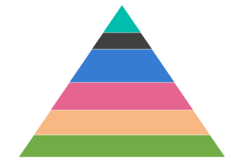
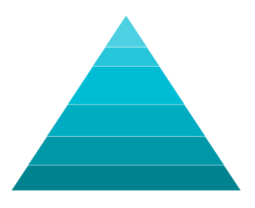
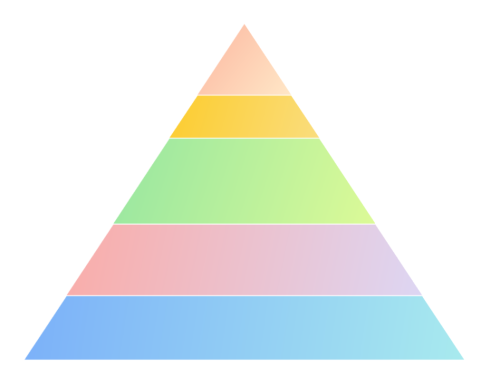

# Appearance in WinUI Chart (SfPyramidChart)

The appearance of [SfPyramidChart](https://help.syncfusion.com/cr/winui/Syncfusion.UI.Xaml.Charts.SfPyramidChart.html) can be customized by using the predefined palettes, custom palettes and gradient, which allows to enrich the application.

## Palettes

[SfPyramidChart](https://help.syncfusion.com/cr/winui/Syncfusion.UI.Xaml.Charts.SfPyramidChart.html) provides options for applying various kinds of palettes. Some predefined palettes, such as.

* Metro
* AutumnBrights
* FloraHues
* Pineapple
* TomatoSpectrum
* RedChrome
* PurpleChrome
* BlueChrome
* GreenChrome
* Elite
* LightCandy
* SandyBeach

### Applying Palette

Each palette applies a set of predefined brushes to the pyramid series in a predefined order. [Metro](https://help.syncfusion.com/cr/winui/Syncfusion.UI.Xaml.Charts.ChartColorPalette.html#Syncfusion_UI_Xaml_Charts_ChartColorPalette_Metro) palette is the default palette.





<chart:SfPyramidChart x:Name="chart" 
                ItemsSource="{Binding Data}" 
                XBindingPath="Category"
                YBindingPath="Value">

</chart:SfPyramidChart>





SfPyramidChart chart = new SfPyramidChart();
chart.SetBinding(SfPyramidChart.ItemsSourceProperty, new Binding() { Path = new PropertyPath("Data") });
chart.XBindingPath = "Category";
chart.YBindingPath = "Value";
. . .
this.Content = chart;





The following code example defined [`Palette`](https://help.syncfusion.com/cr/winui/Syncfusion.UI.Xaml.Charts.ChartBase.html#Syncfusion_UI_Xaml_Charts_ChartBase_Palette) as [`GreenChrome`](https://help.syncfusion.com/cr/winui/Syncfusion.UI.Xaml.Charts.ChartColorPalette.html#Syncfusion_UI_Xaml_Charts_ChartColorPalette_GreenChrome).





<chart:SfPyramidChart x:Name="chart" 
                Palette="GreenChrome"
                ItemsSource="{Binding Data}" 
                XBindingPath="Category"
                YBindingPath="Value">

</chart:SfPyramidChart>





SfPyramidChart chart = new SfPyramidChart();
chart.Palette = ChartColorPalette.GreenChrome;
chart.SetBinding(SfPyramidChart.ItemsSourceProperty, new Binding() { Path = new PropertyPath("Data") });
chart.XBindingPath = "Category";
chart.YBindingPath = "Value";
. . .
this.Content = chart;





## Custom Palette

[SfPyramidChart](https://help.syncfusion.com/cr/winui/Syncfusion.UI.Xaml.Charts.SfPyramidChart.html) provides support to define own brushes for the chart with preferred order by using the [CustomBrushes](https://help.syncfusion.com/cr/winui/Syncfusion.UI.Xaml.Charts.ChartColorModel.html#Syncfusion_UI_Xaml_Charts_ChartColorModel_CustomBrushes) property of [ChartColorModel](https://help.syncfusion.com/cr/winui/Syncfusion.UI.Xaml.Charts.ChartColorModel.html) and [Palette](https://help.syncfusion.com/cr/winui/Syncfusion.UI.Xaml.Charts.ChartBase.html#Syncfusion_UI_Xaml_Charts_ChartBase_Palette) value as `Custom`, as shown in the following code example.





<chart:SfPyramidChart x:Name="chart" 
                Palette="Custom" 
                ItemsSource="{Binding Data}" 
                XBindingPath="Category"
                YBindingPath="Value">

    <chart:SfPyramidChart.ColorModel>
        <chart:ChartColorModel>
            <chart:ChartColorModel.CustomBrushes>
                <SolidColorBrush Color="#4dd0e1"/>
                <SolidColorBrush Color="#26c6da"/>
                <SolidColorBrush Color="#00bcd4"/>
                <SolidColorBrush Color="#00acc1"/>
                <SolidColorBrush Color="#0097a7"/>
                <SolidColorBrush Color="#00838f"/>
            </chart:ChartColorModel.CustomBrushes>
        </chart:ChartColorModel>
    </chart:SfPyramidChart.ColorModel>
. . .
</chart:SfPyramidChart>





SfPyramidChart chart = new SfPyramidChart();
...
ChartColorModel colorModel = new ChartColorModel();
colorModel.CustomBrushes.Add(new SolidColorBrush(Color.FromArgb(255, 77, 208, 225)));
colorModel.CustomBrushes.Add(new SolidColorBrush(Color.FromArgb(255, 38, 198, 218)));
colorModel.CustomBrushes.Add(new SolidColorBrush(Color.FromArgb(255, 0, 188, 212)));
colorModel.CustomBrushes.Add(new SolidColorBrush(Color.FromArgb(255, 0, 172, 193)));
colorModel.CustomBrushes.Add(new SolidColorBrush(Color.FromArgb(255, 0, 151, 167)));
colorModel.CustomBrushes.Add(new SolidColorBrush(Color.FromArgb(255, 0, 131, 143)));

chart.SetBinding(SfPyramidChart.ItemsSourceProperty, new Binding() { Path = new PropertyPath("Data") });
chart.XBindingPath = "Category";
chart.YBindingPath = "Value";
chart.ColorModel = colorModel;
chart.Palette = ChartColorPalette.Custom;
. . .            
this.Content = chart;





## Applying Gradient

Gradient for the pyramid chart can be set by using the [`ColorModel`](https://help.syncfusion.com/cr/winui/Syncfusion.UI.Xaml.Charts.ChartBase.html#Syncfusion_UI_Xaml_Charts_ChartBase_ColorModel) property of the pyramid chart with the help of `LinearGradientBrush` or `RadialGradientBrush`.





<chart:SfPyramidChart x:Name="chart" 
                Palette="Custom" 
                ItemsSource="{Binding Data}" 
                XBindingPath="Category"
                YBindingPath="Value">

    <chart:SfPyramidChart.ColorModel>
        <chart:ChartColorModel>
            <chart:ChartColorModel.CustomBrushes>
                <LinearGradientBrush>
                    <GradientStop Offset="1" Color="#FFE7C7" />
                    <GradientStop Offset="0" Color="#FCB69F" />
                </LinearGradientBrush>
                <LinearGradientBrush>
                    <GradientStop Offset="1" Color="#fadd7d" />
                    <GradientStop Offset="0" Color="#fccc2d" />
                </LinearGradientBrush>
                <LinearGradientBrush>
                    <GradientStop Offset="1" Color="#DCFA97" />
                    <GradientStop Offset="0" Color="#96E6A1" />
                </LinearGradientBrush>
                <LinearGradientBrush>
                    <GradientStop Offset="1" Color="#DDD6F3" />
                    <GradientStop Offset="0" Color="#FAACA8" />
                </LinearGradientBrush>
                <LinearGradientBrush>
                    <GradientStop Offset="1" Color="#A8EAEE" />
                    <GradientStop Offset="0" Color="#7BB0F9" />
                </LinearGradientBrush>
            </chart:ChartColorModel.CustomBrushes>
        </chart:ChartColorModel>
    </chart:SfPyramidChart.ColorModel>
. . .
</chart:SfPyramidChart>





SfPyramidChart chart = new SfPyramidChart();
...
ChartColorModel colorModel = new ChartColorModel();
LinearGradientBrush gradientColor1 = new LinearGradientBrush();
GradientStop stop1 = new GradientStop() { Offset = 1, Color = Color.FromRgb(255, 231, 199) };
GradientStop stop2 = new GradientStop() { Offset = 0, Color = Color.FromRgb(252, 182, 159) };
gradientColor1.GradientStops.Add(stop1);
gradientColor1.GradientStops.Add(stop2);
LinearGradientBrush gradientColor2 = new LinearGradientBrush();
stop1 = new GradientStop() { Offset = 1, Color = Color.FromRgb(250, 221, 125) };
stop2 = new GradientStop() { Offset = 0, Color = Color.FromRgb(252, 204, 45) };
gradientColor2.GradientStops.Add(stop1);
gradientColor2.GradientStops.Add(stop2);
...
colorModel.CustomBrushes.Add(gradientColor1);
colorModel.CustomBrushes.Add(gradientColor2);
...
chart.SetBinding(SfPyramidChart.ItemsSourceProperty, new Binding() { Path = new PropertyPath("Data") });
chart.XBindingPath = "Category";
chart.YBindingPath = "Value";
chart.ColorModel = colorModel;
chart.Palette = ChartColorPalette.Custom;
. . .            
this.Content = chart;





## Segment Color Binding

The color of the each segment can be set by binding their corresponding model property from the `ItemsSource` collection to its [`ColorValuePath`](https://help.syncfusion.com/cr/winui/Syncfusion.UI.Xaml.Charts.SfPyramidChart.html#Syncfusion_UI_Xaml_Charts_SfPyramidChart_ColorValuePath) property of pyramid chart as follows.





<chart:SfPyramidChart x:Name="chart" 
                ItemsSource="{Binding Data}" 
                XBindingPath="Category"
                YBindingPath="Value"
                ColorValuePath="SegmentColor">
. . .
</chart:SfPyramidChart>





public class ViewModel
{
    public ObservableCollection<Model> Data { get; set; }

    public ViewModel()
    {
        Data = new ObservableCollection<Model>()
        {
            new Model(){Category = "Samsung", Value = 30, SegmentColor = new SolidColorBrush(Color.FromArgb(255, 152, 251, 152))},
            new Model(){Category = "LG", Value = 55, SegmentColor = new SolidColorBrush(Color.FromArgb(255, 255, 105, 180))},
            new Model(){Category = "Sony", Value = 50, SegmentColor = new SolidColorBrush(Color.FromArgb(255, 255, 165, 0))},
            new Model(){Category = "Moto", Value = 40, SegmentColor = new SolidColorBrush(Color.FromArgb(255, 238, 130, 238))},
            new Model(){Category = "HP", Value = 50, SegmentColor = new SolidColorBrush(Color.FromArgb(255, 0, 255, 255))},

        };
    }
}

SfPyramidChart chart = new SfPyramidChart();
. . .
chart.SetBinding(SfPyramidChart.ItemsSourceProperty, new Binding() { Path = new PropertyPath("Data") });
chart.XBindingPath = "Category";
chart.YBindingPath = "Value";
chart.ColorValuePath = "SegmentColor";
. . .            
this.Content = chart;





