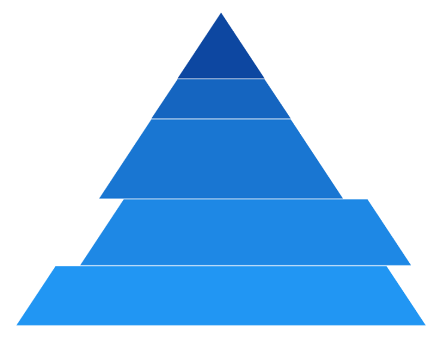

# Explode Segments in WinUI Chart (SfPyramidChart)

Exploding a segment is used to pull attention to a specific area of the pyramid. The following properties are used to explode the segments in the pyramid chart.

* [ExplodeIndex](https://help.syncfusion.com/cr/winui/Syncfusion.UI.Xaml.Charts.SfPyramidChart.html#Syncfusion_UI_Xaml_Charts_SfPyramidChart_ExplodeIndex) - Used to explode any specific segment.
* [ExplodeOffset](https://help.syncfusion.com/cr/winui/Syncfusion.UI.Xaml.Charts.SfPyramidChart.html#Syncfusion_UI_Xaml_Charts_SfPyramidChart_ExplodeOffset) - Used to define the explode distance of segment.
* [ExplodeOnTap](https://help.syncfusion.com/cr/winui/Syncfusion.UI.Xaml.Charts.SfPyramidChart.html#Syncfusion_UI_Xaml_Charts_SfPyramidChart_ExplodeOnTap) - Used to explode the segment when segment is tapped/clicked.

 



<chart:SfPyramidChart x:Name="chart" 
                Palette="BlueChrome"
                ExplodeIndex="3"  
                ExplodeOffset="30" 
                ItemsSource="{Binding Data}" 
                XBindingPath="Category"
                YBindingPath="Value">

</chart:SfPyramidChart>
 




SfPyramidChart chart = new SfPyramidChart();
chart.Palette = ChartColorPalette.BlueChrome;
chart.SetBinding(SfPyramidChart.ItemsSourceProperty, new Binding() { Path = new PropertyPath("Data") });
chart.XBindingPath = "Category";
chart.YBindingPath = "Value";
chart.ExplodeIndex = 3;
chart.ExplodeOffset = 30;
. . . 
this.Content = chart;





