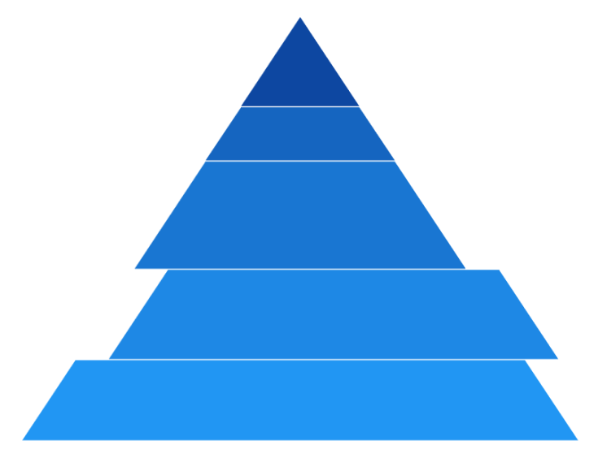

# Explode segments in WinUI pyramid charts

Exploding a segment is used to draw attention to a specific area of the pyramid. The following properties are used to explode the segments in the pyramid chart.

* [ExplodeIndex](https://help.syncfusion.com/cr/winui/Syncfusion.UI.Xaml.Charts.SfPyramidChart.html#Syncfusion_UI_Xaml_Charts_SfPyramidChart_ExplodeIndex) - Used to explode any specific segment.
* [ExplodeOffset](https://help.syncfusion.com/cr/winui/Syncfusion.UI.Xaml.Charts.SfPyramidChart.html#Syncfusion_UI_Xaml_Charts_SfPyramidChart_ExplodeOffset) - Used to define the explode distance of the segment.
* [ExplodeOnTap](https://help.syncfusion.com/cr/winui/Syncfusion.UI.Xaml.Charts.SfPyramidChart.html#Syncfusion_UI_Xaml_Charts_SfPyramidChart_ExplodeOnTap) - Used to explode the segment when it is tapped/clicked.

 



<chart:SfPyramidChart 
    x:Name="chart" 
    ExplodeIndex="3"  
    ExplodeOffset="30" 
    ItemsSource="{Binding Data}" 
    XBindingPath="Category"
    YBindingPath="Value">
</chart:SfPyramidChart>
 




SfPyramidChart chart = new SfPyramidChart();

chart.SetBinding(SfPyramidChart.ItemsSourceProperty, new Binding() 
{ 
    Path = new PropertyPath("Data") 
});

chart.XBindingPath = "Category";
chart.YBindingPath = "Value";
chart.ExplodeIndex = 3;
chart.ExplodeOffset = 30;

// Configure additional chart elements
this.Content = chart;





