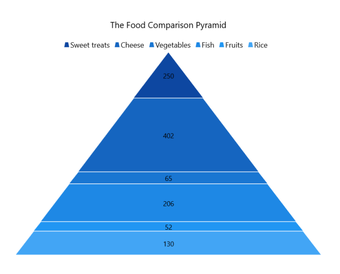

# Getting started with WinUI Chart

This section explains how to populate the pyramid chart with data, a header, data labels, legend, and tooltips, as well as the essential aspects for getting started with the chart.

## Creating an application with WinUI Chart

1. Create a [WinUI 3 desktop app for C# and .NET 5](https://docs.microsoft.com/en-us/windows/apps/winui/winui3/get-started-winui3-for-desktop) or [WinUI 3 app in UWP for C#](https://docs.microsoft.com/en-us/windows/apps/winui/winui3/get-started-winui3-for-uwp).
2. Add reference to [Syncfusion.Chart.WinUI](https://www.nuget.org/packages/Syncfusion.Chart.WinUI/) NuGet. 
3. Import the control namespace `Syncfusion.UI.Xaml.Charts` in XAML or C# to initialize the control.
4. Initialize [SfPyramidChart](https://help.syncfusion.com/cr/winui/Syncfusion.UI.Xaml.Charts.SfPyramidChart.html) control.

 



<Window>
    x:Class="ChartDemo.MainWindow"

    . . .
    xmlns:chart="using:Syncfusion.UI.Xaml.Charts">
    <chart:SfPyramidChart/>

</Window>
 




using Syncfusion.UI.Xaml.Charts;

. . .

public sealed partial class MainWindow : Window
{
    
    public MainWindow()
    {
        this.InitializeComponent();
        SfPyramidChart chart = new SfPyramidChart();
        . . .
        this.Content = chart;
    }
}   





## Initialize View Model

Now, let us define a simple data model that represents a data point in the chart.

  



public class Model
{
    public string FoodName { get; set; }

    public double Calories { get; set; }
}

 

 

Next, create a view model class and initialize a list of `Model` objects as follows.

  



public class ChartViewModel
{
    public List<Model> Data { get; set; }

    public ChartViewModel()
    {
        Data = new List<Model>()
        {
            new Model(){FoodName = "Sweet treats", Calories = 250},
            new Model(){FoodName = "Cheese", Calories = 402},
            new Model(){FoodName = "Vegetables", Calories = 65},
            new Model(){FoodName = "Fish", Calories = 206},
            new Model(){FoodName = "Fruits", Calories = 52},
            new Model(){FoodName = "Rice", Calories = 130},
        };
    }
}

 

 

Create a `ViewModel` instance and set it as the chart's `DataContext`. This enables property binding from the `ViewModel` class.

N> If you prefer to set `DataContext` in XAML, add the namespace of the `ViewModel` class to your XAML Page.

 

 

<Window>
    . . .

    xmlns:chart="using:Syncfusion.UI.Xaml.Charts"
    xmlns:model="using:ChartDemo.ViewModel">

    <chart:SfPyramidChart>
        <chart:SfPyramidChart.DataContext>
            <model:ChartViewModel/>
        </chart:SfPyramidChart.DataContext>
    </chart:SfPyramidChart>

</Window>



 

ChartViewModel viewModel = new ChartViewModel();
chart.DataContext = viewModel;



 

## Add Title

The title of the chart provide quick information to the user about the data being plotted in the chart. The title cane be set by using the [Header](https://help.syncfusion.com/cr/winui/Syncfusion.UI.Xaml.Charts.ChartBase.html#Syncfusion_UI_Xaml_Charts_ChartBase_Header) property of the pyramid chart as follows.

 



<chart:SfPyramidChart Header="Calories in food">
    
. . .

</chart:SfPyramidChart>





SfPyramidChart chart = new SfPyramidChart();

. . .

chart.Header = "Calories in food";



  

## Enable Data Labels

The [ShowDataLabels](https://help.syncfusion.com/cr/winui/Syncfusion.UI.Xaml.Charts.SfPyramidChart.html#Syncfusion_UI_Xaml_Charts_SfPyramidChart_ShowDataLabels) property of [PyramidChart](https://help.syncfusion.com/cr/winui/Syncfusion.UI.Xaml.Charts.SfPyramidChart.html) is used to enable data labels to improve the readability of the pyramid chart. The label visibility is set to `False` by default.

 



<chart:SfPyramidChart ShowDataLabels="True">
    . . . 
</chart:SfPyramidChart>





SfPyramidChart chart = new SfPyramidChart();
. . .
chart.ShowDataLabels = true;



  

## Enable Legend

The legend provides information about the data point displayed in the pyramid chart. The [Legend](https://help.syncfusion.com/cr/winui/Syncfusion.UI.Xaml.Charts.ChartBase.html#Syncfusion_UI_Xaml_Charts_ChartBase_Legend) property of the chart was used to enable it.

 



<chart:SfPyramidChart>
    . . .
    <chart:SfPyramidChart.Legend>
        <chart:ChartLegend/>
    </chart:SfPyramidChart.Legend>
</chart:SfPyramidChart>





SfPyramidChart chart = new SfPyramidChart();
. . .
chart.Legend = new ChartLegend();



 

## Enable Tooltip

Tooltips are used to display information about a segment, when the mouse is moved over it. Enable tooltip by setting [ShowTooltip](https://help.syncfusion.com/cr/winui/Syncfusion.UI.Xaml.Charts.SfPyramidChart.html#Syncfusion_UI_Xaml_Charts_SfPyramidChart_ShowTooltip) property as true.

 



<chart:SfPyramidChart ShowTooltip="True">
    . . . 
</chart:SfPyramidChart>





SfPyramidChart chart = new SfPyramidChart();
. . .
chart.ShowTooltip = true;





The following code example gives you the complete code of above configurations.

N> To plot the chart, the [XBindingPath](https://help.syncfusion.com/cr/winui/Syncfusion.UI.Xaml.Charts.SfPyramidChart.html#Syncfusion_UI_Xaml_Charts_SfPyramidChart_XBindingPath) and [YBindingPath](https://help.syncfusion.com/cr/winui/Syncfusion.UI.Xaml.Charts.SfPyramidChart.html#Syncfusion_UI_Xaml_Charts_SfPyramidChart_YBindingPath) properties must be configured so that the chart may get values from the respective properties in the data model.

 



<chart:SfPyramidChart x:Name="chart" 
                    Header="The Food Comparison Pyramid"
                    ShowTooltip="True"
                    ShowDataLabels="True"
                    Palette="BlueChrome"
                    ItemsSource="{Binding Data}" 
                    XBindingPath="FoodName"
                    YBindingPath="Calories">

    <chart:SfPyramidChart.DataContext>
        <model:ChartViewModel />
    </chart:SfPyramidChart.DataContext>

    <chart:SfPyramidChart.Legend>
        <chart:ChartLegend />
    </chart:SfPyramidChart.Legend>

</chart:SfPyramidChart>
 




using Syncfusion.UI.Xaml.Charts;

. . .

public sealed partial class MainWindow : Window
{
    public MainWindow()
    {
        SfPyramidChart chart = new SfPyramidChart();
        ChartViewModel viewModel = new ChartViewModel();
        chart.DataContext = viewModel;
        chart.SetBinding(SfPyramidChart.ItemsSourceProperty, new Binding() { Path = new PropertyPath("Data") });
        chart.XBindingPath = "FoodName";
        chart.YBindingPath = "Calories";
        chart.Header = "The Food Comparison Pyramid";
        chart.Legend = new ChartLegend();
        chart.ShowTooltip = true;
        chart.ShowDataLabels = true;

        this.Content = chart;
    }
}





N> Download demo application from [GitHub](https://github.com/SyncfusionExamples/GettingStartedChartWinUI/tree/main/PyramidChartGettingStarted).
