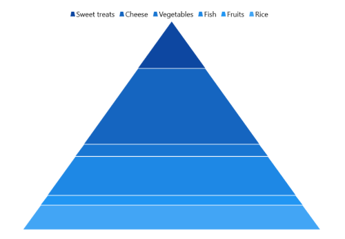
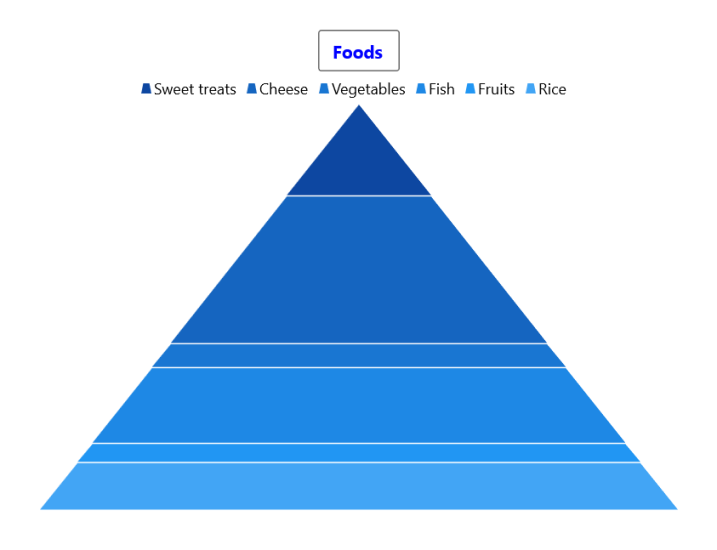
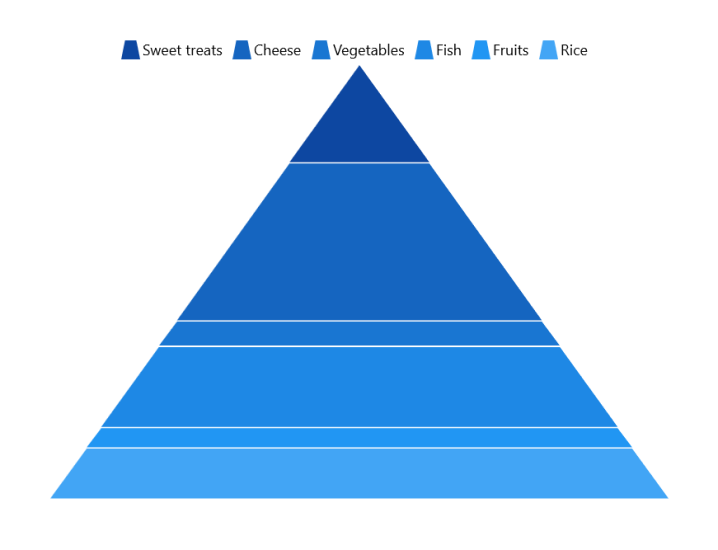
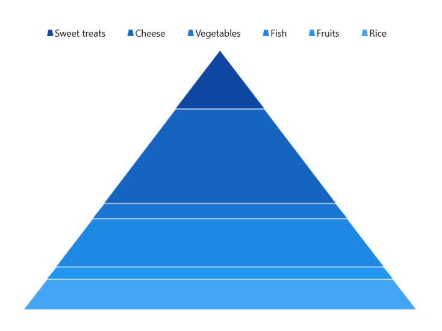
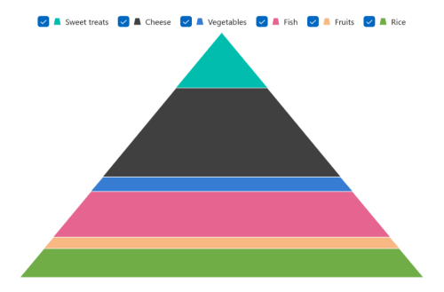
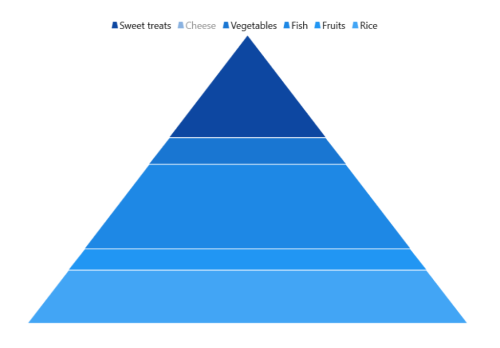
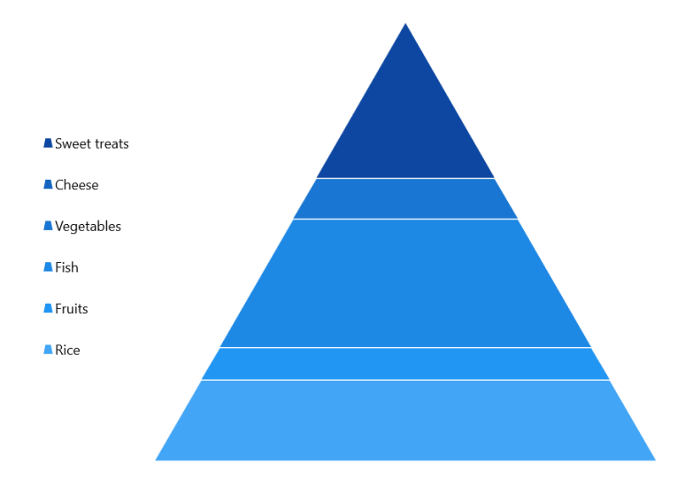
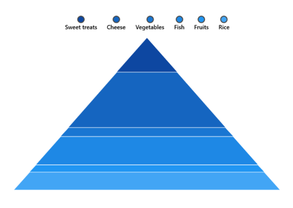

# Legend in WinUI Chart (SfPyramidChart)

The legend contains a list of series data points in the chart. The information provided in each legend item helps you identify the corresponding data in the chart. 

The following code example shows how to enable a legend in the chart.





<chart:SfPyramidChart x:Name="chart">
. . .
    <chart:SfPyramidChart.Legend>
        <chart:ChartLegend/>
    </chart:SfPyramidChart.Legend>
. . .
</chart:SfPyramidChart>





SfPyramidChart chart = new SfPyramidChart();
chart.Legend = new ChartLegend();
. . . 
this.Content = chart;





N> The x-value of data points in the pyramid chart will be the legend items ‘Label’.

## Title

The pyramid chart provides support to add any `UIElement` as a title for the legend. The [Header](https://help.syncfusion.com/cr/winui/Syncfusion.UI.Xaml.Charts.ChartLegend.html#Syncfusion_UI_Xaml_Charts_ChartLegend_Header) property of [ChartLegend](https://help.syncfusion.com/cr/winui/Syncfusion.UI.Xaml.Charts.ChartLegend.html) is used to define the title for the legend, as shown in the following code example.





<chart:SfPyramidChart x:Name="chart">
. . .
    <chart:SfPyramidChart.Legend>
        <chart:ChartLegend>
            <chart:ChartLegend.Header>
                <TextBox Text="Foods" 
                         HorizontalAlignment="Center"
                         FontWeight="Bold"
                         Foreground="Blue"/>
            </chart:ChartLegend.Header>
        </chart:ChartLegend>
    </chart:SfPyramidChart.Legend>
. . .
</chart:SfPyramidChart>





SfPyramidChart chart = new SfPyramidChart();
ChartLegend legend = new ChartLegend();

TextBlock textBlock = new TextBlock()
{
    Text = "Foods",
    HorizontalTextAlignment = TextAlignment.Center,
    Foreground = new SolidColorBrush(Colors.Blue),
    FontWeight = FontWeights.Bold,
};

legend.Header = textBlock;
chart.Legend = legend;
. . . 
this.Content = chart;





## Icon

The legend icon represents a symbol associated with each legend item. The appearance of the legend icon can be customized using the following properties:
* [IconWidth](https://help.syncfusion.com/cr/winui/Syncfusion.UI.Xaml.Charts.ChartLegend.html#Syncfusion_UI_Xaml_Charts_ChartLegend_IconWidth) - Gets or sets the double value that represents the legend icon's width.
* [IconHeight](https://help.syncfusion.com/cr/winui/Syncfusion.UI.Xaml.Charts.ChartLegend.html#Syncfusion_UI_Xaml_Charts_ChartLegend_IconHeight) - Gets or sets the double value that represents the legend icon's height.
* [IconVisibility](https://help.syncfusion.com/cr/winui/Syncfusion.UI.Xaml.Charts.ChartLegend.html#Syncfusion_UI_Xaml_Charts_ChartLegend_IconVisibility) - Gets or sets the visibility of the legend icon.





<chart:SfPyramidChart x:Name="chart">
. . .
    <chart:SfPyramidChart.Legend>
        <chart:ChartLegend IconWidth="15"
						   IconHeight="15" 
                           IconVisibility="Visible">
        </chart:ChartLegend>
    </chart:SfPyramidChart.Legend>
. . .
</chart:SfPyramidChart>





SfPyramidChart chart = new SfPyramidChart();
chart.Legend = new ChartLegend()
{
    IconWidth = 15,
    IconHeight = 15,
    IconVisibility = Visibility.Visible,
};
. . . 
this.Content = chart;





## Item Spacing

The [ItemMargin](https://help.syncfusion.com/cr/winui/Syncfusion.UI.Xaml.Charts.ChartLegend.html#Syncfusion_UI_Xaml_Charts_ChartLegend_ItemMargin) property of the [ChartLegend](https://help.syncfusion.com/cr/winui/Syncfusion.UI.Xaml.Charts.ChartLegend.html) is used to provide spacing between each legend item.





<chart:SfPyramidChart x:Name="chart">
. . .
    <chart:SfPyramidChart.Legend>
        <chart:ChartLegend ItemMargin="10"/>
    </chart:SfPyramidChart.Legend>
. . .
</chart:SfPyramidChart>





SfPyramidChart chart = new SfPyramidChart();
chart.Legend = new ChartLegend()
{
    ItemMargin = new Thickness(10)
};
. . . 
this.Content = chart;





## Checkbox for Legend

The pyramid chart provides support to enable the checkbox for each legend item to make data points visible or collapse them. By default, the value of the [CheckBoxVisibility](https://help.syncfusion.com/cr/winui/Syncfusion.UI.Xaml.Charts.ChartLegend.html#Syncfusion_UI_Xaml_Charts_ChartLegend_CheckBoxVisibility) property is `Collapsed`.





<chart:SfPyramidChart x:Name="chart">
. . .
    <chart:SfPyramidChart.Legend>
        <chart:ChartLegend CheckBoxVisibility="Visible"/>
    </chart:SfPyramidChart.Legend>
. . .
</chart:SfPyramidChart>





SfPyramidChart chart = new SfPyramidChart();
chart.Legend = new ChartLegend()
{
   CheckBoxVisibility = Visibility.Visible
};
. . . 
this.Content = chart;





## Toggle Series Visibility

By enabling the [ToggleSeriesVisibility](https://help.syncfusion.com/cr/winui/Syncfusion.UI.Xaml.Charts.ChartLegend.html#Syncfusion_UI_Xaml_Charts_ChartLegend_ToggleSeriesVisibility) property, the visibility of the pyramid segment can be controlled by tapping the legend item. By default, the value of the [ToggleSeriesVisibility](https://help.syncfusion.com/cr/winui/Syncfusion.UI.Xaml.Charts.ChartLegend.html#Syncfusion_UI_Xaml_Charts_ChartLegend_ToggleSeriesVisibility) property is `False`.





<chart:SfPyramidChart x:Name="chart">
. . .
    <chart:SfPyramidChart.Legend>
        <chart:ChartLegend ToggleSeriesVisibility="True"/>
    </chart:SfPyramidChart.Legend>
. . .
</chart:SfPyramidChart>





SfPyramidChart chart = new SfPyramidChart();
chart.Legend = new ChartLegend()
{
   ToggleSeriesVisibility = true
};
. . . 
this.Content = chart;





## Placement

By using the [Placement](https://help.syncfusion.com/cr/winui/Syncfusion.UI.Xaml.Charts.ChartLegend.html#Syncfusion_UI_Xaml_Charts_ChartLegend_Placement) property, legends can be docked to the left, right, top, or bottom of the chart area. By default, the chart legend is docked at the top of the chart.





<chart:SfPyramidChart x:Name="chart">
. . .
    <chart:SfPyramidChart.Legend>
        <chart:ChartLegend ItemMargin="10" 
						   Placement="Left"/>
    </chart:SfPyramidChart.Legend>
. . .
</chart:SfPyramidChart>





SfPyramidChart chart = new SfPyramidChart();
chart.Legend = new ChartLegend()
{
   Placement = LegendPlacement.Left,
   ItemMargin = new Thickness(10),
};
. . . 
this.Content = chart;





## Background Customization

The legend's background appearance can be customized using the following properties:
* [BorderThickness](https://help.syncfusion.com/cr/winui/Syncfusion.UI.Xaml.Charts.ChartLegend.html#Syncfusion_UI_Xaml_Charts_ChartLegend_BorderThickness) - used to change the stroke width of the legend.
* [BorderBrush](https://help.syncfusion.com/cr/winui/Syncfusion.UI.Xaml.Charts.ChartLegend.html#Syncfusion_UI_Xaml_Charts_ChartLegend_BorderBrush) - used to change the stroke color of the legend.
* [Background](https://help.syncfusion.com/cr/winui/Syncfusion.UI.Xaml.Charts.ChartLegend.html#Syncfusion_UI_Xaml_Charts_ChartLegend_Background) - used to change the background color of the legend.
* [CornerRadius](https://help.syncfusion.com/cr/winui/Syncfusion.UI.Xaml.Charts.ChartLegend.html#Syncfusion_UI_Xaml_Charts_ChartLegend_CornerRadius) - used to change the corner radius of the legend.





<chart:SfPyramidChart x:Name="chart">
. . .
    <chart:SfPyramidChart.Legend>
        <chart:ChartLegend Background="LightGray" 
                           BorderBrush="Black" 
                           BorderThickness="1" 
                           CornerRadius="5">
        </chart:ChartLegend>
    </chart:SfPyramidChart.Legend>
. . .
</chart:SfPyramidChart>





SfPyramidChart chart = new SfPyramidChart();
chart.Legend = new ChartLegend()
{
    Background = new SolidColorBrush(Colors.LightGray),
    BorderBrush = new SolidColorBrush(Colors.Black),
    BorderThickness = new Thickness(1),
    CornerRadius = new CornerRadius(5)
};
. . . 
this.Content = chart;





## Template

Customize each legend item by using the [ItemTemplate](https://help.syncfusion.com/cr/winui/Syncfusion.UI.Xaml.Charts.ChartLegend.html#Syncfusion_UI_Xaml_Charts_ChartLegend_ItemTemplate) property in [ChartLegend](https://help.syncfusion.com/cr/winui/Syncfusion.UI.Xaml.Charts.ChartLegend.html), as shown in the following code sample.





<Grid x:Name="grid">
    <Grid.Resources>
        <DataTemplate x:Key="labelTemplate">
            <StackPanel Margin="10"
						Orientation="Vertical">
                <Ellipse Height="15"
						 Width="15"
						 Fill="{Binding Interior}" 
						 Stroke="#4a4a4a"
						 StrokeThickness="2"/>
                <TextBlock HorizontalAlignment="Center"
						   FontSize="12"
                           Foreground="Black" 
                           FontWeight="SemiBold"
						   Text="{Binding Label}"/>
            </StackPanel>
        </DataTemplate>
    </Grid.Resources>
    <chart:SfPyramidChart>
    . . .
        <chart:SfPyramidChart.Legend>
            <chart:ChartLegend
				ItemTemplate="{StaticResource labelTemplate}"/>
        </chart:SfPyramidChart.Legend>
    </chart:SfPyramidChart>
</Grid>





SfPyramidChart chart = new SfPyramidChart();
chart.Legend = new ChartLegend()
{
   ItemTemplate = grid.Resources["labelTemplate"] as DataTemplate
};
. . . 
this.Content = chart;





