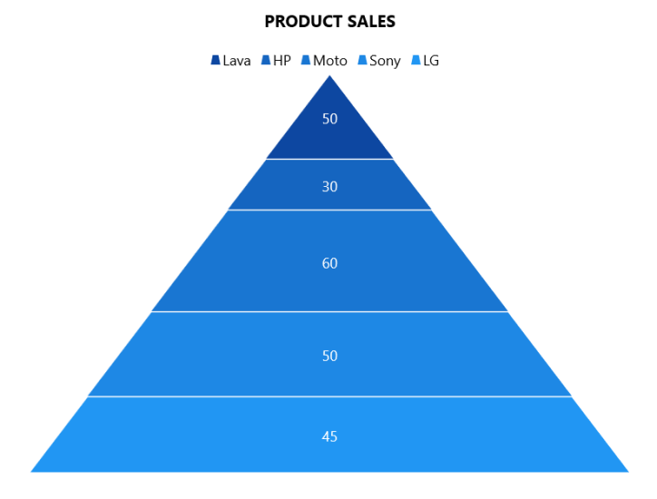

# WinUI Chart (SfPyramidChart) Overview

Syncfusion WinUI Chart (SfPyramidChart) is used to create the beautiful pyramid series to visualize the proportions of a total in hierarchies, which are used in high quality WinUI applications.

## Key features

* It supports pyramid series for more user-friendly data representation and greater UI visualization.

* User interaction features such as tooltip and exploding segments are included in the pyramid chart for enhancing end-user experience.

* Legends provide more information about the segments. The legend can also be used to collapse the segments. If an item exceeds the available bounds, the legends can be wrapped or scrolled.

* Provides various options for customizing and visualizing the chart features, title, data labels, legends, segment spacing, etc.
