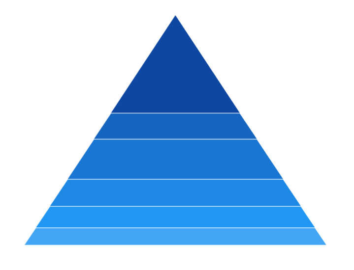
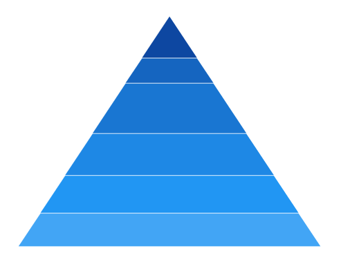

# Rendering Mode in WinUI Chart (SfPyramidChart)

The [Mode]() property is used to define the rendering mode of pyramid chart such as [Surface]() or [Linear](). The default value of [Mode]() property is `Linear`.

## Surface Mode

The [Surface]() mode is used to rendering the area of pyramid chart segments based on data point values.

 



<chart:SfPyramidChart x:Name="chart"
                Palette="BlueChrome"
                ItemsSource="{Binding Data}" 
                XBindingPath="Category" 
                YBindingPath="Value" 
                Mode="Surface">
</chart:SfPyramidChart>
 




SfPyramidChart chart = new SfPyramidChart();
chart.Palette = ChartColorPalette.BlueChrome;
chart.SetBinding(SfPyramidChart.ItemsSourceProperty, new Binding() { Path = new PropertyPath("Data") });
chart.XBindingPath = "Category";
chart.YBindingPath = "Value";
chart.Mode = ChartPyramidMode.Surface;
. . . 
this.Content = chart;





## Linear Mode

The [Linear]() mode is used to rendering the height of pyramid chart segments based on data point values.

 



<chart:SfPyramidChart x:Name="chart"
                Palette="BlueChrome"
                ItemsSource="{Binding Data}" 
                XBindingPath="Category" 
                YBindingPath="Value" 
                Mode="ValueIsWidth">
</chart:SfPyramidChart>
 




SfPyramidChart chart = new SfPyramidChart();
chart.Palette = ChartColorPalette.BlueChrome;
chart.SetBinding(SfPyramidChart.ItemsSourceProperty, new Binding() { Path = new PropertyPath("Data") });
chart.XBindingPath = "Category";
chart.YBindingPath = "Value";
chart.Mode = ChartPyramidMode.Linear;
. . . 
this.Content = chart;





