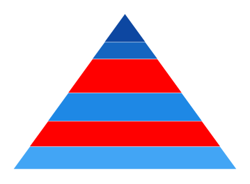

# Selection in WinUI Chart (SfPyramidChart)

Pyramid chart supports selection that allows to select a segment in the chart by using [SelectionBehavior](). 

## Enable Selection

To enable the selection in chart, create an instance of [DataPointSelectionBehavior]() and set it to the `SelectionBehavior` of pyramid chart. And also need to set the [SelectionBrush]() property to highlight the segment in the pyramid chart.





<chart:SfPyramidChart x:Name="chart" 
                    Height="388" Width="500"
                    ItemsSource="{Binding Data}" 
                    XBindingPath="Category"
                    YBindingPath="Value">

    <chart:SfPyramidChart.SelectionBehavior>
        <chart:DataPointSelectionBehavior SelectionBrush="Red"/>
    </chart:SfPyramidChart.SelectionBehavior>

</chart:SfPyramidChart>





SfPyramidChart chart = new SfPyramidChart();
chart.SetBinding(SfPyramidChart.ItemsSourceProperty, new Binding() { Path = new PropertyPath("Data") });
chart.XBindingPath = "Category";
chart.YBindingPath = "Value";
DataPointSelectionBehavior selection = new DataPointSelectionBehavior()
{
	SelectionBrush = new SolidColorBrush(Colors.Red),
};
chart.SelectionBehavior = selection;
. . .
this.Content = chart;





## Multi-selection

Pyramid chart provides support to select multiple segments by using [Type](https://help.syncfusion.com/cr/winui/Syncfusion.UI.Xaml.Charts.ChartSelectionBehavior.html#Syncfusion_UI_Xaml_Charts_ChartSelectionBehavior_Type) property as [Multiple]().  By default, the value of [Type](https://help.syncfusion.com/cr/winui/Syncfusion.UI.Xaml.Charts.ChartSelectionBehavior.html#Syncfusion_UI_Xaml_Charts_ChartSelectionBehavior_Type) is [Single]() and it is used for single selection.

N> `Series` and `MultiSeries` selection type is not support for pyramid chart.





<chart:SfPyramidChart x:Name="chart"  
                    ItemsSource="{Binding Data}" 
                    XBindingPath="Category"
                    YBindingPath="Value">

    chart:SfPyramidChart.SelectionBehavior>
        <chart:DataPointSelectionBehavior Type="Multiple" SelectionBrush="Red"/>
    </chart:SfPyramidChart.SelectionBehavior>
. . .
</chart:SfPyramidChart>





SfPyramidChart chart = new SfPyramidChart();
chart.SetBinding(SfPyramidChart.ItemsSourceProperty, new Binding() { Path = new PropertyPath("Data") });
chart.XBindingPath = "Category";
chart.YBindingPath = "Value";
DataPointSelectionBehavior selection = new DataPointSelectionBehavior()
{
	SelectionBrush = new SolidColorBrush(Colors.Red),
	Type = SelectionType.Multiple
};
chart.SelectionBehavior = selection;
. . .
this.Content = chart;





## Selection on initial rendering

### SelectedIndex

Pyramid chart provides support to select a point programmatically on a chart using the [SelectedIndex]() property of `DataPointSelectionBehavior`.





<chart:SfPyramidChart x:Name="chart" 
                    Height="388" Width="500"
                    ItemsSource="{Binding Data}" 
                    XBindingPath="Category"
                    YBindingPath="Value">

    <chart:SfPyramidChart.SelectionBehavior>
        <chart:DataPointSelectionBehavior SelectionBrush="Red" SelectedIndex="1"/>
    </chart:SfPyramidChart.SelectionBehavior>

</chart:SfPyramidChart>





SfPyramidChart chart = new SfPyramidChart();
chart.SetBinding(SfPyramidChart.ItemsSourceProperty, new Binding() { Path = new PropertyPath("Data") });
chart.XBindingPath = "Category";
chart.YBindingPath = "Value";
DataPointSelectionBehavior selection = new DataPointSelectionBehavior()
{
	SelectionBrush = new SolidColorBrush(Colors.Red),
    SelectedIndex= 1
};
chart.SelectionBehavior = selection;
. . .
this.Content = chart;





### SelectedIndexes

Pyramid chart provides support to select multiple points programmatically on a chart using the [SelectedIndexes]() property of `DataPointSelectionBehavior`.





<chart:SfPyramidChart x:Name="chart"  
                    ItemsSource="{Binding Data}" 
                    XBindingPath="Category"
                    YBindingPath="Value">

    chart:SfPyramidChart.SelectionBehavior>
        <chart:DataPointSelectionBehavior Type="Multiple" SelectionBrush="Red"
        SelectedIndexes="{Binding SelectedIndexes}"/>
    </chart:SfPyramidChart.SelectionBehavior>
. . .
</chart:SfPyramidChart>





SfPyramidChart chart = new SfPyramidChart();
chart.SetBinding(SfPyramidChart.ItemsSourceProperty, new Binding() { Path = new PropertyPath("Data") });
chart.XBindingPath = "Category";
chart.YBindingPath = "Value";
DataPointSelectionBehavior selection = new DataPointSelectionBehavior()
{
	SelectionBrush = new SolidColorBrush(Colors.Red),
	Type = SelectionType.Multiple,
    SelectedIndexes = new List<int>() { 2, 4 }
};
chart.SelectionBehavior = selection;
. . .
this.Content = chart;





## Events

The following selection events are available in [ChartSelectionBehavior]().

### SelectionChanging

The [SelectionChanging](https://help.syncfusion.com/cr/winui/Syncfusion.UI.Xaml.Charts.ChartBase.html#Syncfusion_UI_Xaml_Charts_ChartBase_SelectionChanging) event occurs before the data point is being selected. This is a cancelable event. This argument contains the following information.

* [CurrentIndex]() - Gets the selected data point index.
* [PreviousIndex]() - Gets the previous selected data point index.
* [Cancel]() - Gets or Sets a value that indicates whether the selection should be canceled.

### SelectionChanged

The [SelectionChanged](https://help.syncfusion.com/cr/winui/Syncfusion.UI.Xaml.Charts.ChartBase.html#Syncfusion_UI_Xaml_Charts_ChartBase_SelectionChanged) event occurs after a data point has been selected. This argument contains the following information.

* [CurrentIndex]() - Gets the selected data point index.
* [PreviousIndex]() - Gets the previous selected data point index.
