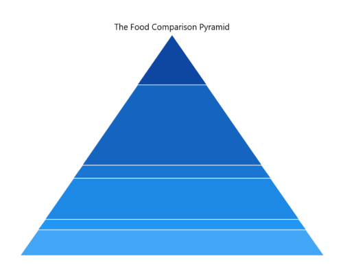
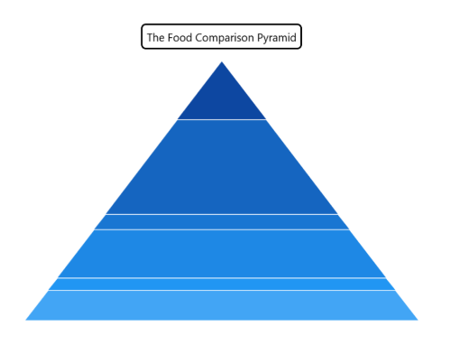

# Chart title in WinUI Chart (SfPyramidChart)

`Header` property is used to define the title for the chart.

   



<chart:SfPyramidChart x:Name="chart" Header="The Food Comparison Pyramid">
 . . .           
</chart:SfPyramidChart>





SfPyramidChart chart = new SfPyramidChart();
chart.Header = "The Food Comparison Pyramid";
. . . 
this.Content = chart;



 

## Customization

The pyramid chart provides support to add any `UIElement` as a title. The following code example defines `TextBlock` as chart header.

   



 <chart:SfPyramidChart>

    <chart:SfPyramidChart.Header>
        <Border BorderThickness="2" BorderBrush="Black" Margin="10" CornerRadius="5">
            <TextBlock FontSize="14" Text="The Food Comparison Pyramid" Margin="5"/>
        </Border>
    </chart:SfPyramidChart.Header>
            
</chart:SfPyramidChart>





    SfPyramidChart chart = new SfPyramidChart();
    . . .
    Border border = new Border()
    {
        BorderThickness = new Thickness(2),
        BorderBrush = new SolidColorBrush(Colors.Black),
        Margin = new Thickness(10),
        CornerRadius = new CornerRadius(5)
    };

    TextBlock textBlock = new TextBlock()
    {
        Text = "The Food Comparison Pyramid",
        Margin = new Thickness(5),
        FontSize = 14
    };

    border.Child = textBlock;
    chart.Header = border;
    . . . 
    this.Content = chart;



 

## Alignment

The title text content can be aligned horizontally to the left, center or right of the chart using the [HorizontalHeaderAlignment]() property of the `SfPyramidChart`.

   



<chart:SfPyramidChart x:Name="chart" 
                Header="The Food Comparison Pyramid"
                HorizontalHeaderAlignment="Left"
                Palette="BlueChrome"
                ItemsSource="{Binding Data}" 
                XBindingPath="FoodName"
                YBindingPath="Calories">
            
</chart:SfPyramidChart>





public sealed partial class MainPage : Page
{
    public MainPage()
    {
        this.InitializeComponent();
        SfPyramidChart chart = new SfPyramidChart();
        chart.Header = "The Food Comparison Pyramid";
        chart.HorizontalHeaderAlignment = HorizontalAlignment.Left;
        chart.Palette = ChartColorPalette.BlueChrome;
        chart.SetBinding(SfPyramidChart.ItemsSourceProperty, new Binding() { Path = new PropertyPath("Data") });
        chart.XBindingPath = "FoodName";
        chart.YBindingPath = "Calories";
        . . . 
        this.Content = chart;
    }
}



 

