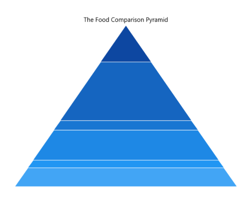
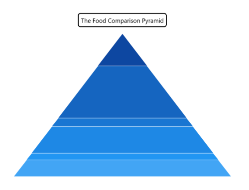
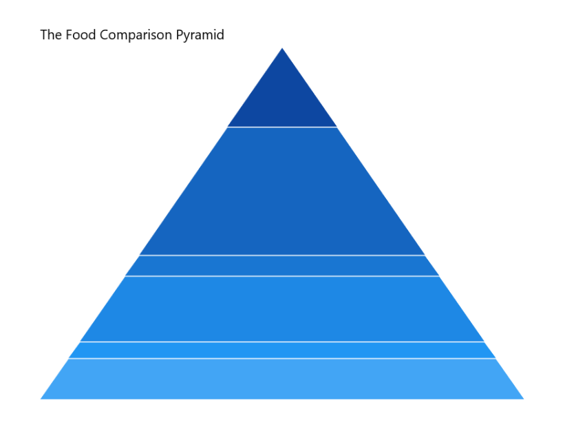

# Chart Title in WinUI Pyramid Chart

[Header](https://help.syncfusion.com/cr/winui/Syncfusion.UI.Xaml.Charts.ChartBase.html#Syncfusion_UI_Xaml_Charts_ChartBase_Header) property is used to define the title of the chart.

   



<chart:SfPyramidChart x:Name="chart" Header="The Food Comparison Pyramid">

    <!-- Configure additional chart elements -->
</chart:SfPyramidChart>





SfPyramidChart chart = new SfPyramidChart();

chart.Header = "The Food Comparison Pyramid";

// Configure additional chart elements
this.Content = chart;



 

## Customization

The pyramid chart provides support to add any `UIElement` as a title. The following code example defines a `TextBlock` as the chart header.

   



<chart:SfPyramidChart>
    <chart:SfPyramidChart.Header>
        <Border 
            BorderThickness="2"
            BorderBrush="Black"
            Margin="10"
            CornerRadius="5">
            <TextBlock 
                FontSize="14"
                Text="The Food Comparison Pyramid"
                Margin="5">
            </TextBlock>
        </Border>
    </chart:SfPyramidChart.Header>  
</chart:SfPyramidChart>





SfPyramidChart chart = new SfPyramidChart();

// Configure additional chart elements
Border border = new Border()
{
    BorderThickness = new Thickness(2),
    BorderBrush = new SolidColorBrush(Colors.Black),
    Margin = new Thickness(10),
    CornerRadius = new CornerRadius(5)
};

TextBlock textBlock = new TextBlock()
{
    Text = "The Food Comparison Pyramid",
    Margin = new Thickness(5),
    FontSize = 14
};

border.Child = textBlock;
chart.Header = border;

this.Content = chart;



 

## Alignment

The title text content can be aligned horizontally to the left, center, or right of the chart using the [HorizontalHeaderAlignment](https://help.syncfusion.com/cr/winui/Syncfusion.UI.Xaml.Charts.ChartBase.html#Syncfusion_UI_Xaml_Charts_ChartBase_HorizontalHeaderAlignment) property of the [SfPyramidChart](https://help.syncfusion.com/cr/winui/Syncfusion.UI.Xaml.Charts.SfPyramidChart.html).

   



<chart:SfPyramidChart
    x:Name="chart"
    Header="The Food Comparison Pyramid"
    HorizontalHeaderAlignment="Left"
    ItemsSource="{Binding Data}"
    XBindingPath="FoodName"
    YBindingPath="Calories">

</chart:SfPyramidChart>





public sealed partial class MainPage : Page
{
    public MainPage()
    {
        this.InitializeComponent();

        SfPyramidChart chart = new SfPyramidChart();

        chart.Header = "The Food Comparison Pyramid";
        chart.HorizontalHeaderAlignment = HorizontalAlignment.Left;
        chart.SetBinding(SfPyramidChart.ItemsSourceProperty, new Binding()
        {
            Path = new PropertyPath("Data")
        });

        chart.XBindingPath = "FoodName";
        chart.YBindingPath = "Calories";

        // Configure additional chart elements
        this.Content = chart;
    }
}



 

