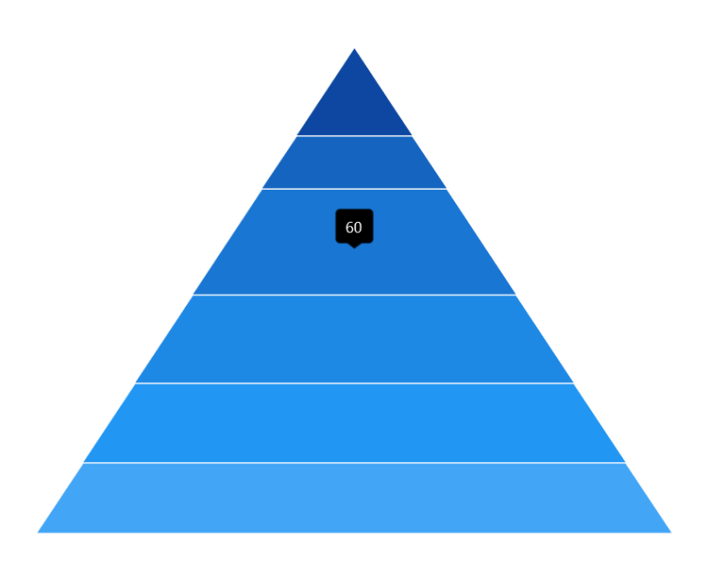
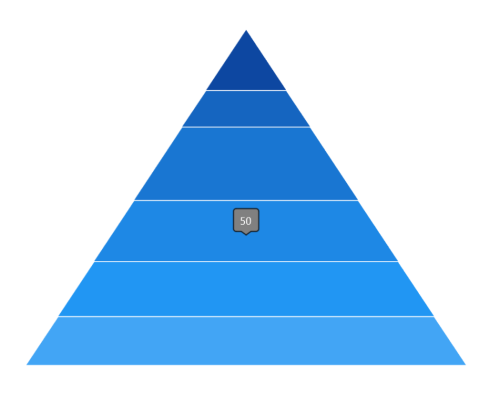
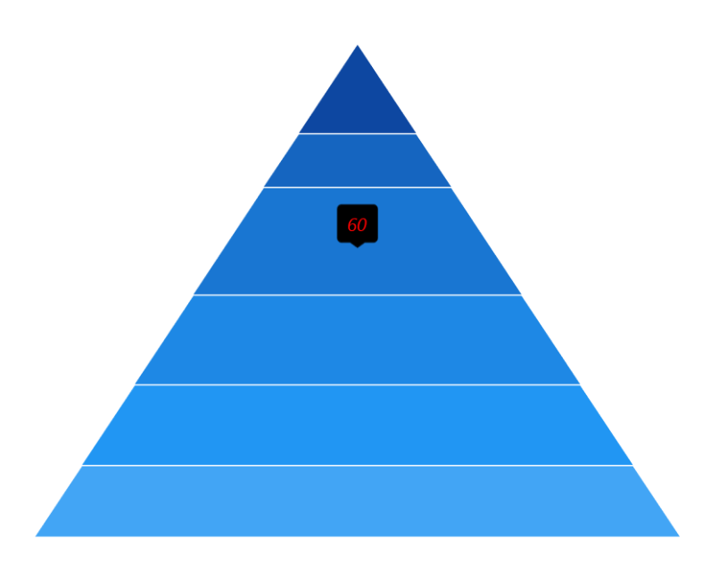
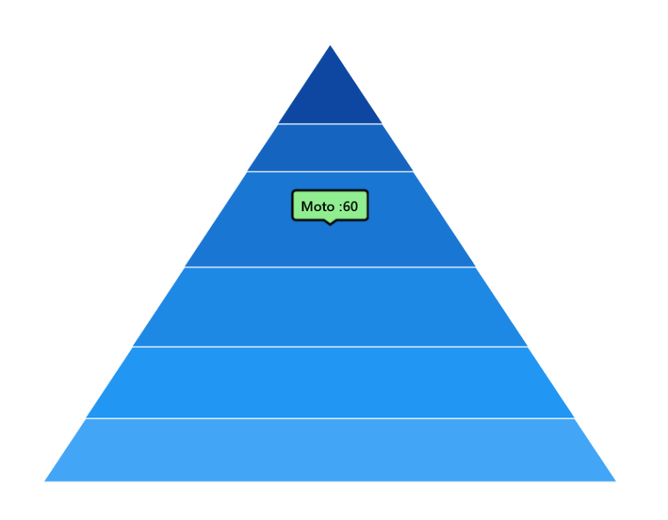

# Tooltip in WinUI Chart (SfPyramidChart)

The tooltip is used to display information over segments. It appears at the data point position when the mouse hovers over any chart segment, displaying the metadata of the hovered segment or data point.

## Define Tooltip

To define the tooltip in the chart, set the [EnableTooltip](https://help.syncfusion.com/cr/winui/Syncfusion.UI.Xaml.Charts.ChartSeries.html#Syncfusion_UI_Xaml_Charts_ChartSeries_EnableTooltip) property to true. The default value of the [EnableTooltip](https://help.syncfusion.com/cr/winui/Syncfusion.UI.Xaml.Charts.ChartSeries.html#Syncfusion_UI_Xaml_Charts_ChartSeries_EnableTooltip) property is false.





<chart:SfPyramidChart x:Name="chart" 
                      EnableTooltip="True"
                      ItemsSource="{Binding Data}" 
                      XBindingPath="Category"
                      YBindingPath="Value">          

</chart:SfPyramidChart>





SfPyramidChart chart = new SfPyramidChart();
chart.SetBinding(SfPyramidChart.ItemsSourceProperty, new Binding() { Path = new PropertyPath("Data") });
chart.XBindingPath = "Category";
chart.YBindingPath = "Value";
chart.EnableTooltip = true;
. . . 
this.Content = chart;





## Customization

[ChartTooltipBehavior](https://help.syncfusion.com/cr/winui/Syncfusion.UI.Xaml.Charts.ChartTooltipBehavior.html) is used to customize the tooltip. To customize the tooltip, create an instance of [ChartTooltipBehavior](https://help.syncfusion.com/cr/winui/Syncfusion.UI.Xaml.Charts.ChartTooltipBehavior.html) and set it to the [TooltipBehavior](https://help.syncfusion.com/cr/winui/Syncfusion.UI.Xaml.Charts.ChartBase.html#Syncfusion_UI_Xaml_Charts_ChartBase_TooltipBehavior) property of [SfPyramidChart](https://help.syncfusion.com/cr/winui/Syncfusion.UI.Xaml.Charts.SfPyramidChart.html). The following properties are used to customize the tooltip:

* [Style](https://help.syncfusion.com/cr/winui/Syncfusion.UI.Xaml.Charts.ChartTooltipBehavior.html#Syncfusion_UI_Xaml_Charts_ChartTooltipBehavior_Style) - Customize the fill and stroke of the tooltip.
* [LabelStyle](https://help.syncfusion.com/cr/winui/Syncfusion.UI.Xaml.Charts.ChartTooltipBehavior.html#Syncfusion_UI_Xaml_Charts_ChartTooltipBehavior_LabelStyle) - Customize the tooltip label.
* [HorizontalAlignment](https://help.syncfusion.com/cr/winui/Syncfusion.UI.Xaml.Charts.ChartTooltipBehavior.html#Syncfusion_UI_Xaml_Charts_ChartTooltipBehavior_HorizontalAlignment) - Align the tooltip label at the left, right, or center of the data point position or cursor position horizontally.
* [VerticalAlignment](https://help.syncfusion.com/cr/winui/Syncfusion.UI.Xaml.Charts.ChartTooltipBehavior.html#Syncfusion_UI_Xaml_Charts_ChartTooltipBehavior_VerticalAlignment) - Align the tooltip label at the top, center, or bottom of the data point position or cursor position vertically.
* [HorizontalOffset](https://help.syncfusion.com/cr/winui/Syncfusion.UI.Xaml.Charts.ChartTooltipBehavior.html#Syncfusion_UI_Xaml_Charts_ChartTooltipBehavior_HorizontalOffset) - Position the tooltip at a distance from the data point or cursor position horizontally.
* [VerticalOffset](https://help.syncfusion.com/cr/winui/Syncfusion.UI.Xaml.Charts.ChartTooltipBehavior.html#Syncfusion_UI_Xaml_Charts_ChartTooltipBehavior_VerticalOffset) - Position the tooltip at a distance from the data point or cursor position vertically.
* [Duration](https://help.syncfusion.com/cr/winui/Syncfusion.UI.Xaml.Charts.ChartTooltipBehavior.html#Syncfusion_UI_Xaml_Charts_ChartTooltipBehavior_Duration) - Set the duration for which the tooltip remains visible in milliseconds.
* [EnableAnimation](https://help.syncfusion.com/cr/winui/Syncfusion.UI.Xaml.Charts.ChartTooltipBehavior.html#Syncfusion_UI_Xaml_Charts_ChartTooltipBehavior_EnableAnimation) - Enable animation when showing the tooltip.
* [InitialShowDelay](https://help.syncfusion.com/cr/winui/Syncfusion.UI.Xaml.Charts.ChartTooltipBehavior.html#Syncfusion_UI_Xaml_Charts_ChartTooltipBehavior_InitialShowDelay) - Delay the display of the tooltip in milliseconds after user interaction with the series.





<chart:SfPyramidChart x:Name="chart">
. . .        
    <chart:SfPyramidChart.TooltipBehavior>
        <chart:ChartTooltipBehavior />
    </chart:SfPyramidChart.TooltipBehavior>
. . .
</chart:SfPyramidChart>





SfPyramidChart chart = new SfPyramidChart();
chart.EnableTooltip = true;
ChartTooltipBehavior behavior = new ChartTooltipBehavior();
chart.TooltipBehavior = behavior;
. . . 
this.Content = chart;





## Background Style

The tooltip's fill and stroke color can be customized using the [Style](https://help.syncfusion.com/cr/winui/Syncfusion.UI.Xaml.Charts.ChartTooltipBehavior.html#Syncfusion_UI_Xaml_Charts_ChartTooltipBehavior_Style) property. To define a [Style](https://help.syncfusion.com/cr/winui/Syncfusion.UI.Xaml.Charts.ChartTooltipBehavior.html#Syncfusion_UI_Xaml_Charts_ChartTooltipBehavior_Style) for the tooltip, specify the style of `TargetType` as `Path`.





<chart:SfPyramidChart x:Name="chart" 
                      EnableTooltip="True">          
. . . 
    <chart:SfPyramidChart.Resources>
        
    </chart:SfPyramidChart.Resources>

    <chart:SfPyramidChart.TooltipBehavior>
        <chart:ChartTooltipBehavior Style="{StaticResource style}"/>
    </chart:SfPyramidChart.TooltipBehavior>
. . . 
</chart:SfPyramidChart>





SfPyramidChart chart = new SfPyramidChart();
chart.EnableTooltip = true;
Style style = new Style(typeof(Path));
style.Setters.Add(new Setter(Path.StrokeProperty, new SolidColorBrush(Colors.Black)));
style.Setters.Add(new Setter(Path.FillProperty, new SolidColorBrush(Colors.Gray)));
...
ChartTooltipBehavior tooltipBehavior = new ChartTooltipBehavior();
tooltipBehavior.Style = style;
chart.TooltipBehavior = tooltipBehavior;
. . . 
this.Content = chart;





## Label Style

The tooltip label style can be customized using the [LabelStyle](https://help.syncfusion.com/cr/winui/Syncfusion.UI.Xaml.Charts.ChartTooltipBehavior.html#Syncfusion_UI_Xaml_Charts_ChartTooltipBehavior_LabelStyle) property. To define a `Style` for the tooltip label, specify the style of `TargetType` as `TextBlock`.





<chart:SfPyramidChart x:Name="chart" EnableTooltip="True">          
. . . 
    <chart:SfPyramidChart.Resources>
        
    </chart:SfPyramidChart.Resources>

    <chart:SfPyramidChart.TooltipBehavior>
        <chart:ChartTooltipBehavior
					LabelStyle="{StaticResource labelStyle}"/>
    </chart:SfPyramidChart.TooltipBehavior>
. . . 
</chart:SfPyramidChart>





SfPyramidChart chart = new SfPyramidChart();
chart.EnableTooltip = true;
Style labelStyle = new Style(typeof(TextBlock));
labelStyle.Setters.Add(new Setter(TextBlock.FontSizeProperty, 14d));
labelStyle.Setters.Add(new Setter(TextBlock.FontStyleProperty, FontStyle.Italic));
labelStyle.Setters.Add(new Setter(TextBlock.ForegroundProperty, new SolidColorBrush(Colors.Red)));
...
ChartTooltipBehavior tooltipBehavior = new ChartTooltipBehavior();
tooltipBehavior.LabelStyle = labelStyle;
chart.TooltipBehavior = tooltipBehavior;
. . . 
this.Content = chart;





## Template

The pyramid chart allows customizing the appearance of the tooltip using the [TooltipTemplate](https://help.syncfusion.com/cr/winui/Syncfusion.UI.Xaml.Charts.SfPyramidChart.html#Syncfusion_UI_Xaml_Charts_SfPyramidChart_TooltipTemplate) property.





<Grid x:Name="grid">
    <Grid.Resources>
        <DataTemplate x:Key="tooltipTemplate">
            <StackPanel Orientation="Horizontal">
                <TextBlock Text="{Binding Item.Category}"
						   Foreground="Black"
						   FontWeight="Medium"
						   FontSize="12" 
						   HorizontalAlignment="Center"
						   VerticalAlignment="Center"/>
                <TextBlock Text=" : "
						   Foreground="Black"
						   FontWeight="Medium"
						   FontSize="12"
						   HorizontalAlignment="Center" 
						   VerticalAlignment="Center"/>
                <TextBlock Text="{Binding Item.Value}"
						   Foreground="Black"
						   FontWeight="Medium"
						   FontSize="12"
						   HorizontalAlignment="Center"
						   VerticalAlignment="Center"/>
            </StackPanel>
        </DataTemplate>

        
    </Grid.Resources>

    <chart:SfPyramidChart x:Name="chart"
                           ItemsSource="{Binding Data}" 
                           XBindingPath="Category"  
                           YBindingPath="Value" 
                           EnableTooltip="True"
                           TooltipTemplate="{StaticResource tooltipTemplate}">

        <chart:SfPyramidChart.TooltipBehavior>
            <chart:ChartTooltipBehavior Style="{StaticResource style}"/>
        </chart:SfPyramidChart.TooltipBehavior>
    </chart:SfPyramidChart>
</Grid>





SfPyramidChart chart = new SfPyramidChart();
chart.SetBinding(SfPyramidChart.ItemsSourceProperty, new Binding() { Path = new PropertyPath("Data") });
chart.XBindingPath = "Category";
chart.YBindingPath = "Value";
chart.TooltipTemplate = this.grid.Resources["tooltipTemplate"] as DataTemplate;
chart.EnableTooltip = true;
. . .
this.Content = chart;
        




