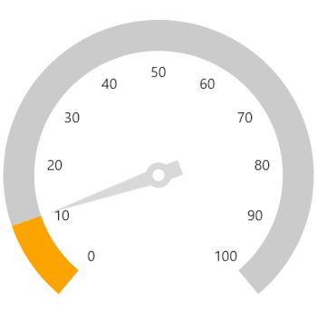

# Animation in WinUI Radial Gauge

## Pointer animation

The [`EnableAnimation`](https://help.syncfusion.com/cr/winui/Syncfusion.UI.Xaml.Gauges.GaugePointer.html#Syncfusion_UI_Xaml_Gauges_GaugePointer_EnableAnimation) property of pointer allows to enable or disable animation for pointer.





<gauge:SfRadialGauge>
    <gauge:SfRadialGauge.Axes>
        <gauge:RadialAxis AxisLineWidth="30"
                          ShowTicks="False">
            <gauge:RadialAxis.Pointers>
                <gauge:NeedlePointer Value="60"
                                     EnableAnimation="True"
                                     NeedleStartWidth="0"
                                     NeedleEndWidth="15"
                                     NeedleFill="#FFDADADA"
                                     KnobFill="White"
                                     KnobStroke="#FFDADADA"
                                     KnobRadius="0.06"
                                     KnobStrokeThickness="0.04"
                                     TailFill="#FFDADADA"
                                     TailLength="0.15"
                                     TailWidth="15">
                </gauge:NeedlePointer>
                <gauge:RangePointer Value="60"
                                    PointerWidth="30"
                                    EnableAnimation="True"
                                    Background="Orange" />
            </gauge:RadialAxis.Pointers>
        </gauge:RadialAxis>
    </gauge:SfRadialGauge.Axes>
</gauge:SfRadialGauge>





SfRadialGauge sfRadialGauge = new SfRadialGauge();

RadialAxis radialAxis = new RadialAxis();
radialAxis.ShowTicks = false;
radialAxis.AxisLineWidth = 30;
sfRadialGauge.Axes.Add(radialAxis);

NeedlePointer needlePointer = new NeedlePointer();
needlePointer.Value = 60;
needlePointer.EnableAnimation = true;
needlePointer.NeedleStartWidth = 0;
needlePointer.NeedleEndWidth = 15;
needlePointer.NeedleFill = new SolidColorBrush(Color.FromArgb(255, 218, 218, 218));
needlePointer.KnobFill = new SolidColorBrush(Colors.White);
needlePointer.KnobStroke = new SolidColorBrush(Color.FromArgb(255, 218, 218, 218));
needlePointer.KnobRadius = 0.06;
needlePointer.KnobStrokeThickness = 0.04;
needlePointer.TailFill = new SolidColorBrush(Color.FromArgb(255, 218, 218, 218));
needlePointer.TailLength = 0.15;
needlePointer.TailWidth = 15;
radialAxis.Pointers.Add(needlePointer);

RangePointer rangePointer = new RangePointer();
rangePointer.Value = 60;
rangePointer.PointerWidth = 30;
rangePointer.EnableAnimation = true;
rangePointer.Background = new SolidColorBrush(Colors.Orange);
radialAxis.Pointers.Add(rangePointer);

this.Content = sfRadialGauge;





## Animation duration

The [`AnimationDuration`](https://help.syncfusion.com/cr/winui/Syncfusion.UI.Xaml.Gauges.GaugePointer.html#Syncfusion_UI_Xaml_Gauges_GaugePointer_AnimationDuration) property of pointer allows to control the animation duration (in milliseconds). The default value of animation duration is 1500ms.





<gauge:SfRadialGauge>
    <gauge:SfRadialGauge.Axes>
        <gauge:RadialAxis AxisLineWidth="30"
                          ShowTicks="False">
            <gauge:RadialAxis.Pointers>
                <gauge:NeedlePointer Value="60"
                                     EnableAnimation="True"
                                     AnimationDuration="3000"
                                     NeedleStartWidth="0"
                                     NeedleEndWidth="15"
                                     NeedleFill="#FFDADADA"
                                     KnobFill="White"
                                     KnobStroke="#FFDADADA"
                                     KnobRadius="0.06"
                                     KnobStrokeThickness="0.04"
                                     TailFill="#FFDADADA"
                                     TailLength="0.15"
                                     TailWidth="15">
                </gauge:NeedlePointer>
                <gauge:RangePointer Value="60"
                                    PointerWidth="30"
                                    EnableAnimation="True"
                                    AnimationDuration="3000"
                                    Background="Orange" />
            </gauge:RadialAxis.Pointers>
        </gauge:RadialAxis>
    </gauge:SfRadialGauge.Axes>
</gauge:SfRadialGauge>





SfRadialGauge sfRadialGauge = new SfRadialGauge();

RadialAxis radialAxis = new RadialAxis();
radialAxis.ShowTicks = false;
radialAxis.AxisLineWidth = 30;
sfRadialGauge.Axes.Add(radialAxis);

NeedlePointer needlePointer = new NeedlePointer();
needlePointer.Value = 60;
needlePointer.EnableAnimation = true;
needlePointer.AnimationDuration = 3000;
needlePointer.NeedleStartWidth = 0;
needlePointer.NeedleEndWidth = 15;
needlePointer.NeedleFill = new SolidColorBrush(Color.FromArgb(255, 218, 218, 218));
needlePointer.KnobFill = new SolidColorBrush(Colors.White);
needlePointer.KnobStroke = new SolidColorBrush(Color.FromArgb(255, 218, 218, 218));
needlePointer.KnobRadius = 0.06;
needlePointer.KnobStrokeThickness = 0.04;
needlePointer.TailFill = new SolidColorBrush(Color.FromArgb(255, 218, 218, 218));
needlePointer.TailLength = 0.15;
needlePointer.TailWidth = 15;
radialAxis.Pointers.Add(needlePointer);

RangePointer rangePointer = new RangePointer();
rangePointer.Value = 60;
rangePointer.PointerWidth = 30;
rangePointer.EnableAnimation = true;
rangePointer.AnimationDuration = 3000;
rangePointer.Background = new SolidColorBrush(Colors.Orange);
radialAxis.Pointers.Add(rangePointer);

this.Content = sfRadialGauge;





## Animation Easing Function

The [`AnimationEasingFunction`](https://help.syncfusion.com/cr/winui/Syncfusion.UI.Xaml.Gauges.GaugePointer.html#Syncfusion_UI_Xaml_Gauges_GaugePointer_AnimationEasingFunction) property of pointer allows you to change the easing function. The default value [`AnimationEasingFunction`](https://help.syncfusion.com/cr/winui/Syncfusion.UI.Xaml.Gauges.GaugePointer.html#Syncfusion_UI_Xaml_Gauges_GaugePointer_AnimationEasingFunction) property is null.





<gauge:SfRadialGauge>
    <gauge:SfRadialGauge.Axes>
        <gauge:RadialAxis AxisLineWidth="30"
                          ShowTicks="False">
            <gauge:RadialAxis.Pointers>
                <gauge:NeedlePointer Value="60"
                                     EnableAnimation="True"
                                     AnimationDuration="3000"
                                     NeedleStartWidth="0"
                                     NeedleEndWidth="15"
                                     NeedleFill="#FFDADADA"
                                     KnobFill="White"
                                     KnobStroke="#FFDADADA"
                                     KnobRadius="0.06"
                                     KnobStrokeThickness="0.04"
                                     TailFill="#FFDADADA"
                                     TailLength="0.15"
                                     TailWidth="15">
                    <gauge:NeedlePointer.AnimationEasingFunction>
                        <ElasticEase Oscillations="1" />
                    </gauge:NeedlePointer.AnimationEasingFunction>

                </gauge:NeedlePointer>
                <gauge:RangePointer Value="60"
                                    PointerWidth="30"
                                    EnableAnimation="True"
                                    AnimationDuration="3000"
                                    Background="Orange">
                    <gauge:RangePointer.AnimationEasingFunction>
                        <ElasticEase Oscillations="1" />
                    </gauge:RangePointer.AnimationEasingFunction>
                </gauge:RangePointer>
            </gauge:RadialAxis.Pointers>
        </gauge:RadialAxis>
    </gauge:SfRadialGauge.Axes>
</gauge:SfRadialGauge>





SfRadialGauge sfRadialGauge = new SfRadialGauge();

RadialAxis radialAxis = new RadialAxis();
radialAxis.ShowTicks = false;
radialAxis.AxisLineWidth = 30;
sfRadialGauge.Axes.Add(radialAxis);

NeedlePointer needlePointer = new NeedlePointer();
needlePointer.Value = 60;
needlePointer.EnableAnimation = true;
needlePointer.AnimationDuration = 3000;
needlePointer.NeedleStartWidth = 0;
needlePointer.NeedleEndWidth = 15;
needlePointer.NeedleFill = new SolidColorBrush(Color.FromArgb(255, 218, 218, 218));
needlePointer.KnobFill = new SolidColorBrush(Colors.White);
needlePointer.KnobStroke = new SolidColorBrush(Color.FromArgb(255, 218, 218, 218));
needlePointer.KnobRadius = 0.06;
needlePointer.KnobStrokeThickness = 0.04;
needlePointer.TailFill = new SolidColorBrush(Color.FromArgb(255, 218, 218, 218));
needlePointer.TailLength = 0.15;
needlePointer.TailWidth = 15;
needlePointer.AnimationEasingFunction = new ElasticEase() { Oscillations = 1 };
radialAxis.Pointers.Add(needlePointer);

RangePointer rangePointer = new RangePointer();
rangePointer.Value = 60;
rangePointer.PointerWidth = 30;
rangePointer.EnableAnimation = true;
rangePointer.AnimationDuration = 3000;
rangePointer.Background = new SolidColorBrush(Colors.Orange);
rangePointer.AnimationEasingFunction = new ElasticEase() { Oscillations = 1 };
radialAxis.Pointers.Add(rangePointer);

this.Content = sfRadialGauge;





N> Refer to the [EasingFunctionBase](https://docs.microsoft.com/en-us/uwp/api/windows.ui.xaml.media.animation.easingfunctionbase), to learn about available easing functions in WinUI.
