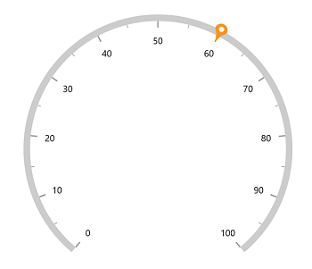

# Content pointer in WinUI Radial Gauge

The [`ContentPointer`](https://help.syncfusion.com/cr/winui/Syncfusion.UI.Xaml.Gauges.ContentPointer.html) in [`SfRadialGauge`](https://help.syncfusion.com/cr/winui/Syncfusion.UI.Xaml.Gauges.SfRadialGauge.html) allows you to use any content as a pointer using the [`Content`](https://help.syncfusion.com/cr/winui/Syncfusion.UI.Xaml.Gauges.ContentPointer.html#Syncfusion_UI_Xaml_Gauges_ContentPointer_Content) property of it. 

## Add custom text as a content pointer

The following code sample demonstrates how to add custom text as a content pointer.





<gauge:SfRadialGauge>
    <gauge:SfRadialGauge.Axes>
        <gauge:RadialAxis>
            <gauge:RadialAxis.Pointers>
                <gauge:ContentPointer Value="60">
                    <gauge:ContentPointer.Content>
                        <Grid Background="Orange"
                              BorderBrush="Black"
                              BorderThickness="1"
                              CornerRadius="4">
                            <TextBlock Text="Syncfusion"
                                       Margin="2" />
                        </Grid>
                    </gauge:ContentPointer.Content>
                </gauge:ContentPointer>
            </gauge:RadialAxis.Pointers>
        </gauge:RadialAxis>
    </gauge:SfRadialGauge.Axes>
</gauge:SfRadialGauge>





SfRadialGauge sfRadialGauge = new SfRadialGauge();

RadialAxis radialAxis = new RadialAxis();
sfRadialGauge.Axes.Add(radialAxis);

ContentPointer contentPointer = new ContentPointer();
contentPointer.Value = 60;
Grid contentPointerRootChild = new Grid
{
    Background = new SolidColorBrush(Colors.Orange),
    BorderBrush = new SolidColorBrush(Colors.Black),
    BorderThickness = new Thickness { Bottom = 1, Left = 1, Right = 1, Top = 1 },
    CornerRadius = new CornerRadius { BottomLeft = 4, BottomRight = 4, TopLeft = 4, TopRight = 4 }
};
contentPointerRootChild.Children.Add(new TextBlock
{
    Text = "Syncfusion",
    Margin = new Thickness { Bottom = 2, Left = 2, Right = 2, Top = 2 }
});

contentPointer.Content = contentPointerRootChild;
radialAxis.Pointers.Add(contentPointer);

this.Content = sfRadialGauge;





## Add image to content pointer

The following code demonstrates how to use an `Image` as a content pointer.





<gauge:SfRadialGauge>
    <gauge:SfRadialGauge.Axes>
        <gauge:RadialAxis>
            <gauge:RadialAxis.Pointers>
                <gauge:ContentPointer Value="60">
                    <gauge:ContentPointer.Content>
                        <Grid Background="Orange"
                              BorderBrush="Black"
                              BorderThickness="1"
                              CornerRadius="4">
                            <Image Source="pin.png" />
                        </Grid>
                    </gauge:ContentPointer.Content>
                </gauge:ContentPointer>
            </gauge:RadialAxis.Pointers>
        </gauge:RadialAxis>
    </gauge:SfRadialGauge.Axes>
</gauge:SfRadialGauge>





SfRadialGauge sfRadialGauge = new SfRadialGauge();

RadialAxis radialAxis = new RadialAxis();
sfRadialGauge.Axes.Add(radialAxis);

ContentPointer contentPointer = new ContentPointer();
contentPointer.Value = 60;
contentPointer.IsInteractive = true;
Grid contentPointerRootChild = new Grid
{
    Background = new SolidColorBrush(Colors.Orange),
    BorderBrush = new SolidColorBrush(Colors.Black),
    BorderThickness = new Thickness { Bottom = 1, Left = 1, Right = 1, Top = 1 },
    CornerRadius = new CornerRadius { BottomLeft = 4, BottomRight = 4, TopLeft = 4, TopRight = 4 }
};
contentPointerRootChild.Children.Add(new Image
{
    Source = "pin.png",
    Margin = new Thickness { Bottom = 2, Left = 2, Right = 2, Top = 2 }
});

contentPointer.Content = contentPointerRootChild;
radialAxis.Pointers.Add(contentPointer);

this.Content = sfRadialGauge;





## Position customization

The content pointer can be moved near or far from its actual position using the [`MarkerOffset`](https://help.syncfusion.com/cr/winui/Syncfusion.UI.Xaml.Gauges.MarkerPointer.html#Syncfusion_UI_Xaml_Gauges_MarkerPointer_MarkerOffset) and [`OffsetUnit`](https://help.syncfusion.com/cr/winui/Syncfusion.UI.Xaml.Gauges.MarkerPointer.html#Syncfusion_UI_Xaml_Gauges_MarkerPointer_OffsetUnit) properties. 

When you set the [`OffsetUnit`](https://help.syncfusion.com/cr/winui/Syncfusion.UI.Xaml.Gauges.MarkerPointer.html#Syncfusion_UI_Xaml_Gauges_MarkerPointer_OffsetUnit) to pixel, the content pointer will be moved based on the pixel value. If you set the [`OffsetUnit`](https://help.syncfusion.com/cr/winui/Syncfusion.UI.Xaml.Gauges.MarkerPointer.html#Syncfusion_UI_Xaml_Gauges_MarkerPointer_OffsetUnit) to factor, then the provided factor will be multiplied with the axis radius value, and then the pointer will be moved to the corresponding value. The default value of [`OffsetUnit`](https://help.syncfusion.com/cr/winui/Syncfusion.UI.Xaml.Gauges.MarkerPointer.html#Syncfusion_UI_Xaml_Gauges_MarkerPointer_OffsetUnit) is [`SizeUnit.Pixel`](https://help.syncfusion.com/cr/winui/Syncfusion.UI.Xaml.Gauges.SizeUnit.html#Syncfusion_UI_Xaml_Gauges_SizeUnit_Pixel).





<gauge:SfRadialGauge>
    <gauge:SfRadialGauge.Axes>
        <gauge:RadialAxis>
            <gauge:RadialAxis.Pointers>
                <gauge:ContentPointer Value="60"
                                    MarkerOffset="-0.1"
                                    OffsetUnit="Factor">
                    <gauge:ContentPointer.Content>
                        <Grid Background="Orange"
                              BorderBrush="Black"
                              BorderThickness="1"
                              CornerRadius="4">
                            <TextBlock Text="60"
                                       Margin="2" />
                            <Image Source="">
                        </Grid>
                    </gauge:ContentPointer.Content>
                </gauge:ContentPointer>
            </gauge:RadialAxis.Pointers>
        </gauge:RadialAxis>
    </gauge:SfRadialGauge.Axes>
</gauge:SfRadialGauge>





SfRadialGauge sfRadialGauge = new SfRadialGauge();

RadialAxis radialAxis = new RadialAxis();
sfRadialGauge.Axes.Add(radialAxis);

ContentPointer contentPointer = new ContentPointer();
contentPointer.Value = 60;
contentPointer.MarkerOffset = -0.1;
contentPointer.OffsetUnit = SizeUnit.Factor;
contentPointer.IsInteractive = true;
Grid contentPointerRootChild = new Grid
{
    Background = new SolidColorBrush(Colors.Orange),
    BorderBrush = new SolidColorBrush(Colors.Black),
    BorderThickness = new Thickness { Bottom = 1, Left = 1, Right = 1, Top = 1 },
    CornerRadius = new CornerRadius { BottomLeft = 4, BottomRight = 4, TopLeft = 4, TopRight = 4 }
};
contentPointerRootChild.Children.Add(new TextBlock
{
    Text = "60",
    Margin = new Thickness { Bottom = 2, Left = 2, Right = 2, Top = 2 }
});

contentPointer.Content = contentPointerRootChild;
radialAxis.Pointers.Add(contentPointer);

this.Content = sfRadialGauge;





N> Provide a positive value to [`MarkerOffset`](https://help.syncfusion.com/cr/winui/Syncfusion.UI.Xaml.Gauges.MarkerPointer.html#Syncfusion_UI_Xaml_Gauges_MarkerPointer_MarkerOffset) to move the pointer inside the axis and a negative value to move the pointer outside the axis.

## See Also

* [How to add an image as a background of WinUI Radial Gauge control](https://support.syncfusion.com/kb/article/11962/how-to-add-an-image-as-a-background-of-winui-radial-gauge-control-sfradialgauge)
