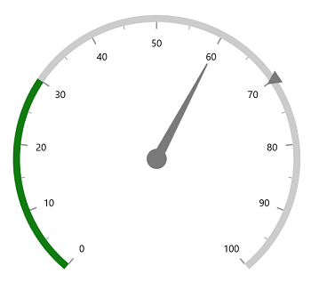

# Pointers in WinUI Radial Gauge

 Pointer is used to indicate values on an axis. The radial gauge control has three types of pointers: 

[`Shape pointer`](https://help.syncfusion.com/winui/radial-gauge/marker-pointer)
`Content pointer`
[`Needle pointer`](https://help.syncfusion.com/winui/radial-gauge/needle-pointer)
[`Range pointer`](https://help.syncfusion.com/winui/radial-gauge/range-pointer)

All the pointers can be customized as needed. You can add multiple pointers to the gauge to point multiple values on the same scale. The value of the pointer is set using the [`Value`](https://help.syncfusion.com/cr/winui/Syncfusion.UI.Xaml.Gauges.GaugePointer.html#Syncfusion_UI_Xaml_Gauges_GaugePointer_Value) property.

## Multiple pointers

In addition to the default pointer, you can add n number of pointers to an axis by adding in the [`Pointers`](https://help.syncfusion.com/cr/winui/Syncfusion.UI.Xaml.Gauges.GaugeAxis.html#Syncfusion_UI_Xaml_Gauges_GaugeAxis_Pointers) property.





<gauge:SfRadialGauge>
    <gauge:SfRadialGauge.Axes>
        <gauge:RadialAxis>
            <gauge:RadialAxis.Pointers>
                <gauge:RangePointer Value="30" />
                <gauge:ShapePointer Value="70" />
                <gauge:NeedlePointer Value="60" />
            </gauge:RadialAxis.Pointers>
        </gauge:RadialAxis>
    </gauge:SfRadialGauge.Axes>
</gauge:SfRadialGauge>





SfRadialGauge sfRadialGauge = new SfRadialGauge();

RadialAxis radialAxis = new RadialAxis();
RangePointer rangePointer = new RangePointer { Value = 30 };
radialAxis.Pointers.Add(rangePointer);
ShapePointer shapePointer = new ShapePointer { Value = 70 };
radialAxis.Pointers.Add(shapePointer);
NeedlePointer needlePointer = new NeedlePointer { Value = 60 };
radialAxis.Pointers.Add(needlePointer);

sfRadialGauge.Axes.Add(radialAxis);

this.Content = sfRadialGauge;





## Pointer dragging

Pointers can be dragged over the scale value. It can be achieved by clicking and dragging the pointer. To enable or disable the pointer drag, use the [`IsInteractive`](https://help.syncfusion.com/cr/winui/Syncfusion.UI.Xaml.Gauges.GaugePointer.html#Syncfusion_UI_Xaml_Gauges_GaugePointer_IsInteractive) property.





<gauge:SfRadialGauge>
    <gauge:SfRadialGauge.Axes>
        <gauge:RadialAxis ShowTicks="False"
                          AxisLineFill="CornflowerBlue"
                          AxisLineWidth="30">
            <gauge:RadialAxis.Pointers>
                <gauge:ShapePointer Value="30"
                                     IsInteractive="True"
                                     MarkerOffset="-30"
                                     Background="Indigo" />
            </gauge:RadialAxis.Pointers>
        </gauge:RadialAxis>
    </gauge:SfRadialGauge.Axes>
</gauge:SfRadialGauge>





SfRadialGauge sfRadialGauge = new SfRadialGauge();

RadialAxis radialAxis = new RadialAxis();
radialAxis.ShowTicks = false;
radialAxis.AxisLineFill = new SolidColorBrush(Colors.CornflowerBlue);
radialAxis.AxisLineWidth = 30;
sfRadialGauge.Axes.Add(radialAxis);

ShapePointer shapePointer = new ShapePointer();
shapePointer.Value = 30;
shapePointer.IsInteractive = true;
shapePointer.Background = new SolidColorBrush(Colors.Indigo);
shapePointer.MarkerOffset = -30;
radialAxis.Pointers.Add(shapePointer);

this.Content = sfRadialGauge;





## Event

[`ValueChangeStarted`](https://help.syncfusion.com/cr/winui/Syncfusion.UI.Xaml.Gauges.GaugePointer.html#Syncfusion_UI_Xaml_Gauges_GaugePointer_ValueChangeStarted) - Occurs whenever the pointer starts to drag.

[`ValueChanging`](https://help.syncfusion.com/cr/winui/Syncfusion.UI.Xaml.Gauges.GaugePointer.html#Syncfusion_UI_Xaml_Gauges_GaugePointer_ValueChanging) - Occurs before the current drag value gets updated as pointer value. The [`Cancel`](https://help.syncfusion.com/cr/winui/Syncfusion.UI.Xaml.Gauges.ValueChangingEventArgs.html#Syncfusion_UI_Xaml_Gauges_ValueChangingEventArgs_Cancel) argument of [`ValueChangingEventArgs`](https://help.syncfusion.com/cr/winui/Syncfusion.UI.Xaml.Gauges.ValueChangingEventArgs.html) allows to restrict the update of current drag value as pointer value.

[`ValueChanged`](https://help.syncfusion.com/cr/winui/Syncfusion.UI.Xaml.Gauges.GaugePointer.html#Syncfusion_UI_Xaml_Gauges_GaugePointer_ValueChanged) - Occurs whenever the pointer value is changed while dragging.

[`ValueChangeCompleted`](https://help.syncfusion.com/cr/winui/Syncfusion.UI.Xaml.Gauges.GaugePointer.html#Syncfusion_UI_Xaml_Gauges_GaugePointer_ValueChangeCompleted) - Occurs once the dragging of the pointer gets completed.





<gauge:SfRadialGauge>
    <gauge:SfRadialGauge.Axes>
        <gauge:RadialAxis ShowTicks="False"
                          AxisLineFill="CornflowerBlue"
                          AxisLineWidth="30">
            <gauge:RadialAxis.Pointers>
                <gauge:ShapePointer Value="30"
                                     IsInteractive="True"
                                     MarkerOffset="-30"
                                     Background="Indigo" 
                                     ValueChanging="ShapePointer_ValueChanging"
                                     ValueChanged="ShapePointer_ValueChanged"/>
            </gauge:RadialAxis.Pointers>
        </gauge:RadialAxis>
    </gauge:SfRadialGauge.Axes>
</gauge:SfRadialGauge>





private void ShapePointer_ValueChanging(object sender, ValueChangingEventArgs e)
{
    if (e.NewValue > 60)
    {
        e.Cancel = true;
    }
}

private void ShapePointer_ValueChanged(object sender, ValueChangedEventArgs e)
{

}




