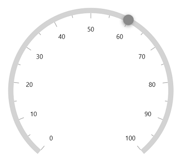
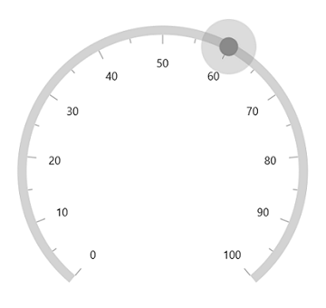

# Shape pointer in WinUI Radial Gauge

The [`ShapePointer`](https://help.syncfusion.com/cr/winui/Syncfusion.UI.Xaml.Gauges.ShapePointer.html) in [`SfRadialGauge`](https://help.syncfusion.com/cr/winui/Syncfusion.UI.Xaml.Gauges.SfRadialGauge.html) allows you to use any build-in shapes as a pointer to mark a specified value. The default type is [`InvertedTriangle`](https://help.syncfusion.com/cr/winui/Syncfusion.UI.Xaml.Gauges.GaugeShapeType.html#Syncfusion_UI_Xaml_Gauges_GaugeShapeType_InvertedTriangle).





<gauge:SfRadialGauge>
    <gauge:SfRadialGauge.Axes>
        <gauge:RadialAxis>
            <gauge:RadialAxis.Pointers>
                <gauge:ShapePointer Value="60" />
            </gauge:RadialAxis.Pointers>
        </gauge:RadialAxis>
    </gauge:SfRadialGauge.Axes>
</gauge:SfRadialGauge>





SfRadialGauge sfRadialGauge = new SfRadialGauge();

RadialAxis radialAxis = new RadialAxis();
sfRadialGauge.Axes.Add(radialAxis);

ShapePointer shapePointer = new ShapePointer();
shapePointer.Value = 60;
radialAxis.Pointers.Add(shapePointer);

this.Content = sfRadialGauge;





Gauge supports the following types of shapes:

* [`Inverted triangle`](https://help.syncfusion.com/cr/winui/Syncfusion.UI.Xaml.Gauges.GaugeShapeType.html#Syncfusion_UI_Xaml_Gauges_GaugeShapeType_InvertedTriangle)
* [`Triangle`](https://help.syncfusion.com/cr/winui/Syncfusion.UI.Xaml.Gauges.GaugeShapeType.html#Syncfusion_UI_Xaml_Gauges_GaugeShapeType_Triangle)
* [`Circle`](https://help.syncfusion.com/cr/winui/Syncfusion.UI.Xaml.Gauges.GaugeShapeType.html#Syncfusion_UI_Xaml_Gauges_GaugeShapeType_Circle)
* [`Rectangle`](https://help.syncfusion.com/cr/winui/Syncfusion.UI.Xaml.Gauges.GaugeShapeType.html#Syncfusion_UI_Xaml_Gauges_GaugeShapeType_Rectangle)
* [`Diamond`](https://help.syncfusion.com/cr/winui/Syncfusion.UI.Xaml.Gauges.GaugeShapeType.html#Syncfusion_UI_Xaml_Gauges_GaugeShapeType_Diamond)

## Shape customization

The shape pointer can be customized using the following properties:

* [`Fill`](https://help.syncfusion.com/cr/winui/Syncfusion.UI.Xaml.Gauges.ShapePointer.html#Syncfusion_UI_Xaml_Gauges_ShapePointer_Fill) – Allows to customize the shape color.
* [`ShaperHeight`](https://help.syncfusion.com/cr/winui/Syncfusion.UI.Xaml.Gauges.ShapePointer.html#Syncfusion_UI_Xaml_Gauges_ShapePointer_ShapeHeight) – Allows to specify the shape height.
* [`ShapeWidth`](https://help.syncfusion.com/cr/winui/Syncfusion.UI.Xaml.Gauges.ShapePointer.html#Syncfusion_UI_Xaml_Gauges_ShapePointer_ShapeWidth) – Allows to specify the shape width.
* [`Stroke`](https://help.syncfusion.com/cr/winui/Syncfusion.UI.Xaml.Gauges.ShapePointer.html#Syncfusion_UI_Xaml_Gauges_ShapePointer_Stroke) – Allows to specify the border color for the shape.
* [`StrokeThickness`](https://help.syncfusion.com/cr/winui/Syncfusion.UI.Xaml.Gauges.ShapePointer.html#Syncfusion_UI_Xaml_Gauges_ShapePointer_StrokeThickness) –  Allows to specify the border width of the shape.





<gauge:SfRadialGauge>
    <gauge:SfRadialGauge.Axes>
        <gauge:RadialAxis>
            <gauge:RadialAxis.Pointers>
                <gauge:ShapePointer Value="60"
                                    ShapeHeight="30"
                                    ShapeWidth="30"
                                    Stroke="Black"
                                    StrokeThickness="3"
                                    ShapeType="Circle"
                                    Fill="LightBlue"/>
            </gauge:RadialAxis.Pointers>
        </gauge:RadialAxis>
    </gauge:SfRadialGauge.Axes>
</gauge:SfRadialGauge>





SfRadialGauge sfRadialGauge = new SfRadialGauge();

RadialAxis radialAxis = new RadialAxis();
sfRadialGauge.Axes.Add(radialAxis);

ShapePointer shapePointer = new ShapePointer();
shapePointer.Value = 60;
shapePointer.ShapeHeight = 30;
shapePointer.ShapeWidth = 30;
shapePointer.Stroke = new SolidColorBrush(Colors.Black);
shapePointer.StrokeThickness = 3;
shapePointer.ShapeType = Syncfusion.UI.Xaml.Gauges.GaugeShapeType.Circle;
shapePointer.Fill = new SolidColorBrush(Colors.LightBlue);
radialAxis.Pointers.Add(shapePointer);

this.Content = sfRadialGauge;





## Shadow support

The shadow can be applied by the `HasShadow` property.





<gauge:SfRadialGauge>
    <gauge:SfRadialGauge.Axes>
        <gauge:RadialAxis>
            <gauge:RadialAxis.Pointers>
                <gauge:ShapePointer Value="60"
                                    ShapeType="Circle"
                                    HasShadow="True"/>
            </gauge:RadialAxis.Pointers>
        </gauge:RadialAxis>
    </gauge:SfRadialGauge.Axes>
</gauge:SfRadialGauge>





SfRadialGauge sfRadialGauge = new SfRadialGauge();

RadialAxis radialAxis = new RadialAxis();
sfRadialGauge.Axes.Add(radialAxis);

ShapePointer pointer = new ShapePointer();
pointer.Value = 60;
pointer.ShapeType = GaugeShapeType.Circle;
pointer.HasShadow = true;
radialAxis.Pointers.Add(pointer);

this.Content = sfRadialGauge;





## Shape pointer overlay

The shape pointer overlay is rendered around the shape when the cursor is on the shape's area. When the [`IsInteractive`](https://help.syncfusion.com/cr/winui/Syncfusion.UI.Xaml.Gauges.GaugePointer.html#Syncfusion_UI_Xaml_Gauges_GaugePointer_IsInteractive) property is set to true and when the cursor is on the shape pointer's area, the overlay will be displayed around the shape pointer.

The shape pointer overlay can be customized using the following properties:

* `OverlayFill`- Allows you to specify the shape pointer overlay's color.
* `OverlayRadius` - Allows you to specify the shape pointer overlay's radius.





<gauge:SfRadialGauge>
    <gauge:SfRadialGauge.Axes>
        <gauge:RadialAxis>
            <gauge:RadialAxis.Pointers>
                <gauge:ShapePointer Value="60"
                                    ShapeType="Circle"
                                    IsInteractive="True"
                                    OverlayRadius="20"/>
            </gauge:RadialAxis.Pointers>
        </gauge:RadialAxis>
    </gauge:SfRadialGauge.Axes>
</gauge:SfRadialGauge>





SfRadialGauge sfRadialGauge = new SfRadialGauge();

RadialAxis radialAxis = new RadialAxis();
sfRadialGauge.Axes.Add(radialAxis);

ShapePointer pointer = new ShapePointer();
pointer.Value = 60;
pointer.ShapeType = GaugeShapeType.Circle;
pointer.OverlayRadius = 20;
pointer.IsInteractive = true;
radialAxis.Pointers.Add(pointer);

this.Content = sfRadialGauge;





## Shape position customization

The shape pointer can be moved near or far from its actual position using the [`MarkerOffset`](https://help.syncfusion.com/cr/winui/Syncfusion.UI.Xaml.Gauges.MarkerPointer.html#Syncfusion_UI_Xaml_Gauges_MarkerPointer_MarkerOffset) and [`OffsetUnit`](https://help.syncfusion.com/cr/winui/Syncfusion.UI.Xaml.Gauges.MarkerPointer.html#Syncfusion_UI_Xaml_Gauges_MarkerPointer_OffsetUnit) properties. 

When you set [`OffsetUnit`](https://help.syncfusion.com/cr/winui/Syncfusion.UI.Xaml.Gauges.MarkerPointer.html#Syncfusion_UI_Xaml_Gauges_MarkerPointer_OffsetUnit) to pixel, the shape pointer will be moved based on the pixel value. If you set [`OffsetUnit`](https://help.syncfusion.com/cr/winui/Syncfusion.UI.Xaml.Gauges.MarkerPointer.html#Syncfusion_UI_Xaml_Gauges_MarkerPointer_OffsetUnit) to factor, then provided factor will be multiplied with the axis radius value, and then the pointer will be moved to corresponding value. The default value of [`OffsetUnit`](https://help.syncfusion.com/cr/winui/Syncfusion.UI.Xaml.Gauges.MarkerPointer.html#Syncfusion_UI_Xaml_Gauges_MarkerPointer_OffsetUnit) is [`SizeUnit.Pixel`](https://help.syncfusion.com/cr/winui/Syncfusion.UI.Xaml.Gauges.SizeUnit.html#Syncfusion_UI_Xaml_Gauges_SizeUnit_Pixel).





<gauge:SfRadialGauge>
    <gauge:SfRadialGauge.Axes>
        <gauge:RadialAxis>
            <gauge:RadialAxis.Pointers>
                <gauge:ShapePointer Value="60"
                                     MarkerOffset="-18"/>
            </gauge:RadialAxis.Pointers>
        </gauge:RadialAxis>
    </gauge:SfRadialGauge.Axes>
</gauge:SfRadialGauge>





SfRadialGauge sfRadialGauge = new SfRadialGauge();

RadialAxis radialAxis = new RadialAxis();
sfRadialGauge.Axes.Add(radialAxis);

ShapePointer shapePointer = new ShapePointer();
shapePointer.Value = 60;
shapePointer.MarkerOffset = -18;
radialAxis.Pointers.Add(shapePointer);

this.Content = sfRadialGauge;





N> Provide positive value to [`MarkerOffset`](https://help.syncfusion.com/cr/winui/Syncfusion.UI.Xaml.Gauges.MarkerPointer.html#Syncfusion_UI_Xaml_Gauges_MarkerPointer_MarkerOffset) to move the pointer inside of the axis and negative value to move the pointer outside of the axis.