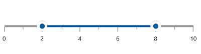
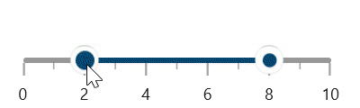
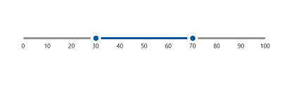
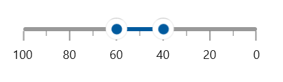

# Basic Features of Range Slider

This section explains about how to add the WinUI slider with basic features.

## Setting Minimum and Maximum value

The [`Minimum`](https://help.syncfusion.com/cr/winui/Syncfusion.UI.Xaml.Sliders.SliderBase.html#Syncfusion_UI_Xaml_Sliders_SliderBase_Minimum) and [`Maximum`](https://help.syncfusion.com/cr/winui/Syncfusion.UI.Xaml.Sliders.SliderBase.html#Syncfusion_UI_Xaml_Sliders_SliderBase_Maximum) properties of a range slider can be used to customize the range. The default value of [`Minimum`](https://help.syncfusion.com/cr/winui/Syncfusion.UI.Xaml.Sliders.SliderBase.html#Syncfusion_UI_Xaml_Sliders_SliderBase_Minimum) is 0 and the default value of [`Maximum`](https://help.syncfusion.com/cr/winui/Syncfusion.UI.Xaml.Sliders.SliderBase.html#Syncfusion_UI_Xaml_Sliders_SliderBase_Maximum) is 100.





<slider:SfRangeSlider Minimum="-20"
                      Maximum="20"
                      RangeStart="-10"
                      RangeEnd="10"
                      ShowLabels="True" />





SfRangeSlider sfRangeSlider = new SfRangeSlider();
sfRangeSlider.Minimum = -20;
sfRangeSlider.Maximum = 20;
sfRangeSlider.RangeStart = -10;
sfRangeSlider.RangeEnd = 10;
sfRangeSlider.ShowLabels = true;
this.Content = sfRangeSlider;





## Interval

Slider elements like labels, ticks and divisors are rendered based on the [`Interval`](https://help.syncfusion.com/cr/winui/Syncfusion.UI.Xaml.Sliders.SliderBase.html#Syncfusion_UI_Xaml_Sliders_SliderBase_Interval), [`Minimum`](https://help.syncfusion.com/cr/winui/Syncfusion.UI.Xaml.Sliders.SliderBase.html#Syncfusion_UI_Xaml_Sliders_SliderBase_Minimum) and [`Maximum`](https://help.syncfusion.com/cr/winui/Syncfusion.UI.Xaml.Sliders.SliderBase.html#Syncfusion_UI_Xaml_Sliders_SliderBase_Maximum) properties. The default value of [`Interval`](https://help.syncfusion.com/cr/winui/Syncfusion.UI.Xaml.Sliders.SliderBase.html#Syncfusion_UI_Xaml_Sliders_SliderBase_Interval) is double.NaN.

For example, if [`Minimum`](https://help.syncfusion.com/cr/winui/Syncfusion.UI.Xaml.Sliders.SliderBase.html#Syncfusion_UI_Xaml_Sliders_SliderBase_Minimum) is 0 and [`Maximum`](https://help.syncfusion.com/cr/winui/Syncfusion.UI.Xaml.Sliders.SliderBase.html#Syncfusion_UI_Xaml_Sliders_SliderBase_Maximum) is 10 and [`Interval`](https://help.syncfusion.com/cr/winui/Syncfusion.UI.Xaml.Sliders.SliderBase.html#Syncfusion_UI_Xaml_Sliders_SliderBase_Interval) is 2, the slider will render the labels, major ticks, and divisors at 0, 2, 4 and so on.





<slider:SfSlider Minimum="0"
                 Maximum="10"
                 Interval="2"
                 Value="4"
                 ShowTicks="True"
                 ShowLabels="True" />





SfSlider sfSlider = new SfSlider();
sfSlider.Minimum = 0;
sfSlider.Maximum = 10;
sfSlider.Interval = 2;
sfSlider.Value = 4;
sfSlider.ShowTicks = true;
sfSlider.ShowLabels = true;
this.Content = sfSlider;





N> Slider having auto interval support. So, the auto interval calculated by default.

N>
* Refer the [`ShowDivisors`](https://help.syncfusion.com/cr/winui/Syncfusion.UI.Xaml.Sliders.SliderBase.html#Syncfusion_UI_Xaml_Sliders_SliderBase_ShowDivisors) to know about the rendering of divisors at given interval.
* Refer the [`ShowTicks`](https://help.syncfusion.com/cr/winui/Syncfusion.UI.Xaml.Sliders.SliderBase.html#Syncfusion_UI_Xaml_Sliders_SliderBase_ShowTicks) to know about the rendering of major ticks at given interval.
* Refer the [`ShowLabels`](https://help.syncfusion.com/cr/winui/Syncfusion.UI.Xaml.Sliders.SliderBase.html#Syncfusion_UI_Xaml_Sliders_SliderBase_ShowLabels) to know about the rendering of labels at given interval.

## Discrete Selection for Values

You can move the thumb in discrete manner for numeric values using the [`StepFrequency`](https://help.syncfusion.com/cr/winui/Syncfusion.UI.Xaml.Sliders.SliderBase.html#Syncfusion_UI_Xaml_Sliders_SliderBase_StepFrequency) property in the slider.





<slider:SfSlider Minimum="0"
                 Maximum="10"
                 Interval="2"
                 Value="4"
                 StepFrequency="2"
                 ShowTicks="True"
                 ShowLabels="True" />





SfSlider sfSlider = new SfSlider();
sfSlider.Minimum = 0;
sfSlider.Maximum = 10;
sfSlider.Interval = 2;
sfSlider.Value = 4;
sfSlider.StepFrequency = 2;
sfSlider.ShowTicks = true;
sfSlider.ShowLabels = true;
this.Content = sfSlider;





## Values

You can show values in the range slider by setting double values to the [`RangeStart`](https://help.syncfusion.com/cr/winui/Syncfusion.UI.Xaml.Sliders.SfRangeSlider.html#Syncfusion_UI_Xaml_Sliders_SfRangeSlider_RangeStart) and [`RangeEnd`](https://help.syncfusion.com/cr/winui/Syncfusion.UI.Xaml.Sliders.SfRangeSlider.html#Syncfusion_UI_Xaml_Sliders_SfRangeSlider_RangeEnd) properties.





<slider:SfRangeSlider RangeStart="30"
                      RangeEnd="70"
                      ShowLabels="True" />





SfRangeSlider sfRangeSlider = new SfRangeSlider();
sfRangeSlider.RangeStart = 30;
sfRangeSlider.RangeEnd = 70;
sfRangeSlider.ShowLabels = true;
this.Content = sfRangeSlider;





## Dragging Active Range

You can drag the active range in the range slider by setting [`CanDragActiveRange`](https://help.syncfusion.com/cr/winui/Syncfusion.UI.Xaml.Sliders.SfRangeSlider.html#Syncfusion_UI_Xaml_Sliders_SfRangeSlider_CanDragActiveRange) property as true. The default value of [`CanDragActiveRange`](https://help.syncfusion.com/cr/winui/Syncfusion.UI.Xaml.Sliders.SfRangeSlider.html#Syncfusion_UI_Xaml_Sliders_SfRangeSlider_CanDragActiveRange) is false.





<slider:SfRangeSlider RangeStart="40"
                      RangeEnd="60"
                      CanDragActiveRange="True"
                      ShowLabels="True"
                      LabelOffset="10"  />





SfRangeSlider sfRangeSlider = new SfRangeSlider();
sfRangeSlider.RangeStart = 40;
sfRangeSlider.RangeEnd = 70;
sfRangeSlider.CanDragActiveRange = true;
sfRangeSlider.ShowLabels = true;
sfRangeSlider.LabelOffset = 10;
this.Content = sfRangeSlider;





## Flow Direction Customization

The direction of range slider can be customized by its [`IsInversed`](https://help.syncfusion.com/cr/winui/Syncfusion.UI.Xaml.Sliders.SliderBase.html#Syncfusion_UI_Xaml_Sliders_SliderBase_IsInversed) property.

When the [`IsInversed`](https://help.syncfusion.com/cr/winui/Syncfusion.UI.Xaml.Sliders.SliderBase.html#Syncfusion_UI_Xaml_Sliders_SliderBase_IsInversed) property is true, the range slider can be placed in right-to-left direction. When the [`IsInversed`](https://help.syncfusion.com/cr/winui/Syncfusion.UI.Xaml.Sliders.SliderBase.html#Syncfusion_UI_Xaml_Sliders_SliderBase_IsInversed) property is set to false, the range slider will be positioned in left-to-right direction.





<slider:SfRangeSlider ShowTicks="True"
                      ShowLabels="True"
                      Interval="20"
                      RangeStart="40"
                      RangeEnd="60"
                      IsInversed="True"/>





SfRangeSlider sfRangeSlider = new SfRangeSlider();
sfRangeSlider.ShowTicks = true;
sfRangeSlider.ShowLabels = true;
sfRangeSlider.Interval = 20;
sfRangeSlider.RangeStart = 40;
sfRangeSlider.RangeEnd = 60;
sfRangeSlider.IsInversed = true;
this.Content = sfRangeSlider;





## Events

**RangeValueChanged**

The [`RangeValueChanged`](https://help.syncfusion.com/cr/winui/Syncfusion.UI.Xaml.Sliders.SfRangeSlider.html#Syncfusion_UI_Xaml_Sliders_SfRangeSlider_RangeValueChanged) event occurs each time a [`RangeStart`](https://help.syncfusion.com/cr/winui/Syncfusion.UI.Xaml.Sliders.SfRangeSlider.html#Syncfusion_UI_Xaml_Sliders_SfRangeSlider_RangeStart) or [`RangeEnd`](https://help.syncfusion.com/cr/winui/Syncfusion.UI.Xaml.Sliders.SfRangeSlider.html#Syncfusion_UI_Xaml_Sliders_SfRangeSlider_RangeEnd) get changed. You can get the following values in this event args:

* [`RangeStartOldValue`](https://help.syncfusion.com/cr/winui/Syncfusion.UI.Xaml.Sliders.RangeValueChangedEventArgs.html#Syncfusion_UI_Xaml_Sliders_RangeValueChangedEventArgs_RangeStartOldValue) – Gets the previous value of a range start.
* [`RangeStartNewValue`](https://help.syncfusion.com/cr/winui/Syncfusion.UI.Xaml.Sliders.RangeValueChangedEventArgs.html#Syncfusion_UI_Xaml_Sliders_RangeValueChangedEventArgs_RangeStartNewValue) – Gets the new value of a range start.
* [`RangeEndOldValue`](https://help.syncfusion.com/cr/winui/Syncfusion.UI.Xaml.Sliders.RangeValueChangedEventArgs.html#Syncfusion_UI_Xaml_Sliders_RangeValueChangedEventArgs_RangeEndOldValue) – Gets the previous value of a range end.
* [`RangeEndNewValue`](https://help.syncfusion.com/cr/winui/Syncfusion.UI.Xaml.Sliders.RangeValueChangedEventArgs.html#Syncfusion_UI_Xaml_Sliders_RangeValueChangedEventArgs_RangeEndNewValue) – Gets the new value of a range end.





<slider:SfRangeSlider RangeStart="30"
                      RangeEnd="70"
                      RangeValueChanged="SfRangeSlider_RangeValueChanged"/>





private void SfRangeSlider_RangeValueChanged(object sender, RangeValueChangedEventArgs e)
{
    var rangeStartOldValue = e.RangeStartOldValue;
    var rangeStartNewValue = e.RangeStartNewValue;
    var rangeEndOldValue = e.RangeEndOldValue;
    var rangeEndNewValue = e.RangeEndNewValue;
}



