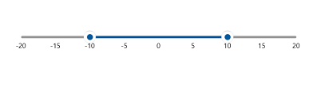
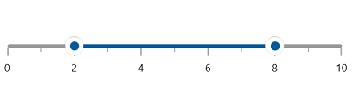
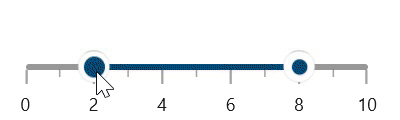
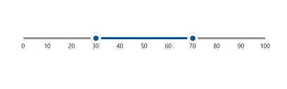
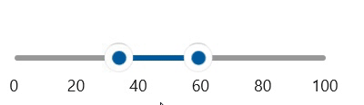
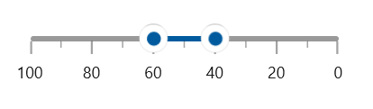
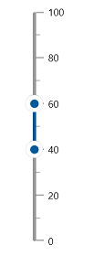

# Basic Features in WinUI RangeSlider (Range Slider)

This section explains how to work with the basic features of the WinUI RangeSlider control.

N> Refer to the [getting started](https://help.syncfusion.com/winui/rangeslider/getting-started) documentation for information on installing the NuGet package, adding namespace references, and adding the `SfRangeSlider` control to your application.

## Setting Minimum and Maximum Values

The [`Minimum`](https://help.syncfusion.com/cr/winui/Syncfusion.UI.Xaml.Sliders.SliderBase.html#Syncfusion_UI_Xaml_Sliders_SliderBase_Minimum) and [`Maximum`](https://help.syncfusion.com/cr/winui/Syncfusion.UI.Xaml.Sliders.SliderBase.html#Syncfusion_UI_Xaml_Sliders_SliderBase_Maximum) properties of the RangeSlider are used to customize the start and end range of the RangeSlider. The default value of [`Minimum`](https://help.syncfusion.com/cr/winui/Syncfusion.UI.Xaml.Sliders.SliderBase.html#Syncfusion_UI_Xaml_Sliders_SliderBase_Minimum) is 0 and [`Maximum`](https://help.syncfusion.com/cr/winui/Syncfusion.UI.Xaml.Sliders.SliderBase.html#Syncfusion_UI_Xaml_Sliders_SliderBase_Maximum) is 100.

The [`RangeStart`](https://help.syncfusion.com/cr/winui/Syncfusion.UI.Xaml.Sliders.SfRangeSlider.html#Syncfusion_UI_Xaml_Sliders_SfRangeSlider_RangeStart) value must be greater than or equal to [`Minimum`](https://help.syncfusion.com/cr/winui/Syncfusion.UI.Xaml.Sliders.SliderBase.html#Syncfusion_UI_Xaml_Sliders_SliderBase_Minimum), and the [`RangeEnd`](https://help.syncfusion.com/cr/winui/Syncfusion.UI.Xaml.Sliders.SfRangeSlider.html#Syncfusion_UI_Xaml_Sliders_SfRangeSlider_RangeEnd) value must be less than or equal to [`Maximum`](https://help.syncfusion.com/cr/winui/Syncfusion.UI.Xaml.Sliders.SliderBase.html#Syncfusion_UI_Xaml_Sliders_SliderBase_Maximum). Values set outside the [`Minimum`](https://help.syncfusion.com/cr/winui/Syncfusion.UI.Xaml.Sliders.SliderBase.html#Syncfusion_UI_Xaml_Sliders_SliderBase_Minimum) and [`Maximum`](https://help.syncfusion.com/cr/winui/Syncfusion.UI.Xaml.Sliders.SliderBase.html#Syncfusion_UI_Xaml_Sliders_SliderBase_Maximum) range will be adjusted to the nearest boundary.





<slider:SfRangeSlider Minimum="-20"
                      Maximum="20"
                      RangeStart="-10"
                      RangeEnd="10"
                      ShowLabels="True" />





SfRangeSlider sfRangeSlider = new SfRangeSlider();
sfRangeSlider.Minimum = -20;
sfRangeSlider.Maximum = 20;
sfRangeSlider.RangeStart = -10;
sfRangeSlider.RangeEnd = 10;
sfRangeSlider.ShowLabels = true;
this.Content = sfRangeSlider;





## Interval

Slider elements like labels, ticks and dividers are rendered based on the [`Interval`](https://help.syncfusion.com/cr/winui/Syncfusion.UI.Xaml.Sliders.SliderBase.html#Syncfusion_UI_Xaml_Sliders_SliderBase_Interval), [`Minimum`](https://help.syncfusion.com/cr/winui/Syncfusion.UI.Xaml.Sliders.SliderBase.html#Syncfusion_UI_Xaml_Sliders_SliderBase_Minimum), and [`Maximum`](https://help.syncfusion.com/cr/winui/Syncfusion.UI.Xaml.Sliders.SliderBase.html#Syncfusion_UI_Xaml_Sliders_SliderBase_Maximum) properties. The default value of [`Interval`](https://help.syncfusion.com/cr/winui/Syncfusion.UI.Xaml.Sliders.SliderBase.html#Syncfusion_UI_Xaml_Sliders_SliderBase_Interval) is double.NaN.

For example, if [`Minimum`](https://help.syncfusion.com/cr/winui/Syncfusion.UI.Xaml.Sliders.SliderBase.html#Syncfusion_UI_Xaml_Sliders_SliderBase_Minimum) is 0, [`Maximum`](https://help.syncfusion.com/cr/winui/Syncfusion.UI.Xaml.Sliders.SliderBase.html#Syncfusion_UI_Xaml_Sliders_SliderBase_Maximum) is 10, and [`Interval`](https://help.syncfusion.com/cr/winui/Syncfusion.UI.Xaml.Sliders.SliderBase.html#Syncfusion_UI_Xaml_Sliders_SliderBase_Interval) is 2, the slider will render the labels, major ticks, and dividers at 0, 2, 4 and so on.





<slider:SfRangeSlider Minimum="0"
                      Maximum="10"
                      Interval="2"
                      RangeStart="2"
                      RangeEnd="8"
                      ShowTicks="True"
                      ShowLabels="True" />





SfRangeSlider sfRangeSlider = new SfRangeSlider();
sfRangeSlider.Minimum = 0;
sfRangeSlider.Maximum = 10;
sfRangeSlider.Interval = 2;
sfRangeSlider.RangeStart = 2;
sfRangeSlider.RangeEnd = 8;
sfRangeSlider.ShowTicks = true;
sfRangeSlider.ShowLabels = true;
this.Content = sfRangeSlider;





N> The slider has auto-interval support, so the interval is calculated automatically by default.

N>
* Refer to the [`ShowDividers`](https://help.syncfusion.com/cr/winui/Syncfusion.UI.Xaml.Sliders.SliderBase.html#Syncfusion_UI_Xaml_Sliders_SliderBase_ShowDividers), to know more about the rendering of dividers at given interval.
* Refer to the [`ShowTicks`](https://help.syncfusion.com/cr/winui/Syncfusion.UI.Xaml.Sliders.SliderBase.html#Syncfusion_UI_Xaml_Sliders_SliderBase_ShowTicks), to know more about the rendering of major ticks at given interval.
* Refer to the [`ShowLabels`](https://help.syncfusion.com/cr/winui/Syncfusion.UI.Xaml.Sliders.SliderBase.html#Syncfusion_UI_Xaml_Sliders_SliderBase_ShowLabels), to know more about the rendering of labels at given interval.

## Discrete Selection for Values

You can move the thumb in a discrete manner for numeric values using the [`StepFrequency`](https://help.syncfusion.com/cr/winui/Syncfusion.UI.Xaml.Sliders.SliderBase.html#Syncfusion_UI_Xaml_Sliders_SliderBase_StepFrequency) property in the range slider.

N> The [`StepFrequency`](https://help.syncfusion.com/cr/winui/Syncfusion.UI.Xaml.Sliders.SliderBase.html#Syncfusion_UI_Xaml_Sliders_SliderBase_StepFrequency) property is supported only for numeric values; it is not supported for date or time values.





<slider:SfRangeSlider Minimum="0"
                      Maximum="10"
                      Interval="2"
                      RangeStart="2"
                      RangeEnd="8"
                      StepFrequency="2"
                      ShowTicks="True"
                      ShowLabels="True" />





SfRangeSlider sfRangeSlider = new SfRangeSlider();
sfRangeSlider.Minimum = 0;
sfRangeSlider.Maximum = 10;
sfRangeSlider.Interval = 2;
sfRangeSlider.RangeStart = 2;
sfRangeSlider.RangeEnd = 8;
sfRangeSlider.StepFrequency = 2;
sfRangeSlider.ShowTicks = true;
sfRangeSlider.ShowLabels = true;
this.Content = sfRangeSlider;





## Values

You can show values in the range slider by setting double values to the [`RangeStart`](https://help.syncfusion.com/cr/winui/Syncfusion.UI.Xaml.Sliders.SfRangeSlider.html#Syncfusion_UI_Xaml_Sliders_SfRangeSlider_RangeStart) and [`RangeEnd`](https://help.syncfusion.com/cr/winui/Syncfusion.UI.Xaml.Sliders.SfRangeSlider.html#Syncfusion_UI_Xaml_Sliders_SfRangeSlider_RangeEnd) properties.





<slider:SfRangeSlider RangeStart="30"
                      RangeEnd="70"
                      ShowLabels="True" />





SfRangeSlider sfRangeSlider = new SfRangeSlider();
sfRangeSlider.RangeStart = 30;
sfRangeSlider.RangeEnd = 70;
sfRangeSlider.ShowLabels = true;
this.Content = sfRangeSlider;





## Dragging the Active Range

You can drag the active range in the range slider by setting the [`CanDragActiveRange`](https://help.syncfusion.com/cr/winui/Syncfusion.UI.Xaml.Sliders.SfRangeSlider.html#Syncfusion_UI_Xaml_Sliders_SfRangeSlider_CanDragActiveRange) property as true. The default value of [`CanDragActiveRange`](https://help.syncfusion.com/cr/winui/Syncfusion.UI.Xaml.Sliders.SfRangeSlider.html#Syncfusion_UI_Xaml_Sliders_SfRangeSlider_CanDragActiveRange) is false.

The [`LabelOffset`](https://help.syncfusion.com/cr/winui/Syncfusion.UI.Xaml.Sliders.SliderBase.html#Syncfusion_UI_Xaml_Sliders_SliderBase_LabelOffset) property is used to set the distance between the labels and the range slider.





<slider:SfRangeSlider RangeStart="40"
                      RangeEnd="60"
                      CanDragActiveRange="True"
                      ShowLabels="True"
                      LabelOffset="10"  />





SfRangeSlider sfRangeSlider = new SfRangeSlider();
sfRangeSlider.RangeStart = 40;
sfRangeSlider.RangeEnd = 60;
sfRangeSlider.CanDragActiveRange = true;
sfRangeSlider.ShowLabels = true;
sfRangeSlider.LabelOffset = 10;
this.Content = sfRangeSlider;





## Flow Direction Customization

The direction of the range slider can be customized by its [`IsInversed`](https://help.syncfusion.com/cr/winui/Syncfusion.UI.Xaml.Sliders.SliderBase.html#Syncfusion_UI_Xaml_Sliders_SliderBase_IsInversed) property. The default value of [`IsInversed`](https://help.syncfusion.com/cr/winui/Syncfusion.UI.Xaml.Sliders.SliderBase.html#Syncfusion_UI_Xaml_Sliders_SliderBase_IsInversed) is false.

When the [`IsInversed`](https://help.syncfusion.com/cr/winui/Syncfusion.UI.Xaml.Sliders.SliderBase.html#Syncfusion_UI_Xaml_Sliders_SliderBase_IsInversed) property is true, the range slider will be placed in a right-to-left direction. When the [`IsInversed`](https://help.syncfusion.com/cr/winui/Syncfusion.UI.Xaml.Sliders.SliderBase.html#Syncfusion_UI_Xaml_Sliders_SliderBase_IsInversed) property is set to false, the range slider will be positioned in a left-to-right direction.





<slider:SfRangeSlider ShowTicks="True"
                      ShowLabels="True"
                      Interval="20"
                      RangeStart="40"
                      RangeEnd="60"
                      IsInversed="True"/>





SfRangeSlider sfRangeSlider = new SfRangeSlider();
sfRangeSlider.ShowTicks = true;
sfRangeSlider.ShowLabels = true;
sfRangeSlider.Interval = 20;
sfRangeSlider.RangeStart = 40;
sfRangeSlider.RangeEnd = 60;
sfRangeSlider.IsInversed = true;
this.Content = sfRangeSlider;





## Vertical Range Slider

The orientation of the [`range slider`](https://help.syncfusion.com/cr/winui/Syncfusion.UI.Xaml.Sliders.SfRangeSlider.html?tabs=tabid-1) can be changed by using the [`Orientation`](https://help.syncfusion.com/cr/winui/Syncfusion.UI.Xaml.Sliders.SliderBase.html#Syncfusion_UI_Xaml_Sliders_SliderBase_Orientation) property. The default value of [`Orientation`](https://help.syncfusion.com/cr/winui/Syncfusion.UI.Xaml.Sliders.SliderBase.html#Syncfusion_UI_Xaml_Sliders_SliderBase_Orientation) is `Horizontal`.

When the [`Orientation`](https://help.syncfusion.com/cr/winui/Syncfusion.UI.Xaml.Sliders.SliderBase.html#Syncfusion_UI_Xaml_Sliders_SliderBase_Orientation) property is `Vertical`, the [`range slider`](https://help.syncfusion.com/cr/winui/Syncfusion.UI.Xaml.Sliders.SfRangeSlider.html?tabs=tabid-1) will be rendered in a bottom-to-top vertical direction.





<slider:SfRangeSlider Orientation="Vertical"
                      ShowTicks="True"
                      ShowLabels="True"
                      Interval="20"
                      RangeStart="40"
                      RangeEnd="60" />





SfRangeSlider sfRangeSlider = new SfRangeSlider();
sfRangeSlider.Orientation = Orientation.Vertical;
sfRangeSlider.ShowTicks = true;
sfRangeSlider.ShowLabels = true;
sfRangeSlider.Interval = 20;
sfRangeSlider.RangeStart = 40;
sfRangeSlider.RangeEnd = 60;
this.Content = sfRangeSlider;





## Events

### RangeValueChanged

The [`RangeValueChanged`](https://help.syncfusion.com/cr/winui/Syncfusion.UI.Xaml.Sliders.SfRangeSlider.html#Syncfusion_UI_Xaml_Sliders_SfRangeSlider_RangeValueChanged) event occurs each time a [`RangeStart`](https://help.syncfusion.com/cr/winui/Syncfusion.UI.Xaml.Sliders.SfRangeSlider.html#Syncfusion_UI_Xaml_Sliders_SfRangeSlider_RangeStart) or [`RangeEnd`](https://help.syncfusion.com/cr/winui/Syncfusion.UI.Xaml.Sliders.SfRangeSlider.html#Syncfusion_UI_Xaml_Sliders_SfRangeSlider_RangeEnd) value changes. You can get the following values in the event args:

* [`RangeStartOldValue`](https://help.syncfusion.com/cr/winui/Syncfusion.UI.Xaml.Sliders.RangeValueChangedEventArgs.html#Syncfusion_UI_Xaml_Sliders_RangeValueChangedEventArgs_RangeStartOldValue) – Gets the previous value of the RangeStart.
* [`RangeStartNewValue`](https://help.syncfusion.com/cr/winui/Syncfusion.UI.Xaml.Sliders.RangeValueChangedEventArgs.html#Syncfusion_UI_Xaml_Sliders_RangeValueChangedEventArgs_RangeStartNewValue) – Gets the new value of the RangeStart.
* [`RangeEndOldValue`](https://help.syncfusion.com/cr/winui/Syncfusion.UI.Xaml.Sliders.RangeValueChangedEventArgs.html#Syncfusion_UI_Xaml_Sliders_RangeValueChangedEventArgs_RangeEndOldValue) – Gets the previous value of the RangeEnd.
* [`RangeEndNewValue`](https://help.syncfusion.com/cr/winui/Syncfusion.UI.Xaml.Sliders.RangeValueChangedEventArgs.html#Syncfusion_UI_Xaml_Sliders_RangeValueChangedEventArgs_RangeEndNewValue) – Gets the new value of the RangeEnd.





<slider:SfRangeSlider RangeStart="30"
                      RangeEnd="70"
                      RangeValueChanged="SfRangeSlider_RangeValueChanged"/>





SfRangeSlider sfRangeSlider = new SfRangeSlider();
sfRangeSlider.RangeStart = 30;
sfRangeSlider.RangeEnd = 70;
sfRangeSlider.RangeValueChanged += SfRangeSlider_RangeValueChanged;
this.Content = sfRangeSlider;

private void SfRangeSlider_RangeValueChanged(object sender, RangeValueChangedEventArgs e)
{
    var rangeStartOldValue = e.RangeStartOldValue;
    var rangeStartNewValue = e.RangeStartNewValue;
    var rangeEndOldValue = e.RangeEndOldValue;
    var rangeEndNewValue = e.RangeEndNewValue;
}



