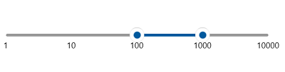

# Custom scale range in range slider

Range slider allows you to define a custom scale range by extending the range slider based on your business logic.





<local:LogarithmicRangeSlider Minimum="1"
                              Maximum="10000"
                              RangeStart="100"
                              RangeEnd="1000"
                              ShowLabels="True" />





public class LogarithmicRangeSlider : SfRangeSlider
{
    int labelsCount;

    public override List<SliderLabelInfo> GenerateVisibleLabels()
    {
        List<SliderLabelInfo> labelInfos = new List<SliderLabelInfo>();
        int minimum = (int)LogBase(this.Minimum, 10);
        int maximum = (int)LogBase(this.Maximum, 10);
        for (int i = minimum; i <= maximum; i++)
        {
            double value = Math.Floor(Math.Pow(10, i)); // logBase  value is 10
            SliderLabelInfo label = new SliderLabelInfo()
            {
                Value = value,
                Text = value.ToString()
            };
            labelInfos.Add(label);
        }

        labelsCount = labelInfos.Count;
        return labelInfos;
    }

    private double LogBase(double value, int baseValue)
    {
        return Math.Log(value) / Math.Log(baseValue);
    }

    public override double ValueToFactor(double value)
    {
        return LogBase(value, 10) / (labelsCount - 1);
    }

    public override double FactorToValue(double factor)
    {
        return Math.Pow(Math.E, factor * (labelsCount - 1) * Math.Log(10));
    }
}





