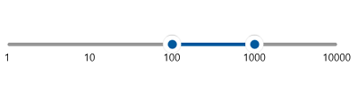

# Custom Range in WinUI RangeSlider (Range Slider)

The RangeSlider allows you to define a custom scale range by extending the `SfRangeSlider` based on your business logic, such as rendering a logarithmic scale.

To create a custom range scale, subclass [`SfRangeSlider`](https://help.syncfusion.com/cr/winui/Syncfusion.UI.Xaml.Sliders.SfRangeSlider.html?tabs=tabid-1) and override the following protected virtual methods:

* `GenerateVisibleLabels()` – Generates the list of labels to be displayed on the scale.
* `ValueToFactor(double value)` – Converts a value on the scale to a normalized factor (0 to 1) used for positioning.
* `FactorToValue(double factor)` – Converts a normalized factor back to a value on the scale.





<local:LogarithmicRangeSlider Minimum="1"
                              Maximum="10000"
                              RangeStart="100"
                              RangeEnd="1000"
                              ShowLabels="True" />





public class LogarithmicRangeSlider : SfRangeSlider
{
    int labelsCount;

    public override List<SliderLabelInfo> GenerateVisibleLabels()
    {
        List<SliderLabelInfo> labelInfos = new List<SliderLabelInfo>();
        int minimum = (int)LogBase(this.Minimum, 10);
        int maximum = (int)LogBase(this.Maximum, 10);
        for (int i = minimum; i <= maximum; i++)
        {
            double value = Math.Floor(Math.Pow(10, i)); // 10^i gives the label value
            SliderLabelInfo label = new SliderLabelInfo()
            {
                Value = value,
                Text = value.ToString()
            };
            labelInfos.Add(label);
        }

        labelsCount = labelInfos.Count;
        return labelInfos;
    }

    // Converts a value to its logarithm with the given base.
    private double LogBase(double value, int baseValue)
    {
        return Math.Log(value) / Math.Log(baseValue);
    }

    public override double ValueToFactor(double value)
    {
        // Normalize the log of the value to a factor between 0 and 1.
        return LogBase(value, 10) / (labelsCount - 1);
    }

    public override double FactorToValue(double factor)
    {
        // Convert the normalized factor back to a value on the logarithmic scale.
        return Math.Pow(10, factor * (labelsCount - 1));
    }
}





