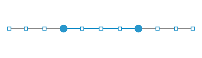

# Dividers in WinUI RangeSlider (Range Slider)

This section explains about how to show the dividers in the range slider.

## Show Dividers

The [`ShowDividers`](https://help.syncfusion.com/cr/winui/Syncfusion.UI.Xaml.Sliders.SliderBase.html#Syncfusion_UI_Xaml_Sliders_SliderBase_ShowDividers) property is used to render the dividers on the track. The default value of the [`ShowDividers`](https://help.syncfusion.com/cr/winui/Syncfusion.UI.Xaml.Sliders.SliderBase.html#Syncfusion_UI_Xaml_Sliders_SliderBase_ShowDividers) property is false. It is a shape, which is used to represent the major interval points of the track.

For example, if [`Minimum`](https://help.syncfusion.com/cr/winui/Syncfusion.UI.Xaml.Sliders.SliderBase.html#Syncfusion_UI_Xaml_Sliders_SliderBase_Minimum) is 0, [`Maximum`](https://help.syncfusion.com/cr/winui/Syncfusion.UI.Xaml.Sliders.SliderBase.html#Syncfusion_UI_Xaml_Sliders_SliderBase_Maximum) is 100, and [`Interval`](https://help.syncfusion.com/cr/winui/Syncfusion.UI.Xaml.Sliders.SliderBase.html#Syncfusion_UI_Xaml_Sliders_SliderBase_Interval) is 10, the slider will render the dividers at 0, 10, 20 and so on.





<slider:SfRangeSlider RangeStart="30"
                      RangeEnd="70"
                      Interval="10"
                      ShowDividers="True" />





SfRangeSlider sfRangeSlider = new SfRangeSlider();
sfRangeSlider.RangeStart = 30;
sfRangeSlider.RangeEnd = 70;
sfRangeSlider.Interval = 10;
sfRangeSlider.ShowDividers = true;
this.Content = sfRangeSlider;





## Dividers Height and Width

You can change the divider height and width of the RangeSlider using the [`DividerHeight`](https://help.syncfusion.com/cr/winui/Syncfusion.UI.Xaml.Sliders.SliderBase.html#Syncfusion_UI_Xaml_Sliders_SliderBase_DividerHeight) and [`DividerWidth`](https://help.syncfusion.com/cr/winui/Syncfusion.UI.Xaml.Sliders.SliderBase.html#Syncfusion_UI_Xaml_Sliders_SliderBase_DividerWidth) properties respectively.





<slider:SfRangeSlider RangeStart="30"
                      RangeEnd="70"
                      Interval="10"
                      ShowDividers="True"
                      DividerHeight="4"
                      DividerWidth="4" />





SfRangeSlider sfRangeSlider = new SfRangeSlider();
sfRangeSlider.RangeStart = 30;
sfRangeSlider.RangeEnd = 70;
sfRangeSlider.Interval = 10;
sfRangeSlider.ShowDividers = true;
sfRangeSlider.DividerHeight = 4;
sfRangeSlider.DividerWidth = 4;
this.Content = sfRangeSlider;





## Divider Stroke Thickness and Stroke

You can change the divider stroke thickness of the range slider using the [`DividerStrokeThickness`](https://help.syncfusion.com/cr/winui/Syncfusion.UI.Xaml.Sliders.SliderBase.html#Syncfusion_UI_Xaml_Sliders_SliderBase_DividerStrokeThickness) property. The default value of [`DividerStrokeThickness`](https://help.syncfusion.com/cr/winui/Syncfusion.UI.Xaml.Sliders.SliderBase.html#Syncfusion_UI_Xaml_Sliders_SliderBase_DividerStrokeThickness) is 0. Also, you can change the divider stroke of the range slider using the [`DividerStroke`](https://help.syncfusion.com/cr/winui/Syncfusion.UI.Xaml.Sliders.SliderBase.html#Syncfusion_UI_Xaml_Sliders_SliderBase_DividerStroke) property.





<slider:SfRangeSlider RangeStart="30"
                      RangeEnd="70"
                      Interval="10"
                      ShowDividers="True"
                      DividerHeight="10"
                      DividerWidth="10"
                      DividerStrokeThickness="2"
                      DividerStroke="Red" />





SfRangeSlider sfRangeSlider = new SfRangeSlider();
sfRangeSlider.RangeStart = 30;
sfRangeSlider.RangeEnd = 70;
sfRangeSlider.Interval = 10;
sfRangeSlider.ShowDividers = true;
sfRangeSlider.DividerHeight = 10;
sfRangeSlider.DividerWidth = 10;
sfRangeSlider.DividerStrokeThickness = 2;
sfRangeSlider.DividerStroke = new SolidColorBrush(Colors.Red);
this.Content = sfRangeSlider;





## Divider Fill

You can change the divider fill of the range slider using the [`DividerFill`](https://help.syncfusion.com/cr/winui/Syncfusion.UI.Xaml.Sliders.SliderBase.html#Syncfusion_UI_Xaml_Sliders_SliderBase_DividerFill) property.





<slider:SfRangeSlider RangeStart="30"
                      RangeEnd="70"
                      Interval="10"
                      ShowDividers="True"
                      DividerHeight="10"
                      DividerWidth="10"
                      DividerFill="#ff7979" />





SfRangeSlider sfRangeSlider = new SfRangeSlider();
sfRangeSlider.RangeStart = 30;
sfRangeSlider.RangeEnd = 70;
sfRangeSlider.Interval = 10;
sfRangeSlider.ShowDividers = true;
sfRangeSlider.DividerHeight = 10;
sfRangeSlider.DividerWidth = 10;
sfRangeSlider.DividerFill = new SolidColorBrush(ColorHelper.FromArgb(255,255, 121, 121));
this.Content = sfRangeSlider;





## Divider Template

### Setting a Template for Dividers

The [`DividerTemplate`](https://help.syncfusion.com/cr/winui/Syncfusion.UI.Xaml.Sliders.SliderBase.html#Syncfusion_UI_Xaml_Sliders_SliderBase_DividerTemplate) property allows you to define the data template for the divider's as shown in the following code sample.





<DataTemplate x:Key="DividerTemplate">
    <Rectangle Height="{Binding DividerHeight}"
               Width="{Binding DividerWidth}"
               Fill="{ThemeResource SystemAltHighColor}"
               Stroke="{ThemeResource SystemAccentColorDark1}"
               StrokeThickness="{Binding DividerStrokeThickness}" />
</DataTemplate>

<slider:SfRangeSlider RangeStart="30"
                      RangeEnd="70"
                      Interval="10"
                      ShowDividers="True"
                      DividerHeight="10"
                      DividerWidth="10"
                      DividerStrokeThickness="2"
                      DividerTemplate="{StaticResource DividerTemplate}">
</slider:SfRangeSlider>





SfRangeSlider sfRangeSlider = new SfRangeSlider();
sfRangeSlider.ShowDividers = true;
sfRangeSlider.DividerHeight = 10;
sfRangeSlider.DividerWidth = 10;
sfRangeSlider.DividerStrokeThickness = 2;
sfRangeSlider.DividerTemplate = this.Resources["DividerTemplate"] as DataTemplate;
sfRangeSlider.RangeStart = 30;
sfRangeSlider.RangeEnd = 70;
this.Content = sfRangeSlider;





N> Its DataContext is [`SliderBase`](https://help.syncfusion.com/cr/winui/Syncfusion.UI.Xaml.Sliders.SliderBase.html?tabs=tabid-1).

### Setting a Active Template for Dividers

The [`DividerTemplate`](https://help.syncfusion.com/cr/winui/Syncfusion.UI.Xaml.Sliders.SliderBase.html#Syncfusion_UI_Xaml_Sliders_SliderBase_DividerTemplate) property allows you to define the data template for the divider's as shown in the following code sample.





<DataTemplate x:Key="ActiveDividerTemplate">
    <Rectangle Height="10"
               Width="10"
               Fill="{ThemeResource SystemAltHighColor}"
               Stroke="{ThemeResource SystemAccentColorDark1}"
               StrokeThickness="2" />
</DataTemplate>

<slider:SfRangeSlider RangeStart="30"
                      RangeEnd="70"
                      Interval="10"
                      ShowDividers="True"
                      DividerHeight="5"
                      DividerWidth="5"
                      ActiveDividerTemplate="{StaticResource ActiveDividerTemplate}">
</slider:SfRangeSlider>





SfRangeSlider sfRangeSlider = new SfRangeSlider();
sfRangeSlider.ShowDividers = true;
sfRangeSlider.DividerHeight = 5;
sfRangeSlider.DividerWidth = 5;
sfRangeSlider.ActiveDividerTemplate = this.Resources["ActiveDividerTemplate"] as DataTemplate;
sfRangeSlider.RangeStart = 30;
sfRangeSlider.RangeEnd = 70;
this.Content = sfRangeSlider;





