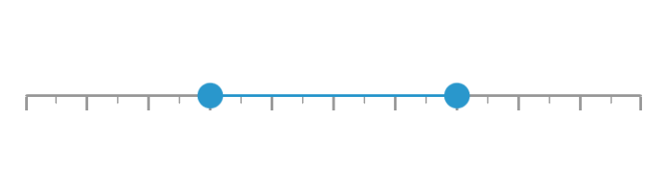
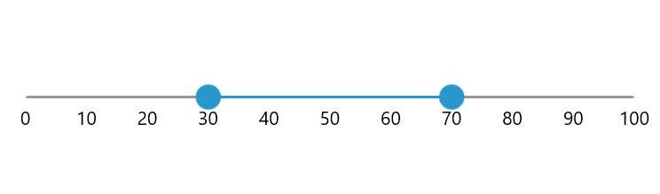

# Getting Started with WinUI RangeSlider (Range Slider)

This section explains the steps required to add the [WinUI RangeSlider](https://www.syncfusion.com/winui-controls/range-slider) control and its elements such as values, ticks, dividers, labels, and tooltips. This section covers only the basic features needed to get started with the Syncfusion RangeSlider.

## Creating an application with WinUI Range Slider

1. Create a [WinUI 3 desktop app for C# and .NET 5](https://learn.microsoft.com/en-us/windows/apps/winui/winui3/create-your-first-winui3-app).

2. Add a reference to the [Syncfusion.Sliders.WinUI](https://www.nuget.org/packages/Syncfusion.Sliders.WinUI) NuGet package.

3. Import the control namespace `Syncfusion.UI.Xaml.Sliders` in XAML or C# code. In XAML, add the following namespace declaration:




xmlns:slider="using:Syncfusion.UI.Xaml.Sliders"




4. Initialize the [`SfRangeSlider`](https://help.syncfusion.com/cr/winui/Syncfusion.UI.Xaml.Sliders.SfRangeSlider.html?tabs=tabid-1) control.

N> The default values of the [`Minimum`](https://help.syncfusion.com/cr/winui/Syncfusion.UI.Xaml.Sliders.SliderBase.html#Syncfusion_UI_Xaml_Sliders_SliderBase_Minimum) and [`Maximum`](https://help.syncfusion.com/cr/winui/Syncfusion.UI.Xaml.Sliders.SliderBase.html#Syncfusion_UI_Xaml_Sliders_SliderBase_Maximum) properties of the [`SfRangeSlider`](https://help.syncfusion.com/cr/winui/Syncfusion.UI.Xaml.Sliders.SfRangeSlider.html?tabs=tabid-1) are 0 and 100 respectively. So, the [`RangeStart`](https://help.syncfusion.com/cr/winui/Syncfusion.UI.Xaml.Sliders.SfRangeSlider.html#Syncfusion_UI_Xaml_Sliders_SfRangeSlider_RangeStart) and [`RangeEnd`](https://help.syncfusion.com/cr/winui/Syncfusion.UI.Xaml.Sliders.SfRangeSlider.html#Syncfusion_UI_Xaml_Sliders_SfRangeSlider_RangeEnd) properties must be set within this range.






<slider:SfRangeSlider />





SfRangeSlider sfRangeSlider = new SfRangeSlider();
this.Content = sfRangeSlider;





{{ codesnippet1 | OrderList_Indent_Level_1 }}

## Set Values

You can show values in the range slider by setting double values to the [`RangeStart`](https://help.syncfusion.com/cr/winui/Syncfusion.UI.Xaml.Sliders.SfRangeSlider.html#Syncfusion_UI_Xaml_Sliders_SfRangeSlider_RangeStart) and [`RangeEnd`](https://help.syncfusion.com/cr/winui/Syncfusion.UI.Xaml.Sliders.SfRangeSlider.html#Syncfusion_UI_Xaml_Sliders_SfRangeSlider_RangeEnd) properties.





<slider:SfRangeSlider RangeStart="30"
                      RangeEnd="70" />





SfRangeSlider sfRangeSlider = new SfRangeSlider();
sfRangeSlider.RangeStart = 30;
sfRangeSlider.RangeEnd = 70;
this.Content = sfRangeSlider;





## Enable Ticks

You can enable ticks in the range slider using the [`ShowTicks`](https://help.syncfusion.com/cr/winui/Syncfusion.UI.Xaml.Sliders.SliderBase.html#Syncfusion_UI_Xaml_Sliders_SliderBase_ShowTicks) property.





<slider:SfRangeSlider RangeStart="30"
                      RangeEnd="70"
                      ShowTicks="True" />





SfRangeSlider sfRangeSlider = new SfRangeSlider();
sfRangeSlider.RangeStart = 30;
sfRangeSlider.RangeEnd = 70;
sfRangeSlider.ShowTicks = true;
this.Content = sfRangeSlider;





## Enable Labels

You can enable labels in the range slider using the [`ShowLabels`](https://help.syncfusion.com/cr/winui/Syncfusion.UI.Xaml.Sliders.SliderBase.html#Syncfusion_UI_Xaml_Sliders_SliderBase_ShowLabels) property.





<slider:SfRangeSlider RangeStart="30"
                      RangeEnd="70"
                      ShowLabels="True" />





SfRangeSlider sfRangeSlider = new SfRangeSlider();
sfRangeSlider.RangeStart = 30;
sfRangeSlider.RangeEnd = 70;
sfRangeSlider.ShowLabels = true;
this.Content = sfRangeSlider;





## Enable Dividers

You can enable dividers in the range slider using the [`ShowDividers`](https://help.syncfusion.com/cr/winui/Syncfusion.UI.Xaml.Sliders.SliderBase.html#Syncfusion_UI_Xaml_Sliders_SliderBase_ShowDividers) property.





<slider:SfRangeSlider RangeStart="30"
                      RangeEnd="70"
                      ShowDividers="True"
                      DividerHeight="4"
                      DividerWidth="4"
                      ActiveTrackHeight="4"
                      InactiveTrackHeight="4" />





SfRangeSlider sfRangeSlider = new SfRangeSlider();
sfRangeSlider.RangeStart = 30;
sfRangeSlider.RangeEnd = 70;
sfRangeSlider.ShowDividers = true;
sfRangeSlider.DividerHeight = 4;
sfRangeSlider.DividerWidth = 4;
sfRangeSlider.ActiveTrackHeight = 4;
sfRangeSlider.InactiveTrackHeight = 4;
this.Content = sfRangeSlider;





N> The [`ActiveTrackHeight`](https://help.syncfusion.com/cr/winui/Syncfusion.UI.Xaml.Sliders.SliderBase.html#Syncfusion_UI_Xaml_Sliders_SliderBase_ActiveTrackHeight) and [`InactiveTrackHeight`](https://help.syncfusion.com/cr/winui/Syncfusion.UI.Xaml.Sliders.SliderBase.html#Syncfusion_UI_Xaml_Sliders_SliderBase_InactiveTrackHeight) properties shown above customize the track height.

N> Download the demo application from [GitHub](https://github.com/SyncfusionExamples/WinUI_Sliders_Getting_Started/tree/main/RangeSliderGettingStartedDesktop).